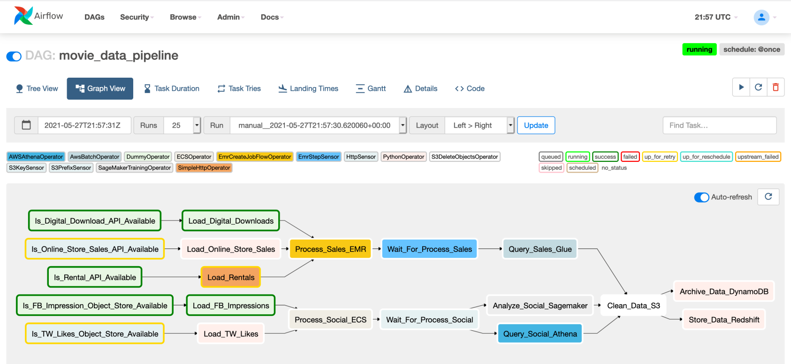
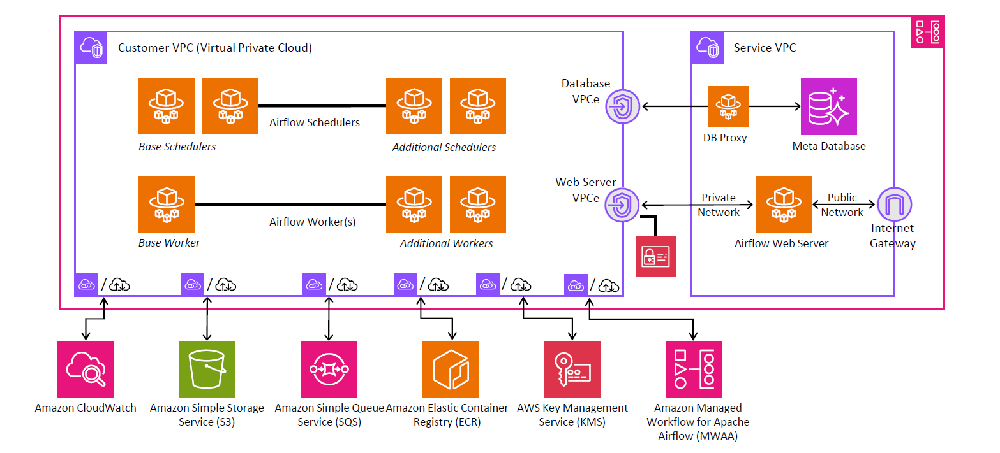

# ☁️ Amazon MWAA (Managed Workflows for Apache Airflow)

If you love the flexibility and power of Apache Airflow but dread the complexity of managing its infrastructure, **Amazon MWAA (Managed Workflows for Apache Airflow)** is the perfect match. It lets you run Airflow pipelines in a fully managed, secure, and scalable environment, natively integrated with AWS.

---

## 🧠 What Is Amazon MWAA?

> **Amazon MWAA** is a **managed service** that allows you to **use Apache Airflow** on AWS **without worrying about infrastructure**.

✅ It's **not a fork** — it's the real, open-source Airflow maintained by the Apache Software Foundation.

---

<div style="text-align: center;"></div>

---

## 🎯 Why Use MWAA?

| Benefit                         | Explanation                                                                    |
| ------------------------------- | ------------------------------------------------------------------------------ |
| ☁️ **Fully Managed**            | No setup of schedulers, web servers, metadata DBs, or workers. AWS handles it. |
| 🔁 **Auto-Scaling**             | Scales the number of workers based on DAG load.                                |
| 🧩 **Seamless AWS Integration** | Easy connectivity to S3, Redshift, Glue, Lambda, EMR, and more.                |
| 🔐 **Secure**                   | IAM, VPC support, encryption with KMS, and private access.                     |
| 🔄 **High Availability**        | Runs across **multiple AZs** with **ECS Fargate** under the hood.              |

---

## 🏗️ MWAA Architecture Overview

<div style="text-align: center;"></div>

---

## ⚙️ Key Components of MWAA

| Component       | Role                                                    |
| --------------- | ------------------------------------------------------- |
| **Web Server**  | UI for DAGs, task status, logs.                         |
| **Scheduler**   | Monitors DAGs & triggers tasks based on time/sensors.   |
| **Workers**     | Execute DAG tasks using **Celery Executor** on Fargate. |
| **Metadata DB** | Tracks DAG state, execution logs, and variables.        |
| **S3 Bucket**   | Stores DAGs, plugins, requirements.txt, and logs.       |
| **CloudWatch**  | Captures Airflow logs and metrics.                      |

---

## 📂 DAGs, Plugins, and Dependencies

- **Upload DAGs** to S3 → `/dags` folder.
- **Upload Plugins** to S3 → `/plugins` (custom operators/hooks).
- **Use `requirements.txt`** in S3 → `/requirements.txt` (e.g., `pandas`, `requests`).

---

## 🚀 How to Deploy MWAA

### Step-by-Step

1. **Create an S3 bucket** with `/dags`, `/plugins`, and `/requirements.txt`.
2. **Upload DAG scripts** to the `dags/` folder.
3. **Go to MWAA Console**, click **"Create environment"**.
4. Choose:
   - Name
   - Airflow version (e.g., 2.8.1)
   - Execution role (IAM)
   - Source S3 bucket
   - VPC, subnets, and security groups
5. **Optionally:**
   - Enable CloudWatch logging
   - Set up environment variables
   - Configure KMS encryption
6. **Click Create**

⌛ _Takes ~30 minutes_ to provision environment.

---

## 🔄 Triggering Workflows in MWAA

MWAA supports multiple ways to trigger DAGs:

| Method                   | Example                                     |
| ------------------------ | ------------------------------------------- |
| 📅 **Schedule**          | `schedule_interval="0 6 * * *"`             |
| 🔔 **Sensor Trigger**    | Waits for file in S3, a state in Glue, etc. |
| 🌐 **API Trigger**       | Use Airflow's REST API or AWS Lambda        |
| 👩‍💻 **Manual UI Trigger** | Via Airflow Web UI                          |

---

## 🛡️ Security Considerations

- Use **private subnets** with **VPC endpoints**.
- DAG files stored in **S3 encrypted with KMS**.
- Fine-grained **IAM Roles** for DAGs and workers.
- **Audit logs** via CloudWatch.

---

## 💡 Use Cases for MWAA

| Scenario                      | Reason                                             |
| ----------------------------- | -------------------------------------------------- |
| Migrate existing Airflow DAGs | Native support for Airflow code                    |
| Complex dependencies          | DAG structure easily models branching & conditions |
| ML Pipelines                  | Model training, evaluation, and batch scoring      |
| Big Data ETL                  | Coordinate EMR, Glue, S3, Redshift                 |
| Event-driven workflows        | Triggers from S3, Lambda, SNS                      |

---

## 🧪 Example DAG: Daily ETL Pipeline

```python
from airflow import DAG
from airflow.operators.bash import BashOperator
from datetime import datetime

with DAG("daily_etl",
         start_date=datetime(2024, 1, 1),
         schedule_interval="@daily",
         catchup=False) as dag:

    extract = BashOperator(
        task_id="extract",
        bash_command="python /scripts/extract.py"
    )

    transform = BashOperator(
        task_id="transform",
        bash_command="python /scripts/transform.py"
    )

    load = BashOperator(
        task_id="load",
        bash_command="python /scripts/load.py"
    )

    extract >> transform >> load
```

---

## 📚 Reference Documentation

- [MWAA Official Docs](https://docs.aws.amazon.com/mwaa/latest/userguide/what-is-mwaa.html)
- [Apache Airflow Docs](https://airflow.apache.org/)
- [MWAA Pricing](https://aws.amazon.com/mwaa/pricing/)
- [Airflow DAG Best Practices](https://airflow.apache.org/docs/apache-airflow/stable/best-practices.html)
- [Airflow REST API Reference](https://airflow.apache.org/docs/apache-airflow/stable/stable-rest-api-ref.html)

---

## 🧭 Final Tips

- ✅ Use **CloudWatch Logs** for debugging.
- ✅ Store secrets using **AWS Secrets Manager**.
- ✅ Use **S3 versioning** for your DAGs.
- ✅ Use **tags** for cost tracking and environment grouping.
- ✅ Consider **MWAA + Step Functions** for hybrid orchestration.
