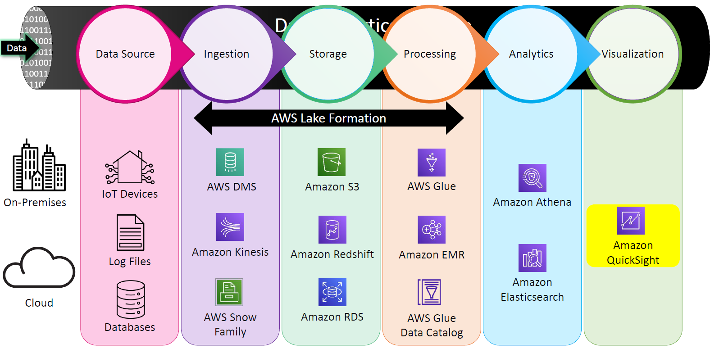
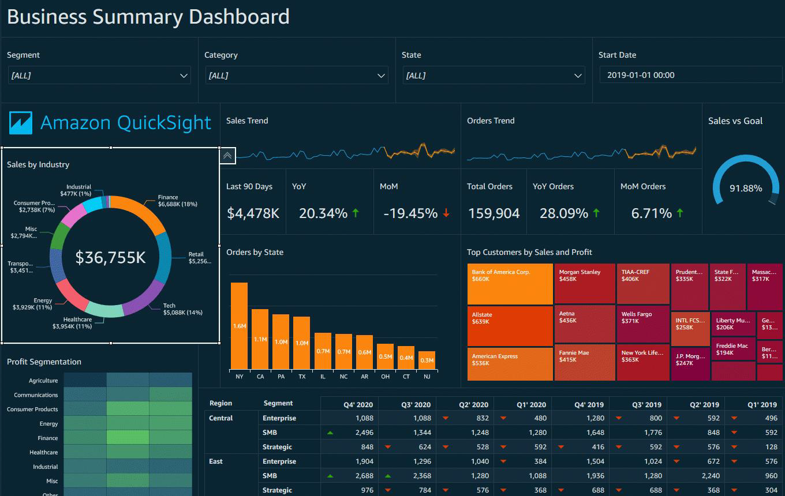
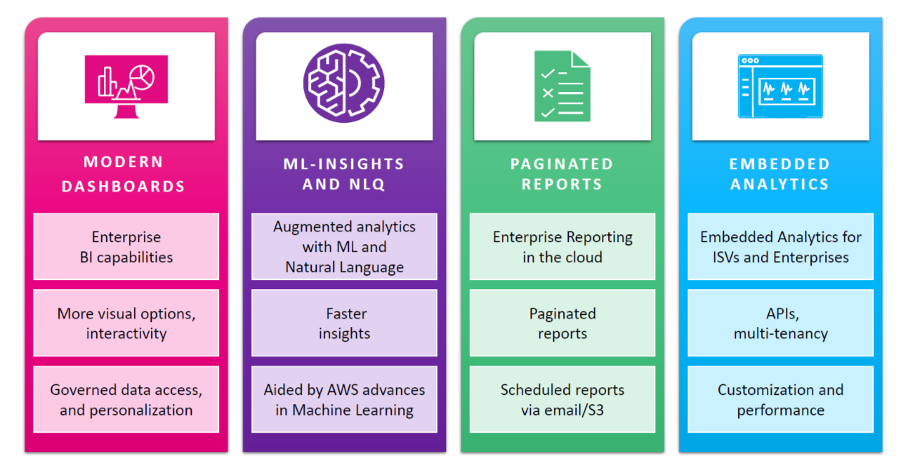
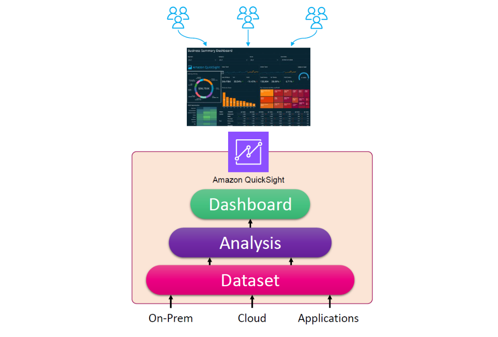

# 📊 **Amazon QuickSight: A Serverless BI Tool for Scalable and Interactive Dashboards**

---

## 🚀 What is Amazon QuickSight?

Amazon QuickSight is **AWS’s native Business Intelligence (BI) service** that helps you **visualize, analyze, and share** your data through rich, interactive dashboards — all in a **fully serverless** and **cost-efficient** environment.

> 📸 _“A picture is worth a thousand rows of data.”_ — That’s the philosophy behind QuickSight.

---

    

---

## 🧠 Why Use QuickSight?

- ✅ You need a **lightweight yet powerful** BI tool
- ✅ You want **serverless setup**, no infrastructure to manage
- ✅ You want to create **real-time dashboards** from multiple data sources
- ✅ You want to **scale dashboards across teams** or even embed them into your applications
- ✅ You want to ask questions using **natural language** (Yes! Just type “Show sales by region”)

---

## 🔍 Key Features

---

### 1. 🎨 **Modern Dashboards**

- Rich visualizations: charts, maps, tables, KPIs
- Interactive filters and drill-downs
- Mobile-friendly view
- Custom themes and controls for branding

### 2. 📑 **Paginated Reports**

- Pixel-perfect, printable reports
- Ideal for **enterprise reporting**
- Schedule delivery via **email** or **S3**

### 3. 🤖 **Augmented Analytics with ML**

- **ML Insights**: Detect anomalies and forecast trends
- **Natural Language Queries (NLQ)**: “How many orders last week?”
- **Auto-narratives**: Automated insights in plain English

### 4. 🧩 **Embedded Analytics**

- Use **APIs** to embed dashboards into your apps
- Supports **multi-tenancy**
- Full control via **IAM + row-level security**

---

## 🔗 Data Integration: Connect to Everything

QuickSight can connect to **virtually any data source**:

| 🔗 Source Type        | 🔌 Examples                                     |
| --------------------- | ----------------------------------------------- |
| **AWS Services**      | S3, Redshift, Athena, RDS, Aurora, Timestream   |
| **On-Prem Databases** | MySQL, PostgreSQL, Oracle, SQL Server, Teradata |
| **SaaS & Apps**       | Salesforce, Jira, ServiceNow, Twitter, GitHub   |
| **Files**             | Excel, CSV from local or S3                     |
| **Big Data**          | Presto, Spark, Snowflake, Databricks            |

---

## 🧱 QuickSight Components (Visual Overview)

---

| Component        | Description                                   |
| ---------------- | --------------------------------------------- |
| **Dataset**      | Foundation; source + transformations + schema |
| **Analysis**     | Canvas to create visualizations from datasets |
| **Dashboard**    | Published version of analysis for consumption |
| **Admin Portal** | User control, billing, capacity, security     |

---

## ⚙️ How It Works

1. 🧺 **Connect** to data (AWS, external, Excel, etc.)
2. 🔧 **Create a dataset** and optionally apply filters/joins
3. 📊 **Build an analysis**: Add visuals, filters, charts
4. 📤 **Publish as dashboard**
5. 👥 **Share** with users via roles or email/S3
6. 💬 **Ask questions** via NLQ or ML insights

---

## 📬 Use Cases

- 🚀 **Startup dashboards**: Real-time product metrics
- 🧾 **Enterprise reports**: Finance, HR, compliance
- 🧪 **Data science**: Show results with minimal setup
- 🛠️ **SaaS apps**: Embed dashboards for clients
- 📢 **Marketing analytics**: From multiple channels

---

## 💡 Pro Tips

- Use **SPICE engine** to cache data in-memory for faster dashboards.
- Schedule **report emails** daily, weekly, or on triggers.
- Secure your dashboards with **row-level security** based on user identity.
- Integrate with **CloudWatch Logs** to monitor dashboard usage.

---

## 📌 Final Thought

> **Amazon QuickSight** gives you the power of Tableau, the scale of AWS, and the simplicity of the cloud — all wrapped into one lightweight BI service.
