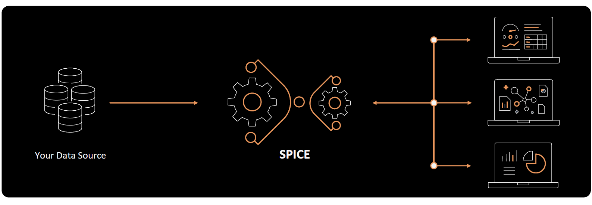

# ⚡ SPICE vs Live Query Mode in Amazon QuickSight

_Understand the Heart of QuickSight Performance!_

---

    

---

## 🧠 What Is SPICE?

**SPICE** stands for **Super-fast, Parallel, In-memory Calculation Engine**.  
It’s QuickSight’s **secret sauce** to deliver fast, interactive dashboards at scale.

### 🚀 Think of it like this

Imagine instead of querying your original data source every time (which could be slow or expensive), you copy your data into QuickSight’s own high-speed memory. That's SPICE!

---

## 🧪 How SPICE Works

- It **imports** data from your source (S3, RDS, Athena, etc.)
- The data is stored in **QuickSight’s in-memory engine**
- When users view dashboards, **QuickSight reads from SPICE**, not your original source

📌 **Great For**:

- Large datasets
- Dashboards with many users
- Reducing load on production databases
- Smoother interactivity (like filters and drill-downs)

---

## 🧩 What Is Live Query Mode?

**Live Query Mode** means QuickSight **connects directly to the data source** every time someone opens a dashboard or runs an analysis.

### 🔌 It’s like

> Every time you view a chart, QuickSight goes, “Hey database, give me the latest data right now!”

---

## 🔍 SPICE vs Live Query: Feature Comparison

| Feature                            | **SPICE**                                           | **Live Query**                                    |
| ---------------------------------- | --------------------------------------------------- | ------------------------------------------------- |
| **Performance**                    | 🏎️ Super fast (in-memory engine)                    | 🐢 Slower (depends on source performance)         |
| **Data Freshness**                 | ⏱️ Needs scheduled refresh to stay updated          | 🔄 Always up-to-date in real-time                 |
| **Data Source Load**               | 💆 Zero load after import                           | 🏋️ Queries hit your database directly             |
| **Cost**                           | 💰 Fixed per GB of SPICE used                       | 💵 Charges depend on query scans (e.g. Athena/S3) |
| **Concurrent Users**               | 👥 Excellent scalability                            | 🧍 May cause bottlenecks under heavy use          |
| **Interactivity (filters, drill)** | ⚡ Ultra-smooth                                     | 🚧 Might lag on large data                        |
| **Usage Limits**                   | 📦 Limited by SPICE capacity (configurable)         | ♾️ No storage limit, only source capacity         |
| **Best Use Case**                  | Dashboards shared with many users or large datasets | When real-time data is essential                  |

---

## 🧠 When to Use SPICE vs Live?

### ✅ **Use SPICE When:**

- You have large datasets that don’t change every second
- You want fast dashboard interactions (zoom, filter, drill down)
- You want to minimize load on your source (e.g., RDS, Redshift, etc.)
- You’re sharing dashboards with many users

### ✅ **Use Live Query When:**

- You need the **latest real-time data** (e.g., monitoring dashboards)
- Your data changes **very frequently** (e.g., transactions, IoT)
- You want to avoid scheduled refreshes or duplicate data

---

## 🔁 Can You Switch Between Them?

Yes! When creating or editing a dataset, QuickSight lets you choose between:

- `Import to SPICE`
- `Directly query your data`

👉 You can also **change it later** from the dataset settings.

---

## 💡 SPICE Capacity and Pricing

| Tier                | Description                              |
| ------------------- | ---------------------------------------- |
| **Free Tier**       | SPICE capacity (up to 1 GB/user) is free |
| **Enterprise Tier** | Starts with 10 GB/user — expandable      |
| **Add-ons**         | You can buy additional GBs as needed     |

⚠️ **Reminder**: SPICE is **not free forever**. Monitor usage and refresh schedules to optimize cost.

---

## 💬 Summary Cheat Sheet

| Use Case                              | Pick  |
| ------------------------------------- | ----- |
| ✅ Fast dashboards for execs          | SPICE |
| ✅ High concurrency (100+ users)      | SPICE |
| ✅ Real-time data needed              | Live  |
| ✅ Financial/transactional dashboards | Live  |
| ✅ Reduce cost with Athena            | SPICE |
| ✅ External DB protection             | SPICE |

---

## 🔍 Bonus: SPICE + Live Combo?

Yes, you can even **mix both**:

- Use **SPICE** for high-level dashboards (trends, charts)
- Use **Live Query** for widgets needing real-time updates (e.g., alerts)

---

## 🔗 Final Tip: Monitor & Refresh Smartly

If you're using SPICE:

- Set up **scheduled refreshes** (e.g., every hour or once daily)
- Track **SPICE capacity usage** in the admin portal
- **Optimize datasets** (remove unused fields, filter rows)
