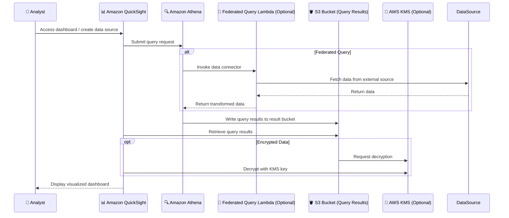

# 🔗 Amazon Athena + QuickSight Integration

_Turn SQL into Stunning Visuals Without Moving Data!_

---

## 🧭 Why Integrate Amazon Athena with QuickSight?

Imagine this:  
You're querying data with **Amazon Athena**—whether from S3 or via **Federated Queries**—and now you want to **visualize it in real-time**. That's where **Amazon QuickSight** comes in.

This integration allows you to:

- 📊 Visualize Athena query results in dashboards
- 🔍 Explore massive datasets interactively
- 💡 Enable non-technical users to consume SQL query results in a visual format

---

## ⚙️ How the Integration Works

Let’s break it down step by step:

### 🛠️ 1. Query Execution

- **Athena** queries data from **S3** or other data sources (via Federated Query).
- The query result is written to an **S3 bucket**.

### 📦 2. Data Access

- **QuickSight** connects to Athena and fetches results from **that S3 bucket**.
- It needs **permission** to:
  - Access Athena workgroups
  - Read from the specific S3 result bucket
  - (Optional) Decrypt data using **KMS key**, if encryption is used

### 🧑‍💻 3. Visualization

- QuickSight lets you:
  - Choose Athena datasets
  - Build dashboards and visuals
  - Filter, drill down, and analyze interactively

---

## 🔐 Required Permissions

This is where many users hit a wall! Here's what you must configure:

### ✅ Permissions for QuickSight

1. **Athena Access**

   - List workgroups
   - Run queries
   - Read results

2. **S3 Bucket Access**

   - `s3:GetObject`
   - `s3:ListBucket`
   - For the **Athena query result bucket**

3. **KMS Access (if applicable)**
   - `kms:Decrypt` permission on the **KMS key** used to encrypt data

### 🧠 Where to Configure?

In **QuickSight Portal → Manage QuickSight → Security & Permissions**

- Choose “**Athena**”
- Add the required **S3 buckets**
- (Optional) Select **Lambda functions** for Federated Queries

---

## ⚡ Real-World Workflow Example

---

## 🚦 Troubleshooting Tips

| ❌ Problem                          | ✅ Solution                                                            |
| ----------------------------------- | ---------------------------------------------------------------------- |
| Cannot see Athena workgroups        | Ensure Athena permissions are granted in QuickSight settings           |
| Error accessing query result bucket | Add the S3 bucket in QuickSight’s security & permissions section       |
| Decryption error for encrypted data | Grant QuickSight IAM role access to KMS key with `kms:Decrypt`         |
| Federated queries not working       | Add Lambda functions used in Federated Query to QuickSight permissions |

---

## 🧪 Live Query or SPICE?

Once Athena is connected:

- You can use **Live Query mode** (runs query in real-time)
- Or use **SPICE** to import results into QuickSight's in-memory engine for better performance

🔍 [Read SPICE vs Live Comparison »](https://chat.openai.com/share/...) _(previous topic reference)_

---

## 🧭 Best Practices

- ✅ Use **named workgroups** for fine-grained control
- ✅ Limit QuickSight access to only **necessary S3 buckets**
- ✅ Schedule **SPICE refreshes** if you’re caching data
- ✅ Set up **alerts** for failed Athena queries if using federated sources

---

## 📌 Summary Cheat Sheet

| Feature               | Description                                         |
| --------------------- | --------------------------------------------------- |
| 🔗 Integration Type   | Native QuickSight → Athena connector                |
| 🪣 Data Path           | Query runs in Athena → Results saved to S3          |
| 🔐 Permissions Needed | Athena, S3 (result bucket), and optional KMS access |
| 💻 IAM Role           | QuickSight managed role used for access             |
| ⚡ Real-Time Option   | Use Live Query mode or SPICE                        |
| 📊 Use Case           | Dashboarding on top of SQL/Federated Query Results  |

---

## 📚 Learn More

- [Amazon QuickSight Official Docs](https://docs.aws.amazon.com/quicksight/)
- [Amazon Athena Integration Guide](https://docs.aws.amazon.com/quicksight/latest/user/athena.html)
- [Athena Federated Query Overview](https://docs.aws.amazon.com/athena/latest/ug/connect-with-data-source-connectors.html)
