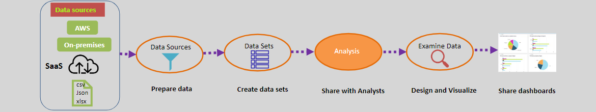

# AWS QuickSight: Cloud-Scale Business Intelligence (BI) Tool 📊

AWS QuickSight is a **cloud-based business intelligence (BI) and analytics service** designed to help organizations derive insights from their data using interactive dashboards, visualizations, and ad-hoc analysis.

[Getting started with Amazon Quicksight](https://aws.amazon.com/quicksight/getting-started/)

---

  

---

## 🌟 **What is AWS QuickSight?**

QuickSight enables businesses to:

- **Visualize data**: Create rich, interactive dashboards and visualizations.
- **Perform ad-hoc analysis**: Query and explore data without requiring IT assistance.
- **Provide insights**: Share insights with teams to make data-driven decisions.

Yes, it is **similar to Power BI**, but it's optimized for AWS environments with **cloud scalability** and seamless integration with AWS services.

---

## 🔑 **Key Features of QuickSight**

1. **Cloud-Scale Analytics**:

   - Scales to hundreds of thousands of users without the need to manage infrastructure.

2. **Wide Data Source Compatibility**:

   - Works with data from:
     - **AWS Services**: RDS, Redshift, Athena, S3, OpenSearch, and Timestream.
     - **Third-Party Applications**: Salesforce, Jira, and others.
     - **File Uploads**: Import data from MS Excel, CSV, or JSON files.

3. **Interactive Dashboards**:

   - Create **dynamic dashboards** that update automatically and can be shared securely with your team.

4. **Machine Learning Insights**:

   - Offers **ML-powered features** like anomaly detection, forecasting, and natural language querying.

5. **Seamless Integration**:

   - Easily integrates with other AWS services, making it a great choice for AWS-powered organizations.

6. **Secure and Globally Available**:
   - Provides built-in redundancy, global availability, and **secure access** controls.

---

## 🛠️ **How Does QuickSight Work?**

QuickSight simplifies the process of creating BI solutions through these steps:

  

1. **Data Sources**:

   - Connect to your data in **AWS services** (like S3 or Redshift) or from external sources (like Salesforce or Excel files).

2. **Data Preparation**:

   - Create **data sets** by importing, filtering, and transforming your data.

3. **Analysis and Visualization**:

   - Use **drag-and-drop tools** to create analyses and visualizations.

4. **Shareable Dashboards**:
   - Publish your insights in **interactive dashboards** that can be shared securely with other users.

---

## 📚 **Use Cases for QuickSight**

1. **Business Intelligence**:

   - Monitor KPIs and metrics for sales, marketing, or operations.

2. **Data Exploration**:

   - Enable teams to explore data and uncover trends or anomalies.

3. **Operational Dashboards**:

   - Build real-time dashboards to track business processes.

4. **Customer Insights**:
   - Analyze user behavior and trends to improve customer experience.

---

## ⚖️ **How Does QuickSight Compare to Power BI?**

| **Feature**         | **AWS QuickSight**                           | **Power BI**                                   |
| ------------------- | -------------------------------------------- | ---------------------------------------------- |
| **Platform**        | Cloud-native, fully managed service.         | Desktop application with cloud features.       |
| **Scalability**     | Automatically scales to 100K+ users.         | Limited scalability without Azure setup.       |
| **AWS Integration** | Seamless integration with AWS services.      | Limited AWS integration; Azure optimized.      |
| **Data Sources**    | Supports AWS services, SaaS apps, and files. | Supports Azure services, SaaS apps, and files. |
| **Pricing**         | Pay-per-use pricing model.                   | Subscription-based pricing.                    |

---

## ✅ **Why Choose QuickSight?**

1. **Optimized for AWS**:

   - Seamlessly integrates with popular AWS services like S3, Redshift, and Athena.

2. **Cost-Effective**:

   - Pay only for what you use, making it suitable for businesses of all sizes.

3. **No Infrastructure Management**:

   - Fully managed by AWS—no servers to provision or maintain.

4. **Machine Learning Insights**:
   - Built-in ML capabilities for forecasting and anomaly detection.

---

## 🧠 **Conclusion**

AWS QuickSight is a powerful, cloud-native alternative to traditional BI tools like Power BI. With its ability to scale, integrate seamlessly with AWS, and support a wide range of data sources, QuickSight is a perfect fit for organizations looking to harness the power of data for decision-making. Whether you're analyzing sales, tracking KPIs, or building operational dashboards, QuickSight provides a **cost-effective**, **scalable**, and **easy-to-use** solution for business intelligence.
