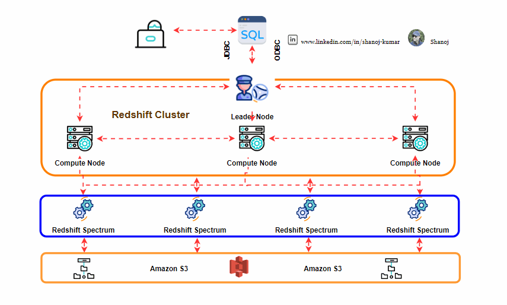
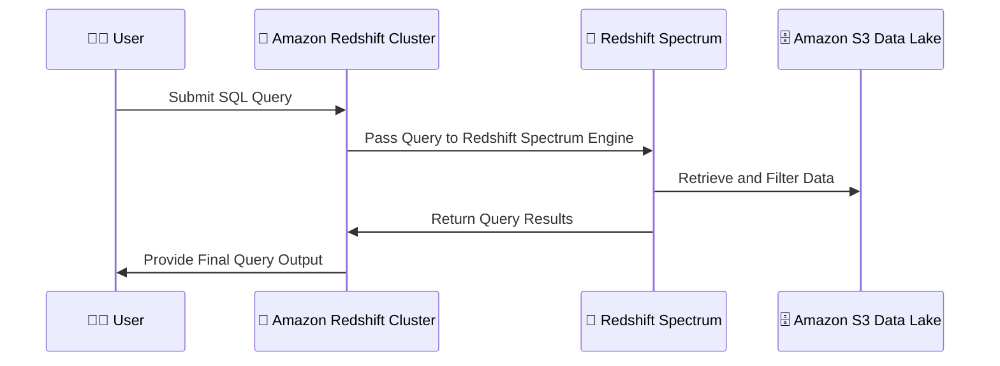
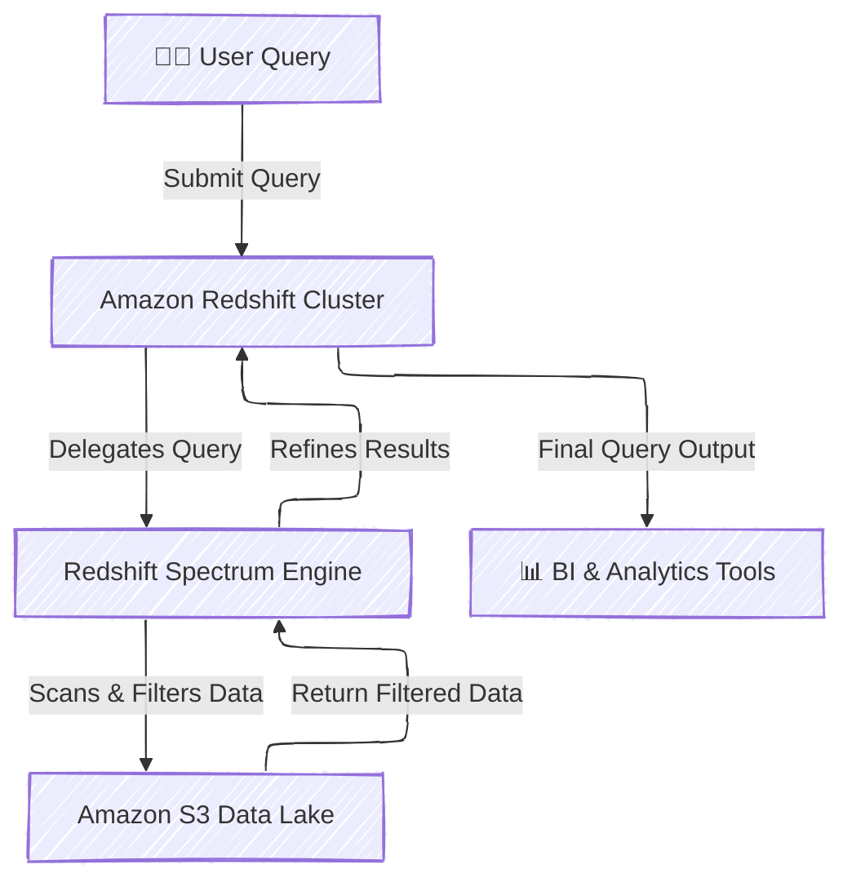

# **🚀 AWS Redshift Spectrum – The Complete Guide**

**Amazon Redshift Spectrum** allows you to run SQL queries against massive amounts of data (exabytes) in S3 without loading it into Redshift tables.

<div style="text-align: center">
    
</div>

## **🔍 Introduction to AWS Redshift Spectrum**

AWS **Redshift Spectrum** is an extension of Amazon Redshift that allows users to **query data stored in Amazon S3** without having to load it into Redshift tables. It enables organizations to run **high-performance SQL queries** on massive datasets stored in an S3-based **data lake**.

### **✅ Why Use Redshift Spectrum?**

- **Analyze massive datasets** stored in S3 without moving them.
- **Extend Redshift analytics** beyond structured data in the warehouse.
- **Reduce costs** by keeping raw and infrequently accessed data in S3.
- **Seamless integration** with BI tools like QuickSight, Tableau, and Power BI.
- **High performance** with the power of **Redshift’s SQL engine**.

---

## **1️⃣ How AWS Redshift Spectrum Works**

AWS Redshift Spectrum enables **data lake analytics** by allowing queries on data stored in **Amazon S3** using **Amazon Redshift’s SQL engine**.

### **📌 How the Querying Process Works**



### **📌 Steps in the Redshift Spectrum Query Process**

- 1️⃣ **User submits a query from Amazon Redshift**.
- 2️⃣ **Redshift Spectrum engine** translates the query into **S3-compatible** operations.
- 3️⃣ **Filtered data from S3** is returned to **Redshift compute nodes**.
- 4️⃣ **Final query execution** happens in Redshift to refine the results.
- 5️⃣ **Results are provided** back to the user.

---

## **2️⃣ AWS Redshift Spectrum Architecture**

AWS Redshift Spectrum is **not entirely serverless** but operates in a **hybrid model** where Redshift manages the query execution while Spectrum processes external data.

### **📌 Architecture Components**

- **Amazon Redshift Cluster** – Acts as the main SQL query engine.
- **Redshift Spectrum Query Engine** – Runs SQL queries on data stored in Amazon S3.
- **Amazon S3 (Data Lake)** – Stores raw and structured data in various formats.
- **AWS Glue Data Catalog** – Defines table schemas for querying external S3 data.
- **BI & Analytics Tools** – Tools like Tableau, Power BI, and AWS QuickSight use Spectrum for real-time analysis.



### **📌 Is Redshift Spectrum Serverless?**

- **Redshift Spectrum itself is serverless**, meaning it does not require dedicated infrastructure setup.
- However, it **requires an Amazon Redshift cluster**, making it a **hybrid approach**.
- Compute resources are **dynamically allocated** based on the query load.
- Spectrum **automatically scales** to handle multiple queries simultaneously.

---

## **3️⃣ Key Features of AWS Redshift Spectrum**

### **📌 Key Capabilities**

- ✅ **Query Data Directly in S3** – No need to load data into Redshift.
- ✅ **Supports Open Data Formats** – Query **Parquet, ORC, Avro, JSON, CSV**.
- ✅ **Works with AWS Glue Data Catalog** – Uses schema-on-read for flexibility.
- ✅ **Seamless SQL Query Execution** – Uses standard SQL queries via Redshift.
- ✅ **Scalable Compute Engine** – Runs queries on **thousands of nodes** in parallel.

### **📌 Supported File Formats**

| **File Format** | **Best Use Case**                                   |
| --------------- | --------------------------------------------------- |
| **Parquet**     | Optimized for columnar analytics (best performance) |
| **ORC**         | Optimized for Hive-based workloads                  |
| **Avro**        | Best for structured data & schemas                  |
| **JSON/CSV**    | Common but less optimized for querying              |

---

## **4️⃣ Redshift Spectrum vs. Amazon Athena**

Many users compare **Redshift Spectrum** with **Amazon Athena**, since both allow querying S3 data. However, they serve different use cases.

| **Feature**        | **AWS Redshift Spectrum** 📊                | **AWS Athena** 🎯                      |
| ------------------ | ------------------------------------------- | -------------------------------------- |
| **Infrastructure** | Requires a Redshift cluster                 | Serverless, no infrastructure required |
| **Performance**    | Faster for structured analytics             | Good for ad-hoc queries, lower cost    |
| **Integration**    | Works with Redshift SQL engine              | Uses Presto engine                     |
| **Use Case**       | Best for Redshift users extending analytics | Best for ad-hoc analysis on S3         |
| **Pricing**        | Redshift cluster + Spectrum query cost      | Pay per query, no cluster required     |

---

## **5️⃣ Setting Up AWS Redshift Spectrum**

### **📌 Prerequisites**

- An **Amazon Redshift Cluster**.
- **Data stored in Amazon S3** (in Parquet, ORC, Avro, or CSV format).
- **AWS Glue Data Catalog** to define schemas.
- **IAM Permissions** to access S3 from Redshift.

### **📌 Steps to Set Up Redshift Spectrum**

#### **Step 1: Create an External Schema in Redshift**

```sql
CREATE EXTERNAL SCHEMA spectrum_schema
FROM DATA CATALOG
DATABASE 'mydatacatalog'
IAM_ROLE 'arn:aws:iam::your-account-id:role/MySpectrumRole'
CREATE EXTERNAL DATABASE IF NOT EXISTS;
```

#### **Step 2: Create an External Table (Referencing S3 Data)**

```sql
CREATE EXTERNAL TABLE spectrum_schema.orders (
    order_id INT,
    customer_name STRING,
    total_amount DECIMAL(10,2),
    order_date DATE
)
ROW FORMAT DELIMITED
FIELDS TERMINATED BY ','
STORED AS PARQUET
LOCATION 's3://your-bucket/orders-data/';
```

#### **Step 3: Query Data Using SQL**

```sql
SELECT * FROM spectrum_schema.orders WHERE total_amount > 100;
```

---

## **🚀 Summary: When to Use AWS Redshift Spectrum?**

- ✔ **If you already use Amazon Redshift** and need to analyze data in S3.
- ✔ **For querying structured S3 data at high speed** with Redshift SQL.
- ✔ **For extending data warehouses to a data lake architecture**.
- ✔ **For cost-effective big data analytics without fully loading data into Redshift**.
