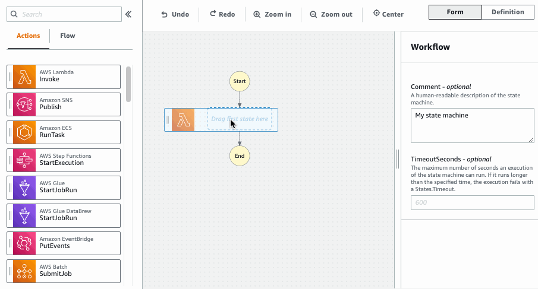
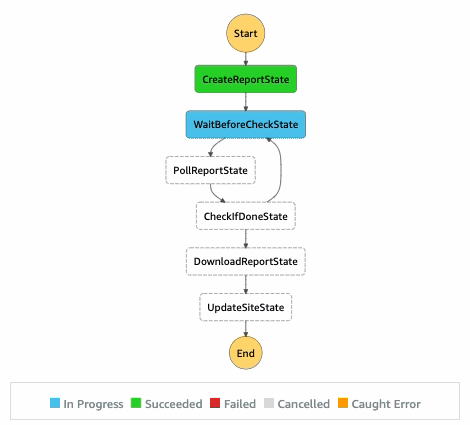

# 🚀 **AWS Step Functions: Orchestrate Your Serverless Workflows with Ease**

AWS Step Functions is a **fully managed serverless service** designed to simplify the coordination of components within distributed applications and microservices through intuitive visual workflows. Whether you're building complex workflows or orchestrating simple tasks, Step Functions provides the tools you need to manage and monitor your processes seamlessly.

---

## 🚀 What is AWS Step Functions?

AWS **Step Functions** is a **serverless orchestration service** that allows you to design and execute workflows using AWS services. It enables you to coordinate multiple AWS Lambda functions and other services into a **visual, easy-to-manage workflow**.

### 🖼️ **Workflow Overview**

<div style="text-align: center; padding: 0 20px">
  
</div>

---

## 🔹 Key Features of AWS Step Functions

✅ **Workflow Automation** – Orchestrate microservices, functions, and APIs without managing servers.  
✅ **State Machines** – Uses **Amazon States Language (ASL)** to define workflows.  
✅ **Error Handling & Retries** – Automatically retries failed tasks with built-in error handling.  
✅ **Parallel Execution** – Supports running multiple steps concurrently.  
✅ **Integration with AWS Services** – Works with Lambda, DynamoDB, SNS, SQS, ECS, SageMaker, and more.  
✅ **Visual Workflow Designer** – Provides a graphical interface for designing workflows.

---

## 🏗️ Components of AWS Step Functions

AWS Step Functions consists of several key components that help orchestrate workflows effectively. Let's break them down:

---

### 1️⃣ **State Machine === Workflow 🖼️**

A **state machine** is a JSON-based definition of the workflow. It describes how states interact, process data, handle errors, and transition between steps.

📌 **Key Points:**

- Written in **Amazon States Language (ASL)**
- Defines the **sequence of states** (steps)
- Can be **Standard** or **Express** workflows
- Monitors execution progress in **real-time**

📌 **Example JSON definition of a state machine:**

```json
{
  "Comment": "Simple AWS Step Function",
  "StartAt": "FirstStep",
  "States": {
    "FirstStep": {
      "Type": "Task",
      "Resource": "arn:aws:lambda:us-east-1:123456789012:function:MyLambdaFunction",
      "Next": "FinalStep"
    },
    "FinalStep": {
      "Type": "Succeed"
    }
  }
}
```

---

### 2️⃣ **States 📍**

A **state** is a step in the workflow. Each state can perform a task, make a choice, wait, run in parallel, or terminate execution.

🔹 **Types of States in Step Functions:**

| State Type            | Description                                             |
| --------------------- | ------------------------------------------------------- |
| **🛠️ Task State**     | Calls AWS services like Lambda, DynamoDB, S3, etc.      |
| **🔀 Choice State**   | Implements conditional branching (if/else logic).       |
| **⚡ Parallel State** | Runs multiple steps concurrently.                       |
| **⏳ Wait State**     | Delays execution for a specified duration.              |
| **🔄 Pass State**     | Passes data without performing any action.              |
| **✅ Succeed State**  | Marks the workflow as successful.                       |
| **❌ Fail State**     | Ends execution with a failure message.                  |
| **🗺️ Map State**      | Iterates over a dataset and executes steps in parallel. |

---

### 3️⃣ **Transitions 🔄**

Transitions define the flow of execution between states. After a state completes, Step Functions decides the next state based on:

✔️ **Next** → Specifies which state to transition to.  
✔️ **Choice Conditions** → Evaluates conditions for branching logic.  
✔️ **End** → Marks the workflow as completed.

📌 **Example Transition:**

```json
"FirstStep": {
  "Type": "Task",
  "Resource": "arn:aws:lambda:us-east-1:123456789012:function:MyLambdaFunction",
  "Next": "SecondStep"
}
```

---

### 4️⃣ **Execution ⚙️**

An **execution** represents a single run of a state machine. it is Instances of state machines running with specific input.

📌 **Execution Properties:**

- Starts when triggered by an **event** (e.g., API Gateway, CloudWatch, S3).
- Can pass **input parameters** to the state machine.
- Generates **execution history**, tracking every step.
- Can run in **Standard** (durable) or **Express** (high-speed) mode.

📌 **Example Execution Input:**

```json
{
  "orderId": "12345",
  "customerName": "John Doe"
}
```

---

### 5️⃣ **Amazon States Language (ASL) 📜**

ASL is the **JSON-based language** used to define state machines in AWS Step Functions.

✔️ Defines states, transitions, error handling, and retries.  
✔️ Supports **integrations with AWS services** via service SDK.  
✔️ Allows complex workflows with **loops, parallel execution, and conditions**.

---

### 6️⃣ **Error Handling & Retries 🔄**

AWS Step Functions **automatically handles failures** with retry policies and catch blocks.

✔️ **Retry Policy:** Retries a task multiple times with exponential backoff.  
✔️ **Catch Blocks:** Redirects execution to a fallback state on failure.  
✔️ **Timeouts:** Ensures tasks do not hang indefinitely.

📌 **Example Error Handling in ASL:**

```json
"Retry": [
  {
    "ErrorEquals": ["Lambda.ServiceException"],
    "IntervalSeconds": 2,
    "MaxAttempts": 3,
    "BackoffRate": 2
  }
]
```

---

### 7️⃣ **AWS Service Integrations 🔗**

Step Functions **natively integrates** with **200+ AWS services**, enabling automation.

✅ **AWS Lambda** – Run serverless functions.  
✅ **DynamoDB** – Query or update database records.  
✅ **S3** – Store and retrieve files.  
✅ **SNS/SQS** – Send notifications or messages.  
✅ **API Gateway** – Trigger workflows via REST APIs.  
✅ **SageMaker** – Automate ML model training.  
✅ **ECS/EKS** – Run containerized workloads.

📌 **Example Direct AWS SDK Integration (No Lambda needed!):**

```json
{
  "Type": "Task",
  "Resource": "arn:aws:states:::dynamodb:getItem",
  "Parameters": {
    "TableName": "OrdersTable",
    "Key": {
      "orderId": {
        "S": "12345"
      }
    }
  },
  "Next": "ProcessOrder"
}
```

---

### 🎯 Summary of AWS Step Functions Components

| Component                           | Description                                                           |
| ----------------------------------- | --------------------------------------------------------------------- |
| **🖼️ State Machine**                | The workflow definition written in ASL.                               |
| **📍 States**                       | Steps that perform tasks, wait, choose paths, or terminate execution. |
| **🔄 Transitions**                  | Control the flow of execution between states.                         |
| **⚙️ Executions**                   | Instances of state machines running with specific input.              |
| **📜 Amazon States Language (ASL)** | The JSON-based language used to define workflows.                     |
| **🔄 Error Handling & Retries**     | Built-in retry and error-handling mechanisms.                         |
| **🔗 AWS Integrations**             | Step Functions interact with Lambda, S3, DynamoDB, and more.          |
| **📊Monitoring & Logging**          | Uses CloudWatch and X-Ray for execution tracking.                     |

---

## 🏗️ How It Works?

**1️⃣ Define a State Machine** – Describe your workflow using Amazon States Language.  
**2️⃣ Configure Step Functions** – Specify the order of execution, branching, error handling, and retries.  
**3️⃣ Execute the Workflow** – The workflow runs automatically, ensuring that each step is executed in order.

---

## 🛠️ **How AWS Step Functions Work**

Understanding the mechanics of Step Functions is crucial for effectively integrating it into your architecture. Here's a breakdown of its core functionalities:

### 🔄 **Workflow Execution**

<div style="text-align: center; padding: 0 20px">
  
</div>

- **State Machine:** AWS Step Functions uses a **state machine** to define your workflow. This state machine is written in **Amazon States Language (ASL)** in json format, which outlines each step and their transitions.

- **Visual Workflow:** The service provides a **visual representation** of your workflow, highlighting the real-time status of each step. This makes it easier to monitor and debug your processes.

### 📈 **Tracking and Managing Status**

<div style="text-align: center;padding: 0 20px">
  
</div>

- **Real-Time Monitoring:** Track the execution status of each step in real-time, allowing for quick identification and resolution of issues.

- **Error Handling:** Step Functions can **automatically retry** failed steps and manage error states, ensuring your workflow remains resilient and reliable.

- **Execution Order:** Maintains the **order of execution**, ensuring that each step runs in the correct sequence.

---

## 🔎 **Execution Monitoring & Logging 📊**

Step Functions provide **real-time monitoring** via:

🔹 **CloudWatch Logs** – Stores execution history, errors, and state transitions.  
🔹 **CloudWatch Metrics** – Measures success rates, failure rates, and execution duration.  
🔹 **AWS X-Ray** – Provides tracing and debugging insights.

📌 **Example Execution Monitoring:**

- View logs in **AWS Step Functions Console**.
- Enable **CloudWatch Logging** to track errors.
- Use **AWS X-Ray** to trace step execution latency.

## 🛠️ AWS Step Functions Use Cases

🔹 **Data Processing Pipelines** – Automate ETL workflows and big data processing.  
🔹 **Microservices Orchestration** – Manage API calls and event-driven applications.  
🔹 **Machine Learning Pipelines** – Automate model training and deployment.  
🔹 **IoT Automation** – Handle IoT device events and workflows.  
🔹 **Security & Compliance Automation** – Implement automated audits and security workflows.

---

## 🎯 Why Use AWS Step Functions?

🔸 **Reduces Complexity** – No need for custom workflow orchestration logic.  
🔸 **Scalable & Serverless** – Grows with your application needs.  
🔸 **Resilient & Fault-Tolerant** – Built-in retries and error handling.  
🔸 **Cost-Effective** – Pay for what you use, no need to maintain servers.

## 📚 **Additional Resources**

To deepen your understanding of AWS Step Functions and explore advanced topics, consider the following resources:

- **AWS Step Functions Documentation:** [AWS Step Functions Docs](https://docs.aws.amazon.com/step-functions/index.html)
- **Tutorials and Guides:** Explore step-by-step tutorials to build and deploy your workflows.
- **Serverless Guru Blog:** [Serverless Orchestration Workflows with AWS Step Functions](https://www.serverlessguru.com/blog/serverless-orchestration-workflows-with-aws-step-functions)
- **AWS Training and Certification:** Enhance your skills with AWS-certified training programs.
