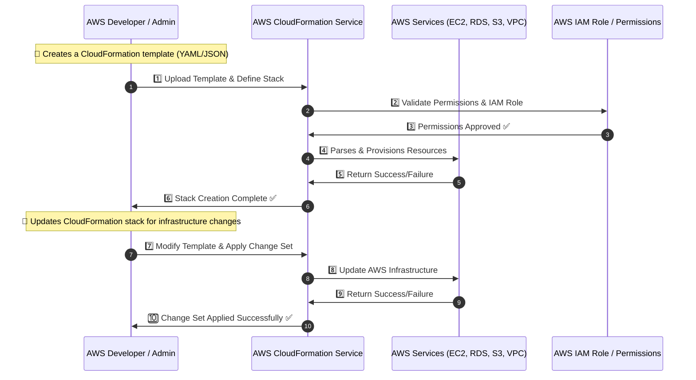
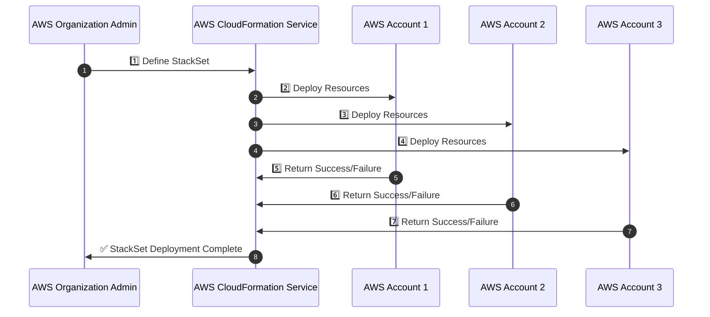
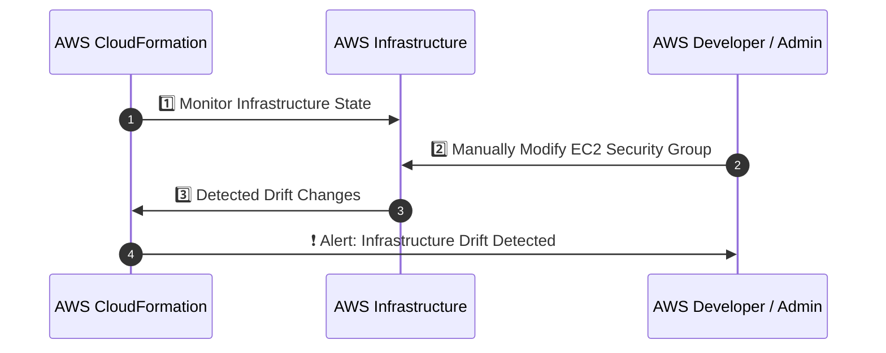
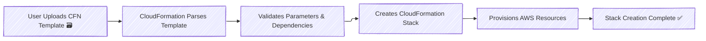
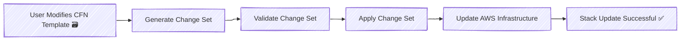
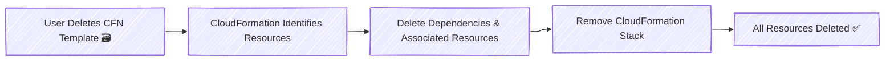

# **🔧 AWS CloudFormation**

AWS CloudFormation is an **Infrastructure as Code (IaC) service** that **automates the provisioning, management, and deprovisioning** of AWS resources using **declarative templates** (YAML/JSON).

✔ **Manages AWS resources automatically** (EC2, RDS, VPC, IAM, S3, Lambda, etc.).  
✔ **Ensures infrastructure consistency** across multiple environments.  
✔ **Eliminates manual errors** in AWS infrastructure management.

🔹 **Why Use AWS CloudFormation?**  
✅ Reduces **manual AWS configuration**  
✅ Supports **multi-account and multi-region deployments**  
✅ Enables **rollback & version control** for infrastructure

---

## 🏗️ **How AWS CloudFormation Works (Step-by-Step)**

AWS CloudFormation **orchestrates** infrastructure deployment through a **workflow of Stacks, StackSets, and Change Sets**.



✅ **Automates AWS resource provisioning & modification**  
✅ **Ensures infrastructure is deployed in a predictable manner**

---

## 🔑 **Key AWS CloudFormation Concepts**

### **1️⃣ CloudFormation Templates**

✔ **Declarative YAML/JSON files** that define AWS resources.  
✔ Defines **EC2, RDS, S3, IAM, Lambda, VPC, etc.**  
✔ Includes **Parameters, Mappings, Conditions, Outputs, Resources**.

---

### **2️⃣ CloudFormation Stacks**

✔ A **stack** is an instance of a **CloudFormation template**, just like an object is an instance of a class in OOP.  
✔ Each stack is created with different parameters, just like objects are created with different attributes.

### **3️⃣ StackSets**

✔ Enables **multi-account and multi-region deployment**.  
✔ Uses **AWS Organizations** to manage infrastructure centrally.  
✔ Helps in **cross-account resource provisioning**.

🔹 **Example:** Deploy a **VPC and IAM Roles** across multiple AWS accounts in an organization.



✅ **Ensures infrastructure consistency across multiple AWS accounts and regions**.

---

### **4️⃣ Change Sets**

✔ Allows **previewing infrastructure changes before applying them**.  
✔ Helps avoid **accidental modifications or breaking changes**.

🔹 **Example:** Updating an EC2 instance type from `t2.micro` to `t3.micro`.

```yaml
ChangeSetName: "UpgradeEC2"
Resources:
  MyEC2Instance:
    Type: AWS::EC2::Instance
    Properties:
      InstanceType: t3.micro
```

✅ **Prevents unintended changes in AWS infrastructure**.

---

### **5️⃣ Drift Detection**

✔ Identifies **unintended manual changes** in AWS infrastructure.  
✔ Compares **actual AWS state** with CloudFormation template.

🔹 **Example:**

1. User manually modifies **EC2 security group rules** outside CloudFormation.
2. **Drift Detection** identifies the difference.
3. **Admin reverts** to the original CloudFormation state.



✅ **Ensures CloudFormation remains the source of truth for infrastructure.**

---

## 🛠️ **AWS CloudFormation Lifecycle & Execution Flow**

### **1️⃣ Stack Creation**



✅ **Creates a new AWS infrastructure stack based on the template.**

---

### **2️⃣ Stack Update**



✅ **Allows safe updates to AWS infrastructure without downtime.**

---

### **3️⃣ Stack Deletion**



✅ **Safely deprovisions AWS resources when no longer needed.**

---

## 🚀 **Best Practices for CloudFormation**

✅ **Use YAML instead of JSON** for readability.  
✅ **Leverage Parameters, Mappings, and Conditions** for reusable templates.  
✅ **Use Change Sets before updating stacks** to prevent accidental issues.  
✅ **Enable Drift Detection** to track infrastructure changes.  
✅ **Store CloudFormation Templates in Git repositories (GitHub, CodeCommit)**.

---

## ✅ **Conclusion**

AWS CloudFormation **automates AWS infrastructure deployment** using **Infrastructure as Code (IaC)**.

✔ **Eliminates manual provisioning & ensures consistency**  
✔ **Supports multi-account & multi-region deployments**  
✔ **Reduces risk with rollback & drift detection**

💡 **Mastering CloudFormation simplifies AWS infrastructure management, making deployments fast, secure, and scalable!** 🚀
