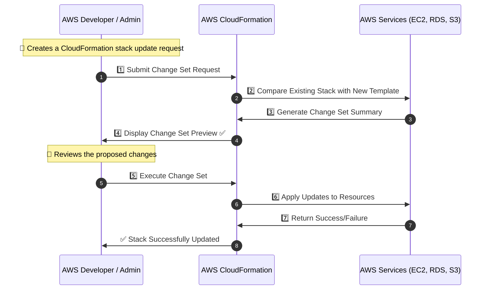

# **🔄 AWS CloudFormation Change Sets: Safely Updating Infrastructure**

## **📌 Introduction**

AWS CloudFormation **Change Sets** allow you to preview **modifications to your infrastructure** before applying them.

✔ **Prevents accidental changes** that could disrupt workloads.  
✔ **Provides a detailed preview** of added, modified, and removed resources.  
✔ **Ensures safe updates** to AWS resources with rollback protection.

---

## **🏗️ How Change Sets Work (Step-by-Step)**

Change Sets follow a **four-step lifecycle**:



---

## **📜 Creating a Change Set in AWS CloudFormation**

A **Change Set** is created when modifying an existing CloudFormation **stack**.

### **1️⃣ Create a Change Set via AWS CLI**

```sh
aws cloudformation create-change-set \
    --stack-name MyStack \
    --template-body file://updated_template.yaml \
    --change-set-name MyChangeSet
```

✅ **Submits a change request to AWS CloudFormation.**

---

### **2️⃣ View the Change Set Summary**

```sh
aws cloudformation describe-change-set --change-set-name MyChangeSet --stack-name MyStack
```

✅ **Displays all planned modifications before execution.**

Example **Change Set Output**:

```json
{
  "Changes": [
    {
      "ResourceChange": {
        "Action": "Modify",
        "LogicalResourceId": "MyEC2Instance",
        "ResourceType": "AWS::EC2::Instance",
        "Replacement": "True",
        "Scope": ["Properties"],
        "Details": [
          {
            "Target": {
              "Attribute": "InstanceType",
              "Name": "InstanceType",
              "RequiresRecreation": "Always"
            },
            "ChangeSource": "DirectModification",
            "Evaluation": "Static"
          }
        ]
      }
    }
  ]
}
```

🔹 **In this example**:

- The **EC2 instance type** is changing.
- **Instance recreation is required** due to a major change.

✅ **Allows verification of the impact before deployment.**

---

### **3️⃣ Execute the Change Set**

```sh
aws cloudformation execute-change-set --change-set-name MyChangeSet --stack-name MyStack
```

✅ **Applies the changes to the stack.**

---

### **4️⃣ Deleting a Change Set (If Not Needed)**

```sh
aws cloudformation delete-change-set --change-set-name MyChangeSet --stack-name MyStack
```

✅ **Cancels an unwanted update.**

---

## **🔄 Understanding Change Set Actions**

A Change Set can **add, modify, or remove resources**.

| **Action** | **Description**                       |
| ---------- | ------------------------------------- |
| **Add**    | A new resource will be created.       |
| **Modify** | An existing resource will be updated. |
| **Remove** | A resource will be deleted.           |

---

## **🔄 Change Set vs Direct Stack Updates**

| **Feature**                     | **Change Set** | **Direct Stack Update** |
| ------------------------------- | -------------- | ----------------------- |
| **Preview of changes**          | ✅ Yes         | ❌ No                   |
| **Rollback on failure**         | ✅ Yes         | ❌ No                   |
| **Safe updates**                | ✅ Yes         | ⚠ Risky                 |
| **Visibility before execution** | ✅ Yes         | ❌ No                   |

---

## **📜 Best Practices for Using Change Sets**

✅ **Always create a Change Set before modifying a stack.**  
✅ **Use `describe-change-set` to review modifications before execution.**  
✅ **Verify if resources require replacement (`Replacement: True`).**  
✅ **Test updates in a separate environment before applying to production.**  
✅ **Use IAM least privilege principles to restrict Change Set execution.**

---

## 📍 **Conclusion**

AWS CloudFormation **Change Sets** provide a **safe and controlled approach** to updating AWS infrastructure.

✔ **Prevents unexpected downtime by previewing updates.**  
✔ **Improves visibility of infrastructure changes.**  
✔ **Ensures secure and predictable AWS deployments.**
