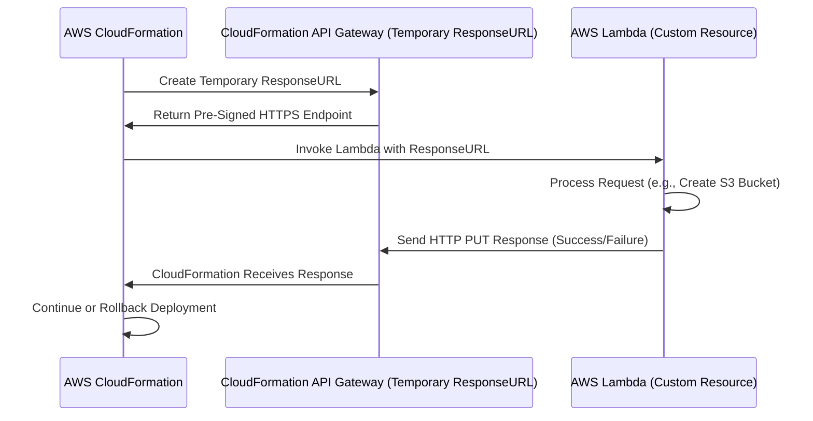

# 🔍 **CloudFormation's Temporary HTTPS ResponseURL Behind the Scenes**

Since you're a developer, let’s **deep dive into what’s happening behind the hood** of CloudFormation’s **temporary HTTPS ResponseURL** and how AWS implements it.

---

## 🔥 **What is CloudFormation's ResponseURL?**

CloudFormation needs a way to receive **asynchronous responses** from **Custom Resources** (such as an AWS Lambda function). Instead of **polling Lambda** for the response, it creates a **temporary HTTPS endpoint** where the Lambda function must send a **one-time response**.

💡 **In short:**

- AWS **CloudFormation generates a unique HTTPS webhook URL**.
- This URL is included in the **event sent to Lambda**.
- The Lambda function **must send an HTTP PUT request** to this URL with the result.
- **CloudFormation listens for the response** and then continues the stack execution.

---

## 🔄 **How Does AWS Generate the ResponseURL?**

Although AWS doesn’t publicly disclose its internal architecture, based on cloud engineering principles, this is **how CloudFormation likely implements the ResponseURL system**:

### 🔧 **Step 1: CloudFormation Generates a Temporary ResponseURL**

When CloudFormation detects a **Custom Resource** in a stack, it:  
1️⃣ **Creates a temporary HTTPS endpoint** (ResponseURL)

- The URL **looks like an Amazon S3 pre-signed URL**, but it is NOT a real S3 file.
- Instead, AWS likely uses **Amazon API Gateway + AWS Lambda** to handle responses behind the scenes.

2️⃣ **Encodes a unique request ID** in the URL, which includes:

- **Stack ID** (to track which stack the request belongs to)
- **Request ID** (a unique identifier for this specific request)
- **Expiration timestamp** (so the URL becomes invalid after some time)

✅ Example **ResponseURL** that CloudFormation sends to Lambda:

```plaintext
https://cloudformation-custom-resource-response.s3.amazonaws.com/arn%3Aaws%3Acloudformation%3Aus-east-1%3A123456789012%3Astack%2FMyStack%2Fuuid%3Aabc-12345-xyz
```

---

### 🔧 **Step 2: AWS Hosts a Temporary HTTPS Endpoint**

Once the **ResponseURL** is generated, AWS must **host a backend service** to listen for incoming HTTP requests.

🚀 **Possible AWS Services Used by CloudFormation:**  
✅ **Amazon API Gateway** – To create a temporary webhook endpoint.  
✅ **AWS Lambda** – To process incoming responses and validate the request.  
✅ **Amazon SQS (or DynamoDB)** – To temporarily store responses before CloudFormation fetches them.

👉 **AWS might be using an internal API Gateway or similar managed service** to expose this temporary HTTPS endpoint.

---

### 🔧 **Step 3: CloudFormation Waits for a Response**

- Once AWS generates the **ResponseURL**, it **pauses the stack execution**.
- It **waits for Lambda (or another Custom Resource handler) to send a response** to that URL.

👉 **CloudFormation does NOT poll the ResponseURL.**  
👉 It simply waits for an **HTTP PUT request**.

---

### 🔧 **Step 4: Lambda Sends the Response to the Temporary Endpoint**

Your **AWS Lambda function** (or any other Custom Resource) must **send an HTTP PUT request** to the **ResponseURL**.

💡 **What Happens When Lambda Sends the Response?**

- Lambda **sends a JSON payload** via an **HTTP PUT request**.
- The CloudFormation backend **validates the request** to ensure:  
  ✅ The `RequestId` matches an active stack operation.  
  ✅ The **ResponseURL has not expired**.  
  ✅ The response **includes a valid success/failure status**.

✅ **Example of Lambda Sending a Response**

```python
import json
import requests

def handler(event, context):
    response_body = {
        "Status": "SUCCESS",
        "PhysicalResourceId": "custom-resource-123",
        "StackId": event["StackId"],
        "RequestId": event["RequestId"],
        "LogicalResourceId": event["LogicalResourceId"],
        "Data": {"Message": "Resource Created Successfully"}
    }

    response_url = event["ResponseURL"]

    # Send the response via an HTTP PUT request
    requests.put(response_url, data=json.dumps(response_body))

    print("Response sent to CloudFormation")
```

---

### 🔧 **Step 5: CloudFormation Processes the Response**

When AWS receives the response:

- It **extracts the request ID** from the ResponseURL.
- It **matches the request** to an active stack operation.
- It **parses the response body** to check if the operation was successful.

💡 **What happens next?**

- ✅ If `Status: SUCCESS` → **CloudFormation continues the stack deployment.**
- ❌ If `Status: FAILED` → **CloudFormation rolls back the stack.**

---

### 🔧 **Step 6: CloudFormation Deletes the Temporary Endpoint**

Once CloudFormation **receives the response**, it:  
1️⃣ **Closes the webhook (ResponseURL)** so it **cannot be used again**.  
2️⃣ **Continues or rolls back the CloudFormation stack execution**.  
3️⃣ The **ResponseURL expires automatically** after a short time.

---

## 🏗 **Diagram: How CloudFormation’s Temporary HTTPS Endpoint Works**



---

## 🎯 **How AWS Might Implement This Internally**

AWS **likely implements CloudFormation's ResponseURL system** using:
✅ **Amazon API Gateway** – To expose the temporary HTTPS endpoint.  
✅ **AWS Lambda (Internal)** – To process incoming responses.  
✅ **Amazon SQS / DynamoDB** – To temporarily store responses while CloudFormation waits.  
✅ **AWS CloudFormation Event System** – To notify the stack when the response arrives.

### **Alternative Approach AWS Might Use**

AWS might be using an **internal, serverless webhook system** instead of API Gateway:

- The ResponseURL could point to an **AWS-internal service** handling stack execution.
- AWS **does not need to use S3**—the URL just **looks like a pre-signed S3 URL**.
- The CloudFormation backend **validates** the request and **updates stack state**.

---

## 🎯 **Key Takeaways**

✅ **CloudFormation's ResponseURL is NOT a real pre-signed S3 URL**.  
✅ **It is actually a temporary HTTPS endpoint (webhook) created by CloudFormation**.  
✅ **AWS likely uses API Gateway + Lambda to process responses**.  
✅ **Lambda sends an HTTP PUT request to the ResponseURL, not S3**.  
✅ **Once CloudFormation receives the response, the ResponseURL expires**.

---

## 🚀 **Final Thoughts**

🔹 Now you fully understand how AWS **implements CloudFormation’s temporary HTTPS ResponseURL system**!  
🔹 It behaves **like a webhook**, but AWS **hides the backend details** from users.  
🔹 This ensures that **CloudFormation gets real-time updates from Lambda** instead of polling for results.

💡 **Would you like a real-world project implementing a webhook-based response system like CloudFormation? Let me know! 🚀**
