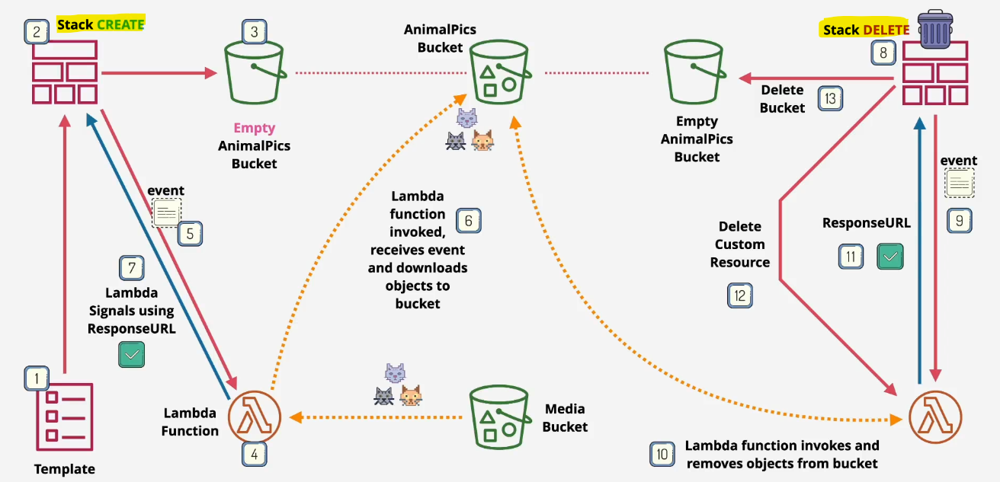
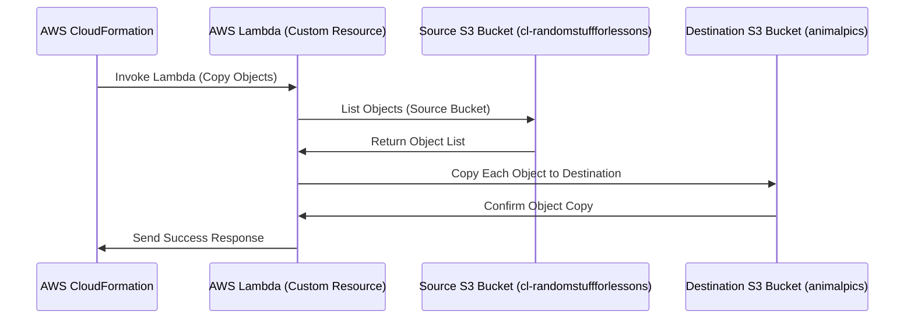

# 🚀 **AWS CloudFormation Custom Resource Example – Copying Objects Between S3 Buckets**

## 📌 **Introduction**

This guide explains another **real-world AWS CloudFormation Custom Resource** example where we use an **AWS Lambda function** to copy objects from a **source S3 bucket** (`cl-randomstuffforlessons`) into a **newly created S3 bucket** (`animalpics`).

This is useful for:  
✅ **Automatically copying default files** (e.g., templates, images, or data) into new S3 buckets.  
✅ **Ensuring new S3 buckets start with pre-loaded data**.  
✅ **Using CloudFormation for fully automated bucket provisioning and content population**.

---

<div style="text-align: center"></div>

---

## 🔄 **1. How This CloudFormation Custom Resource Works**

### 📌 **High-Level Workflow**



---

## 🏗 **2. CloudFormation Template Breakdown**

This CloudFormation template defines all AWS resources required for the **custom resource setup**.

```yaml
Description: S3 Bucket Using a custom Resource
Resources:
  animalpics:
    Type: AWS::S3::Bucket
  copyanimalpics:
    Type: "Custom::S3Objects"
    Properties:
      ServiceToken: !GetAtt CopyS3ObjectsFunction.Arn
      SourceBucket: "cl-randomstuffforlessons"
      SourcePrefix: "customresource"
      Bucket: !Ref animalpics
  S3CopyRole:
    Type: AWS::IAM::Role
    Properties:
      Path: /
      AssumeRolePolicyDocument:
        Version: 2012-10-17
        Statement:
          - Effect: Allow
            Principal:
              Service: lambda.amazonaws.com
            Action: sts:AssumeRole
      Policies:
        - PolicyName: S3Access
          PolicyDocument:
            Version: 2012-10-17
            Statement:
              - Sid: AllowLogging
                Effect: Allow
                Action:
                  - "logs:CreateLogGroup"
                  - "logs:CreateLogStream"
                  - "logs:PutLogEvents"
                Resource: "*"
              - Sid: ReadFromLCBucket
                Effect: Allow
                Action:
                  - "s3:ListBucket"
                  - "s3:GetObject"
                Resource:
                  - !Sub "arn:aws:s3:::cl-randomstuffforlessons"
                  - !Sub "arn:aws:s3:::cl-randomstuffforlessons/*"
              - Sid: WriteToStudentBuckets
                Effect: Allow
                Action:
                  - "s3:ListBucket"
                  - "s3:GetObject"
                  - "s3:PutObject"
                  - "s3:PutObjectAcl"
                  - "s3:PutObjectVersionAcl"
                  - "s3:DeleteObject"
                  - "s3:DeleteObjectVersion"
                  - "s3:CopyObject"
                Resource:
                  - !Sub "arn:aws:s3:::${animalpics}"
                  - !Sub "arn:aws:s3:::${animalpics}/*"
  CopyS3ObjectsFunction:
    Type: AWS::Lambda::Function
    Properties:
      Description: Copies objects into buckets
      Handler: index.handler
      Runtime: python3.9
      Role: !GetAtt S3CopyRole.Arn
      Timeout: 120
      Code:
        ZipFile: |
          import os 
          import json
          import cfnresponse
          import boto3
          import logging

          from botocore.exceptions import ClientError
          client = boto3.client('s3')
          logger = logging.getLogger()
          logger.setLevel(logging.INFO)

          def handler(event, context):
            logger.info("Received event: %s" % json.dumps(event))
            source_bucket = event['ResourceProperties']['SourceBucket']
            source_prefix = event['ResourceProperties'].get('SourcePrefix') or ''
            bucket = event['ResourceProperties']['Bucket']
            prefix = event['ResourceProperties'].get('Prefix') or ''

            result = cfnresponse.SUCCESS

            try:
              if event['RequestType'] == 'Create' or event['RequestType'] == 'Update':
                result = copy_objects(source_bucket, source_prefix, bucket, prefix)
              elif event['RequestType'] == 'Delete':
                result = delete_objects(bucket, prefix)
            except ClientError as e:
              logger.error('Error: %s', e)
              result = cfnresponse.FAILED

            cfnresponse.send(event, context, result, {})

          def copy_objects(source_bucket, source_prefix, bucket, prefix):
            paginator = client.get_paginator('list_objects_v2')
            page_iterator = paginator.paginate(Bucket=source_bucket, Prefix=source_prefix)
            for key in {x['Key'] for page in page_iterator for x in page['Contents']}:
              dest_key = os.path.join(prefix, os.path.relpath(key, source_prefix))
              if not key.endswith('/'):
                print 'copy {} to {}'.format(key, dest_key)
                client.copy_object(CopySource={'Bucket': source_bucket, 'Key': key}, Bucket=bucket, Key = dest_key)
            return cfnresponse.SUCCESS

          def delete_objects(bucket, prefix):
            paginator = client.get_paginator('list_objects_v2')
            page_iterator = paginator.paginate(Bucket=bucket, Prefix=prefix)
            objects = [{'Key': x['Key']} for page in page_iterator for x in page['Contents']]
            client.delete_objects(Bucket=bucket, Delete={'Objects': objects})
            return cfnresponse.SUCCESS
```

---

### 📜 **1️⃣ Creating the Target S3 Bucket (`animalpics`)**

This is where **the copied objects** will be stored.

```yaml
Resources:
  animalpics:
    Type: AWS::S3::Bucket
```

✅ Creates an **S3 bucket** to store copied objects.

---

### 📜 **2️⃣ Creating the IAM Role for Lambda (`S3CopyRole`)**

The Lambda function needs permissions to:

- **Read from the source S3 bucket** (`cl-randomstuffforlessons`).
- **Write to the destination S3 bucket** (`animalpics`).

```yaml
S3CopyRole:
  Type: AWS::IAM::Role
  Properties:
    Path: /
    AssumeRolePolicyDocument:
      Version: 2012-10-17
      Statement:
        - Effect: Allow
          Principal:
            Service: lambda.amazonaws.com
          Action:
            - sts:AssumeRole
    Policies:
      - PolicyName: S3Access
        PolicyDocument:
          Version: 2012-10-17
          Statement:
            - Sid: AllowLogging
              Effect: Allow
              Action:
                - "logs:CreateLogGroup"
                - "logs:CreateLogStream"
                - "logs:PutLogEvents"
              Resource: "*"
            - Sid: ReadFromLCBucket
              Effect: Allow
              Action:
                - "s3:ListBucket"
                - "s3:GetObject"
              Resource:
                - !Sub "arn:aws:s3:::cl-randomstuffforlessons"
                - !Sub "arn:aws:s3:::cl-randomstuffforlessons/*"
            - Sid: WriteToStudentBuckets
              Effect: Allow
              Action:
                - "s3:ListBucket"
                - "s3:GetObject"
                - "s3:PutObject"
                - "s3:DeleteObject"
                - "s3:CopyObject"
              Resource:
                - !Sub "arn:aws:s3:::${animalpics}"
                - !Sub "arn:aws:s3:::${animalpics}/*"
```

✅ Allows Lambda to **list, read, write, and copy** objects in S3.

---

### 📜 **3️⃣ Creating the Lambda Function (`CopyS3ObjectsFunction`)**

This function will:

- Copy objects **from the source S3 bucket** (`cl-randomstuffforlessons`).
- Store them **in the new S3 bucket** (`animalpics`).

```yaml
CopyS3ObjectsFunction:
  Type: AWS::Lambda::Function
  Properties:
    Description: Copies objects into buckets
    Handler: index.handler
    Runtime: python3.9
    Role: !GetAtt S3CopyRole.Arn
    Timeout: 120
    Code:
      ZipFile: |
        import os 
        import json
        import cfnresponse
        import boto3
        import logging
        from botocore.exceptions import ClientError

        client = boto3.client('s3')
        logger = logging.getLogger()
        logger.setLevel(logging.INFO)

        def handler(event, context):
          logger.info("Received event: %s" % json.dumps(event))
          source_bucket = event['ResourceProperties']['SourceBucket']
          source_prefix = event['ResourceProperties'].get('SourcePrefix') or ''
          bucket = event['ResourceProperties']['Bucket']
          prefix = event['ResourceProperties'].get('Prefix') or ''

          result = cfnresponse.SUCCESS

          try:
            if event['RequestType'] == 'Create' or event['RequestType'] == 'Update':
              result = copy_objects(source_bucket, source_prefix, bucket, prefix)
            elif event['RequestType'] == 'Delete':
              result = delete_objects(bucket, prefix)
          except ClientError as e:
            logger.error('Error: %s', e)
            result = cfnresponse.FAILED

          cfnresponse.send(event, context, result, {})

        def copy_objects(source_bucket, source_prefix, bucket, prefix):
          paginator = client.get_paginator('list_objects_v2')
          page_iterator = paginator.paginate(Bucket=source_bucket, Prefix=source_prefix)
          for key in {x['Key'] for page in page_iterator for x in page['Contents']}:
            dest_key = os.path.join(prefix, os.path.relpath(key, source_prefix))
            if not key.endswith('/'):
              print(f'copy {key} to {dest_key}')
              client.copy_object(CopySource={'Bucket': source_bucket, 'Key': key}, Bucket=bucket, Key=dest_key)
          return cfnresponse.SUCCESS

        def delete_objects(bucket, prefix):
          paginator = client.get_paginator('list_objects_v2')
          page_iterator = paginator.paginate(Bucket=bucket, Prefix=prefix)
          objects = [{'Key': x['Key']} for page in page_iterator for x in page['Contents']]
          client.delete_objects(Bucket=bucket, Delete={'Objects': objects})
          return cfnresponse.SUCCESS
```

✅ **What This Does**

- Uses `list_objects_v2` to **find files in the source bucket**.
- Uses `copy_object` to **copy them to the new bucket**.
- Handles **Create, Update, and Delete** events from CloudFormation.

---

### 📜 **4️⃣ Defining the Custom Resource (`copyanimalpics`)**

This triggers the **Lambda function** to start copying objects.

```yaml
copyanimalpics:
  Type: "Custom::S3Objects"
  Properties:
    ServiceToken: !GetAtt CopyS3ObjectsFunction.Arn
    SourceBucket: "cl-randomstuffforlessons"
    SourcePrefix: "customresource"
    Bucket: !Ref animalpics
```

✅ **What Happens?**

1. CloudFormation **creates the new S3 bucket** (`animalpics`).
2. It **invokes the Lambda function** (`CopyS3ObjectsFunction`).
3. The Lambda function **copies objects from `cl-randomstuffforlessons/customresource`**.
4. Objects are **stored in the `animalpics` bucket**.

---

## 🛠 **3. Deploying the Stack**

### 📜 **Step 1: Save the CloudFormation Template**

Save the template as `s3-copy-resource.yaml`.

### 📜 **Step 2: Deploy the Stack**

```sh
aws cloudformation deploy \
    --template-file s3-copy-resource.yaml \
    --stack-name S3-Copy-Stack \
    --capabilities CAPABILITY_NAMED_IAM
```

---

## 🎯 **4. Summary**

✅ **Automatically copies objects from a source S3 bucket** into a **new bucket**.  
✅ **Uses a CloudFormation Custom Resource with AWS Lambda**.  
✅ **Handles Create, Update, and Delete events** in CloudFormation.  
✅ **Lambda function finds, copies, and deletes S3 objects dynamically**.
