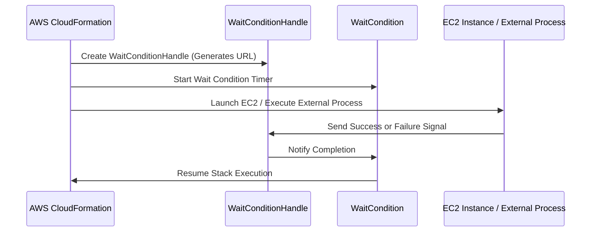

# 🚀 **AWS CloudFormation Wait Condition – The Ultimate Guide**

## 📌 **Introduction**

AWS **CloudFormation Wait Conditions** allow you to **pause stack execution** until an external signal is received. This is useful for **synchronizing asynchronous tasks** such as software installations, custom scripts, external service provisioning, or manual approvals before continuing CloudFormation stack deployment.

💡 **Why Use Wait Conditions?**  
✅ Ensures **resources are fully configured** before proceeding.  
✅ Allows **external processes (e.g., software installations) to complete** before moving forward.  
✅ Supports **manual approvals or third-party service integrations**.  
✅ Helps **synchronize dependent CloudFormation resources**.

### ✅ **What You’ll Learn in This Guide:**

✔ What CloudFormation Wait Conditions are and when to use them.  
✔ How Wait Conditions work and their components.  
✔ Two ways to implement Wait Conditions in CloudFormation.  
✔ Real-world use cases and best practices.

---

## 📌 **1. What is a Wait Condition in CloudFormation?**

A **Wait Condition** in CloudFormation is a mechanism that **pauses stack execution until CloudFormation receives a success or failure signal**.

### 💡 **When Should You Use Wait Conditions?**

✅ **Waiting for an EC2 instance to finish bootstrapping software** (e.g., installing packages).  
✅ **Pausing execution until an external API service completes provisioning**.  
✅ **Waiting for manual approval before proceeding with deployment**.  
✅ **Synchronizing complex dependencies between multiple AWS resources**.

### 🔥 **Two Ways to Implement Wait Conditions in CloudFormation**

| **Method**                                           | **Uses**                                                                                      | **Best For**                                                                                   |
| ---------------------------------------------------- | --------------------------------------------------------------------------------------------- | ---------------------------------------------------------------------------------------------- |
| **Using `AWS::CloudFormation::WaitConditionHandle`** | Generates a pre-signed URL that an external process must call to signal success or failure.   | **External scripts, APIs, or third-party services that send HTTP requests to CloudFormation.** |
| **Using `CreationPolicy` with `cfn-signal`**         | The resource (e.g., an EC2 instance) sends a signal to CloudFormation when setup is complete. | **EC2 bootstrapping, software installations, or internal AWS resource dependencies.**          |

---

## 🔄 **2. How Wait Conditions Work & Their Components**

### **🛠 Key Components of a Wait Condition**

**1️⃣ `AWS::CloudFormation::WaitCondition`**

- Defines the **timeout** and the **number of success signals** required before continuing the stack execution.

**2️⃣ `AWS::CloudFormation::WaitConditionHandle`** _(for external signals)_

- Generates a **pre-signed URL** that an external process (e.g., script, API) can send a success/failure signal to.

**3️⃣ `CreationPolicy` with `cfn-signal`** _(for EC2 and AWS-managed processes)_

- Allows an AWS resource to **send a success signal** when it completes a task.

### **🔍 CloudFormation Wait Condition Workflow**



---

## 📌 **3. Method 1: Using `WaitConditionHandle` for External Signals**

### ✅ **Step 1: Define the Wait Condition Handle**

This resource **creates a pre-signed URL** where an external script or API sends a success or failure signal.

```yaml
MyWaitHandle:
  Type: AWS::CloudFormation::WaitConditionHandle
```

💡 **CloudFormation generates a temporary pre-signed S3 URL, valid only during stack execution.**

---

### ✅ **Step 2: Define the Wait Condition**

This resource **pauses stack execution** until a success signal is received.

```yaml
MyWaitCondition:
  Type: AWS::CloudFormation::WaitCondition
  Properties:
    Handle: !Ref MyWaitHandle
    Timeout: "600" # Waits for 10 minutes
    Count: 1 # Requires 1 success signal to proceed
```

✅ **The stack will fail if no signal is received within `Timeout` seconds.**

---

### ✅ **Step 3: Send a Success Signal (External Script or API Call)**

An external script or service must send a **PUT request** to the `WaitConditionHandle` URL.

### **Bash Example:**

```sh
curl -X PUT -H 'Content-Type:' --data-binary \
    '{"Status": "SUCCESS", "Reason": "Setup Complete", "UniqueId": "MyResourceID", "Data": "Process Finished"}' \
    http://pre-signed-url-generated-by-MyWaitHandle
```

💡 **If a failure occurs, send `"Status": "FAILURE"` instead.**

---

## 📌 **4. Method 2: Using `CreationPolicy` and `cfn-signal` for EC2 Bootstrapping**

### ✅ **Step 1: Define an EC2 Instance with `CreationPolicy`**

This approach **removes the need for a separate WaitConditionHandle** and uses **cfn-signal** instead.

```yaml
App1Server:
  Type: AWS::EC2::Instance
  Properties:
    InstanceType: t2.micro
    ImageId: !Ref ImageId
    SecurityGroups:
      - !Ref App1SecurityGroup
    Tags:
      - Key: Name
        Value: !Sub ${AWS::StackName}-app1
    UserData: !Base64
      Fn::Sub: |
        #!/bin/bash -xe
        yum update -y
        yum install -y aws-cfn-bootstrap

        amazon-linux-extras install -y nginx1
        service nginx start

        /opt/aws/bin/cfn-signal -e $? --stack ${AWS::StackName} --resource App1ConfigWait --region ${AWS::Region}
```

✅ **EC2 runs a script, installs required software (`nginx`), and signals success using `cfn-signal`.**

---

### ✅ **Step 2: Define the Wait Condition with `CreationPolicy`**

```yaml
App1ConfigWait:
  Type: AWS::CloudFormation::WaitCondition
  DependsOn: App1Server
  CreationPolicy:
    ResourceSignal:
      Count: 1
      Timeout: PT5M
```

✅ **CloudFormation waits until it receives the expected signals (`Count: 1`).**  
✅ **If `cfn-signal` is not sent within `Timeout`, stack creation fails.**

---

## 🔥 **5. Real-World Use Cases for Wait Conditions**

✅ **Waiting for an EC2 instance to complete its software installation** before continuing.  
✅ **Delaying stack execution until a third-party API completes provisioning**.  
✅ **Manually approving stack deployment before proceeding**.  
✅ **Ensuring external processes (e.g., database migrations) finish before moving to the next step**.

---

## 🎯 **6. Best Practices for Using Wait Conditions**

✅ **Use `cfn-signal` instead of `WaitConditionHandle` whenever possible** to simplify stack deployment.  
✅ **Set realistic timeouts (`Timeout: X`)** to avoid long delays in stack execution.  
✅ **Ensure that the external process reliably sends success signals** to prevent stack failures.  
✅ **Use `DependsOn` correctly** to make sure the Wait Condition is dependent on the resource it is waiting for.  
✅ **Monitor CloudFormation stack logs in CloudWatch** to debug issues.

---

## 🚀 **7. Conclusion**

AWS CloudFormation **Wait Conditions** provide a powerful way to **pause stack execution** until an external process completes.

### ✅ **Key Takeaways**

✔ **Wait Conditions allow external scripts, servers, or APIs to control CloudFormation stack execution**.  
✔ **You can use `WaitConditionHandle` for external processes or `CreationPolicy` with `cfn-signal` for EC2 automation**.  
✔ **Timeouts ensure that stacks do not remain indefinitely in progress**.  
✔ **`cfn-signal` is the preferred method for EC2 bootstrapping**.

🚀 **Now you're ready to use Wait Conditions effectively in your CloudFormation stacks!** 🎯🔥
