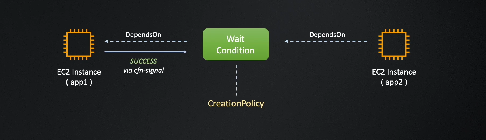
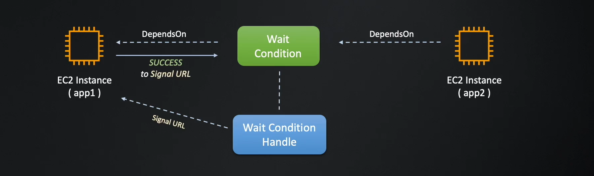

# 🚀 **AWS CloudFormation Wait Conditions & Creation Policies – The Ultimate Guide**

## 📌 **Introduction**

CloudFormation provides multiple ways to **pause stack execution** until a process is completed. Choosing the right method can be confusing, so this guide will break down the **three different approaches** and explain **when to use each one**.

### ✅ **What You’ll Learn in This Guide:**

✔ The **three different ways** to handle wait conditions in CloudFormation.  
✔ When to use **CreationPolicy vs. WaitCondition vs. WaitConditionHandle**.  
✔ Step-by-step **examples and comparisons** of each method.  
✔ Best practices for choosing the **right approach** for your use case.

---

## 🔥 **Three Methods to Wait for a Condition in CloudFormation**

| **Method**                                 | **Best for**                                                          | **Requires WaitCondition?** | **Requires WaitConditionHandle?** | **Uses cfn-signal?** |
| ------------------------------------------ | --------------------------------------------------------------------- | --------------------------- | --------------------------------- | -------------------- |
| **1. CreationPolicy on EC2**               | Waiting for an AWS resource (e.g., EC2, Auto Scaling) to be ready.    | ❌ No                       | ❌ No                             | ✅ Yes               |
| **2. WaitCondition + WaitConditionHandle** | Waiting for an external process (e.g., script, API, manual approval). | ✅ Yes                      | ✅ Yes                            | ❌ No                |
| **3. CreationPolicy on WaitCondition**     | Waiting for multiple AWS resources before proceeding.                 | ✅ Yes                      | ❌ No                             | ✅ Yes               |

---

## 🔖 **1. Using `CreationPolicy` on an EC2 Instance**

✅ **Best for:** Waiting for an **EC2 instance or AWS resource** to complete its bootstrapping before proceeding.  
✅ **Does NOT need a `WaitCondition` or `WaitConditionHandle`.**  
✅ **`cfn-signal` sends the success signal inside EC2’s UserData.**

### **How It Works**

1️⃣ CloudFormation **launches the EC2 instance**.  
2️⃣ EC2 **executes a setup script** (e.g., installs software).  
3️⃣ EC2 **sends a success signal using `cfn-signal`**.  
4️⃣ CloudFormation **waits for the signal** before moving forward.

### **CloudFormation Code**

```yaml
Resources:
  MyEC2Instance:
    Type: AWS::EC2::Instance
    Properties:
      InstanceType: t2.micro
      ImageId: ami-12345678
      UserData:
        Fn::Base64: !Sub |
          #!/bin/bash
          yum install -y httpd
          /usr/bin/cfn-signal --success true --stack ${AWS::StackName} --resource MyEC2Instance --region ${AWS::Region}
    CreationPolicy:
      ResourceSignal:
        Count: 1
        Timeout: PT5M
```

✅ **CloudFormation waits until `cfn-signal` is received before proceeding.**

📌 **Use `CreationPolicy` on EC2 when you only need to wait for that single instance to be ready!**

---

## 🔖 **2. Using `WaitCondition` + `CreationPolicy` _(CreationPolicy on WaitCondition)_ (Multiple AWS Resources)**

✅ **Best for:** Waiting for **multiple AWS resources** before proceeding.  
✅ **Does NOT need a `WaitConditionHandle`.**  
✅ **Multiple resources can send signals to a single `WaitCondition`.**

### **How It Works**

1️⃣ CloudFormation **creates an EC2 instance (`App1Server`)**.  
2️⃣ EC2 **runs a script and signals `App1ConfigWait` using `cfn-signal`**.  
3️⃣ CloudFormation **waits for the required number of signals** before proceeding.  
4️⃣ Once signals are received, **CloudFormation proceeds to create `App2Server`**.

### **CloudFormation Code**

```yaml
Resources:
  App1Server:
    Type: AWS::EC2::Instance
    Properties:
      InstanceType: t2.micro
      ImageId: ami-12345678
      UserData: !Base64
        Fn::Sub: |
          #!/bin/bash -xe
          yum install -y httpd
          /usr/bin/cfn-signal --success true --stack ${AWS::StackName} --resource App1ConfigWait --region ${AWS::Region}

  App1ConfigWait:
    Type: AWS::CloudFormation::WaitCondition
    DependsOn: App1Server
    CreationPolicy:
      ResourceSignal:
        Count: 1
        Timeout: PT5M

  App2Server:
    Type: AWS::EC2::Instance
    DependsOn: App1ConfigWait
    Properties:
      InstanceType: t2.micro
      ImageId: ami-12345678
```

✅ **`App2Server` only starts after `App1Server` successfully completes setup.**

📌 **Use `CreationPolicy` on `WaitCondition` when waiting for multiple AWS resources!**

### **Full Example**



```yaml
AWSTemplateFormatVersion: "2010-09-09"
Description: Sample template for the wait conditions examples of AWS
  CloudFormation Step by Step course series.

Parameters:
  ImageId:
    Type: AWS::EC2::Image::Id
    Description: AMI of server instances

Resources:
  App1Server:
    Type: AWS::EC2::Instance
    Properties:
      InstanceType: t2.micro
      ImageId: !Ref ImageId
      SecurityGroups:
        - !Ref App1SecurityGroup
      Tags:
        - Key: Name
          Value: !Sub ${AWS::StackName}-app1
      UserData: !Base64
        Fn::Sub: |
          #!/bin/bash -xe
          yum update -y
          yum install -y aws-cfn-bootstrap

          amazon-linux-extras install -y nginx1
          service nginx start

          /opt/aws/bin/cfn-signal -e $? --stack ${AWS::StackName} --resource App1ConfigWait --region ${AWS::Region}

  App1ConfigWait:
    Type: AWS::CloudFormation::WaitCondition
    DependsOn: App1Server
    CreationPolicy:
      ResourceSignal:
        Count: 1
        Timeout: PT5M

  App2Server:
    Type: AWS::EC2::Instance
    DependsOn: App1ConfigWait
    Properties:
      InstanceType: t2.micro
      ImageId: !Ref ImageId
      Tags:
        - Key: Name
          Value: !Sub ${AWS::StackName}-app2

  App1SecurityGroup:
    Type: AWS::EC2::SecurityGroup
    Properties:
      GroupDescription: Security group for the server
      SecurityGroupIngress:
        - CidrIp: 0.0.0.0/0
          FromPort: 80
          ToPort: 80
          IpProtocol: tcp
        - CidrIp: 0.0.0.0/0
          FromPort: 22
          ToPort: 22
          IpProtocol: tcp

Outputs:
  App1PublicDNS:
    Description: Public DNS name of the app1 instance
    Value: !GetAtt App1Server.PublicDnsName
```

---

## 🔖 **3. Using `WaitCondition` + `WaitConditionHandle` (Multiple External Resources)**

✅ **Best for:** Waiting for **external scripts, APIs, or manual approvals** before continuing stack execution.  
✅ **Requires a `WaitConditionHandle` to generate a pre-signed URL.**  
✅ **External process must send an HTTP request to signal success/failure.**

### **How It Works**

1️⃣ CloudFormation **creates a `WaitConditionHandle`**, which generates a **pre-signed URL**.  
2️⃣ CloudFormation **starts a `WaitCondition`**, waiting for the signal.  
3️⃣ An **external process (script, API, human approval) sends a success signal** to the URL.  
4️⃣ CloudFormation **receives the signal** and resumes stack execution.

### **CloudFormation Code**

```yaml
Resources:
  MyWaitHandle:
    Type: AWS::CloudFormation::WaitConditionHandle

  MyWaitCondition:
    Type: AWS::CloudFormation::WaitCondition
    Properties:
      Handle: !Ref MyWaitHandle
      Timeout: "600"
      Count: 1
```

### **External Script to Send a Success Signal**

```sh
curl -X PUT -H 'Content-Type:' --data-binary \
    '{"Status": "SUCCESS", "Reason": "Setup Complete", "UniqueId": "MyExternalProcess", "Data": "Process Finished"}' \
    http://pre-signed-url-generated-by-MyWaitHandle
```

✅ **CloudFormation pauses until the external process completes and sends a success signal.**

📌 **Use `WaitCondition` + `WaitConditionHandle` when waiting for an external process!**

### **Full Example**



```yaml
AWSTemplateFormatVersion: 2010-09-09
Description: >-
  Sample template for the wait conditions examples of
  AWS CloudFormation Step by Step course series.

Parameters:
  ImageId:
    Type: AWS::EC2::Image::Id
    Description: AMI of server instances

Resources:
  App1Server:
    Type: AWS::EC2::Instance
    Properties:
      InstanceType: t2.micro
      ImageId: !Ref ImageId
      SecurityGroups:
        - !Ref App1SecurityGroup
      Tags:
        - Key: Name
          Value: !Sub "${AWS::StackName}-app1"
      UserData:
        Fn::Base64: !Sub |
          #!/bin/bash -xe
          yum update -y

          amazon-linux-extras install -y nginx1
          service nginx start

          curl -X PUT '${App1ConfigWaitHandle}' -d '
          {
            "Status": "SUCCESS",
            "UniqueId": "Signal1",
            "Data": "Data attribute value",
            "Reason": "Configuration finished!"
          }'

  App1ConfigWait:
    Type: AWS::CloudFormation::WaitCondition
    DependsOn: App1Server
    Properties:
      Handle: !Ref App1ConfigWaitHandle
      Count: 1
      Timeout: 300

  App1ConfigWaitHandle:
    Type: AWS::CloudFormation::WaitConditionHandle

  App2Server:
    Type: AWS::EC2::Instance
    DependsOn: App1ConfigWait
    Properties:
      InstanceType: t2.micro
      ImageId: !Ref ImageId
      Tags:
        - Key: Name
          Value: !Sub "${AWS::StackName}-app2"

  App1SecurityGroup:
    Type: AWS::EC2::SecurityGroup
    Properties:
      GroupDescription: Security group for the server
      SecurityGroupIngress:
        - CidrIp: "0.0.0.0/0"
          FromPort: 80
          ToPort: 80
          IpProtocol: tcp
        - CidrIp: "0.0.0.0/0"
          FromPort: 22
          ToPort: 22
          IpProtocol: tcp

Outputs:
  App1PublicDNS:
    Description: Public DNS name of the app1 instance
    Value: !GetAtt App1Server.PublicDnsName
```

---

## 🔥 **Final Comparison**

| **Method**                                 | **Best For**                                           | **Needs WaitCondition?** | **Needs WaitConditionHandle?** | **Uses cfn-signal?** |
| ------------------------------------------ | ------------------------------------------------------ | ------------------------ | ------------------------------ | -------------------- |
| **1. CreationPolicy on EC2**               | Waiting for an AWS resource (EC2, Auto Scaling)        | ❌ No                    | ❌ No                          | ✅ Yes               |
| **2. WaitCondition + WaitConditionHandle** | Waiting for external scripts, APIs, or manual approval | ✅ Yes                   | ✅ Yes                         | ❌ No                |
| **3. CreationPolicy on WaitCondition**     | Waiting for multiple AWS resources before proceeding   | ✅ Yes                   | ❌ No                          | ✅ Yes               |

---

## 🚀 **Conclusion**

Now you know **when to use each method** and **how to implement them correctly in CloudFormation!** 🎯🔥

### ✅ **Key Takeaways**

✔ **Use `CreationPolicy` for AWS resources that support `cfn-signal` (EC2, Auto Scaling, Lambda).**  
✔ **Use `WaitCondition + WaitConditionHandle` when waiting for an external script, API, or manual approval.**  
✔ **Use `CreationPolicy` on `WaitCondition` when multiple AWS resources need to complete before proceeding.**  
✔ **Ensure timeouts are reasonable to prevent stack failures.**

🚀 **Now you’re ready to handle wait conditions and creation policies like a pro!** 🎯🔥
