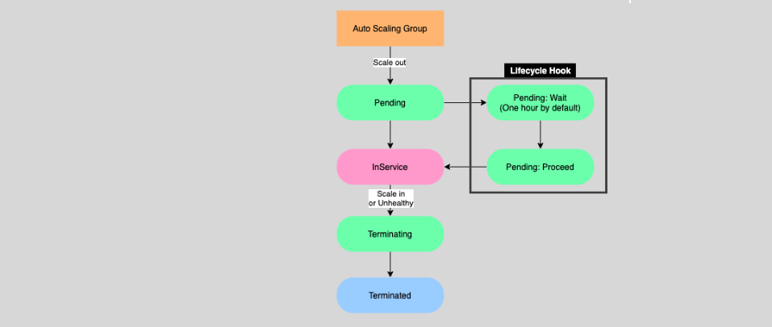

# **EC2 Auto Scaling – Lifecycle Hooks ⏳**

Lifecycle hooks in EC2 Auto Scaling allow you to perform custom actions during the launch or termination of instances in an Auto Scaling group. By pausing the instances in a wait state, you gain more control over the scaling process. These hooks can be crucial for verifying an instance is ready before it starts accepting traffic or for capturing logs before an instance is terminated.

---

## **What Are Lifecycle Hooks? 🔄**

Lifecycle hooks let you pause an instance during its launch or termination in an Auto Scaling group. When paused, the instance remains in a **wait state** until the specified action is completed, or until the **timeout period** (default of 1 hour) expires.

### **Benefits of Lifecycle Hooks:**

- **Verify readiness**: Ensure the instance is fully initialized before it is placed in service.
- **Capture logs**: Collect logs or other important data before terminating an instance.

Lifecycle hooks offer enhanced control over instance lifecycles, ensuring smooth scaling operations.

---

## **Scale-Out Lifecycle Hook 🚀**

When a new instance is launched by Auto Scaling, you may want to make sure it is fully initialized and configured before it is registered with a load balancer (ELB) or starts accepting traffic.

### **How It Works:**

- **Pause on launch**: The lifecycle hook pauses the instance after launch and before it is marked as **InService**.
- **Run initialization tasks**: The instance can run **bootstrap scripts** to complete any required setup, such as software installation or configurations.
- **Register with ELB**: Once the instance is ready, it is automatically registered with the ELB to start receiving traffic.

  

### **Example Use Case:**

For a web server launched by Auto Scaling, the lifecycle hook ensures that all necessary configurations, like security updates and application settings, are applied before the server starts handling traffic. This guarantees a properly configured and secure server environment.

---

## **Scale-In Lifecycle Hook 🔽**

When scaling in, instances are terminated to reduce the number of resources used. However, you may need to pause the termination process to perform custom actions, such as capturing logs or performing cleanup tasks.

### **How It Works:**

- **Pause on termination**: The lifecycle hook pauses the instance termination process.
- **Event notification**: You can configure the hook to **send notifications** using **EventBridge**, triggering automated workflows for tasks like log extraction.
- **Log capture and data collection**: You can use **AWS Lambda** or **Systems Manager** to connect to the instance and collect logs before it's terminated.

  

### **Example Use Case:**

If an application is running on an EC2 instance, and you need to capture application logs before scaling down, the lifecycle hook gives you time to extract logs or other data from the instance. This can be automated through AWS Lambda and EventBridge to trigger the log extraction process.

---

## **How Lifecycle Hooks Fit in the Scaling Process ⚙️**

### **1. Scale-Out:**

- Ensure that the instance is fully initialized and ready to accept traffic.
- Example: Run **bootstrap scripts** and then register with the ELB.

### **2. Scale-In:**

- Pause termination to capture logs or perform other necessary tasks.
- Example: Use **EventBridge** and **AWS Lambda** to retrieve logs before termination.

---

## **Conclusion 🎯**

Lifecycle hooks in EC2 Auto Scaling give you precise control over the scaling process. Whether you're launching new instances or terminating old ones, lifecycle hooks allow you to pause and perform custom actions, ensuring that your instances are properly configured and that no important data is lost during termination. With **Scale-Out** and **Scale-In** hooks, you can automate crucial tasks like initialization and log management, improving both availability and operational efficiency.
