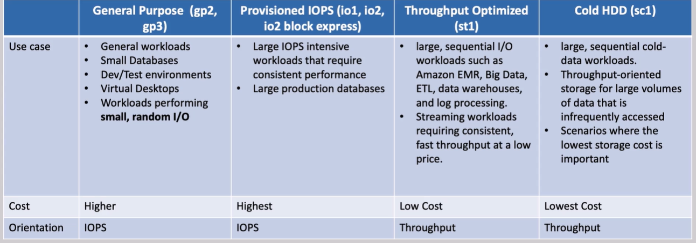

# 📦 Amazon EBS (Elastic Block Store) – Scalable, Persistent Storage for EC2 🖴

Amazon **Elastic Block Store (EBS)** is a high-performance, durable, block-level storage service designed to work seamlessly with Amazon EC2. It offers **persistent storage** that exists independently of EC2 instance lifecycles and is ideal for storing everything from OS boot volumes to mission-critical databases.

---

## 🔑 Key Features of Amazon EBS

- 🧠 **Persistent Storage**: Your data stays intact, even when the instance is stopped or terminated.
- 🔁 **Replicated for Durability**: EBS volumes are automatically replicated within the same AZ to protect against hardware failure.
- 🔗 **Single Instance Attachment**: Each volume is attached to one EC2 instance (except in Multi-Attach scenarios).
- 📍 **Same AZ Requirement**: Volumes and instances must reside in the same Availability Zone.
- 🔄 **Multi-Attach (io1/io2 only)**: Volumes can be shared across multiple EC2 instances for high availability.

---

## 🏅 EBS Volume Types – Pick the Right Tool for the Job

### 🚀 SSD-Backed Volumes (Random I/O)

#### 💻 General Purpose SSD (gp3, gp2)

- Use Case: Boot volumes, dev/test, general-purpose apps.
- gp3 supports up to **16,000 IOPS** and **1,000 MB/s throughput** (configurable).
- gp2 performance scales with volume size (max **3,000 IOPS**).

#### ⚙️ Provisioned IOPS SSD (io1, io2)

- Use Case: Mission-critical databases (e.g., Oracle, SQL Server, SAP HANA).
- Up to **64,000 IOPS** per volume, and **256,000 IOPS** across an instance.
- io2 offers **higher durability (99.999%)** and **Multi-Attach support**.

---

### 🐢 HDD-Backed Volumes (Sequential I/O)

#### 🚌 Throughput Optimized HDD (st1)

- Use Case: Streaming logs, data lakes, big data analytics.
- Up to **500 MB/s throughput**, designed for large block sequential I/O.

#### ❄️ Cold HDD (sc1)

- Use Case: Archival storage and infrequently accessed data.
- Very low cost; lowest IOPS and throughput.

---

## 🔗 Multi-Attach – Share a Volume Across Multiple EC2 Instances

The **Multi-Attach** feature allows a provisioned IOPS SSD (io1 or io2) EBS volume to be attached to multiple EC2 instances (up to 16 in the same AZ). This capability is useful for high-availability applications where multiple EC2 instances need to access the same volume concurrently.

- 🌀 **Attach a single io1/io2 volume to up to 16 EC2 instances** in the same AZ.
- 📡 Enables high-availability apps like clustered file systems and databases.
- ⚠️ **Concurrency must be managed at the app level** – EBS does NOT handle locking.
- ❌ Cannot use for boot volumes.

**Real-world Example**: MySQL clusters or shared file systems where each EC2 instance needs write/read access to the same data.

---

    

---

## 🔧 Elastic Volumes – Modify Without Downtime

With **Elastic Volumes**, you can dynamically adjust:

- 📏 **Volume size** (only increase allowed)
- ⚙️ **Volume type** (e.g., from gp2 to io2)
- 🚀 **Performance** (adjust IOPS and throughput on gp3)

Changes are applied **without detaching** the volume – zero downtime scaling!

---

## 🧪 What About Instance Store?

Some EC2 instances offer **Instance Store volumes**:

- ⚡ **Ephemeral storage** – Data lost when instance stops or terminates.
- 💥 Super-fast (NVMe-backed options) with up to **millions of IOPS**.
- 📦 Best for temporary data like caches, buffers, or scratch space.
- 🚫 Not persistent – don’t use for critical or long-term data.

Example: Use Instance Store for Redis caching, and EBS for long-term database files.

---

## 🔍 EBS Volume Type Comparison

    

| Volume Type               | Best For                     | Max IOPS / Throughput     | Key Benefit                              |
| ------------------------- | ---------------------------- | ------------------------- | ---------------------------------------- |
| gp3 (General Purpose SSD) | Most workloads, boot volumes | 16,000 IOPS / 1,000 MB/s  | Custom IOPS & throughput, cost-effective |
| io1/io2 (Provisioned SSD) | Databases, HA apps           | 64,000+ IOPS / 4,000 MB/s | High IOPS, Multi-Attach, durability      |
| st1 (Throughput HDD)      | Big data, streaming logs     | ~500 IOPS / 500 MB/s      | Low-cost, high-throughput                |
| sc1 (Cold HDD)            | Archiving, infrequent access | ~250 IOPS / 250 MB/s      | Cheapest storage option                  |

---

## 🧠 Final Thoughts

EBS is the **go-to block storage** solution for EC2 in AWS. Whether you’re running a high-performance database, serving content from a web server, or archiving logs, there’s an EBS volume tailored to your needs.

✅ **Choose SSDs for IOPS-heavy workloads**.  
✅ **Choose HDDs for large, sequential reads/writes**.  
✅ **Use Multi-Attach and Elastic Volumes** for high availability and flexibility.

Design smart, scale safely, and optimize costs by understanding your app’s performance profile.
