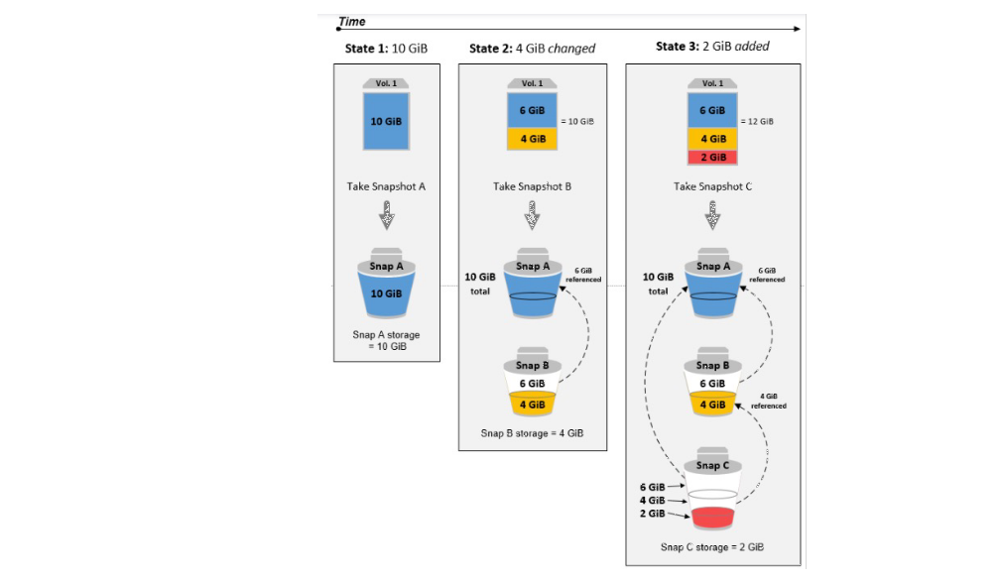
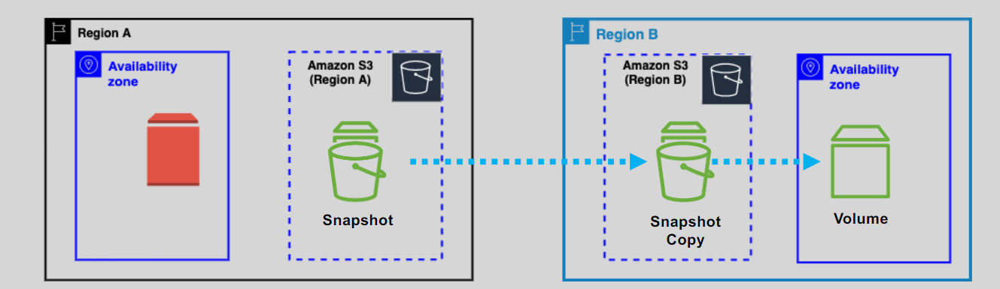

# 📸 Amazon EBS Snapshots – Efficient, Scalable Backup for Your Volumes 💾

Amazon **EBS Snapshots** provide point-in-time backups of your EBS volumes, stored securely in Amazon S3. They are **incremental** by design—only storing changes since the last snapshot—making them highly efficient for **backup**, **disaster recovery**, **volume replication**, and **cross-AZ or cross-region cloning**.

---

    

---

## 🔑 Key Features

- ✅ **Stored in Amazon S3** – Snapshots are backed by durable S3 storage (not directly accessible to you).
- 🌍 **Region-Scoped** – Snapshots are tied to the region of the source volume.
- 🔁 **Incremental** – After the first full snapshot, only changes are saved in future snapshots.
- 🧪 **Crash-Consistent** – You can create snapshots without stopping the volume. They capture the current state.
- 🚀 **Create Volumes Anywhere** – Use snapshots to create new volumes in different **Availability Zones** or even across **regions**.

---

    

---

## 🌐 Cross-Region Snapshot Copy

Want to use a snapshot in another region? You must **copy** it first:

- 📤 Copy snapshots manually or automate it via **AWS Backup** or **Lambda**.
- 📦 Once copied, you can **launch volumes or AMIs** from the new region.

---

    

---

## 🧩 How Snapshots Work

1. **First Snapshot** → Full copy of the volume.
2. **Subsequent Snapshots** → Only store changes (deltas).
3. **Concurrent Access** → Volume stays available during the snapshot process.

---

## 🔁 Automation Tools

Simplify snapshot management with:

- 📆 **Data Lifecycle Manager (DLM)**: Define policies to schedule and expire snapshots.
- 📡 **CloudWatch Events + Lambda**: Trigger snapshot creation on instance events.

---

## ⚡ Fast Snapshot Restore (FSR)

Normally, volumes created from snapshots are **lazy-loaded**—data is pulled from S3 when accessed, leading to initial latency. **FSR** solves that:

- ⚡ Pre-warms the volume so full performance is available instantly.
- 🔧 Must be **explicitly enabled** for each snapshot.
- 💵 **Pricing**: ~\$0.75 per snapshot per AZ per hour
  - Example: 1 snapshot in `us-east-1a` for 30 days = ~\$540

---

## 🗃️ Snapshot Archive Tier

For long-term retention at low cost:

- 📦 Move snapshots to **EBS Snapshot Archive Tier** to save **up to 75%**.
- 🛑 Archived snapshots are stored as **full copies**, not incremental.
- 🔄 To use them again, **restore to standard tier** (can take hours).

---

## 🗑️ Recycle Bin for Snapshots and AMIs

Accidentally deleted a snapshot or AMI? Use **Recycle Bin**:

- ♻️ Recover deleted snapshots within a **retention window** you define.
- ⏳ Resources are retained for days/weeks (you choose).
- 💵 Storage still incurs regular snapshot charges during retention.

---

## 🚫 Instance Store Volumes

📌 **Snapshots only apply to EBS volumes**. You **cannot snapshot instance store** volumes. Instead:

- Copy data to **EBS volumes** and snapshot that.
- Or backup files directly to **Amazon S3**.

---

## 🏁 Conclusion

Amazon EBS Snapshots provide a powerful, cost-efficient way to back up your data, migrate workloads across AZs or regions, and protect against disasters. With features like **incremental backups**, **Fast Snapshot Restore**, **automated policies**, and **archiving**, snapshots are a core component of any reliable cloud storage strategy. Plan your lifecycle policies and leverage the right snapshot tier to get the best mix of performance, recoverability, and cost savings.
