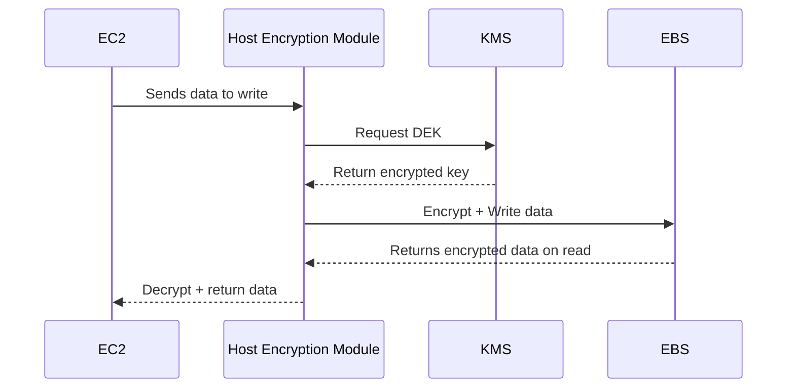
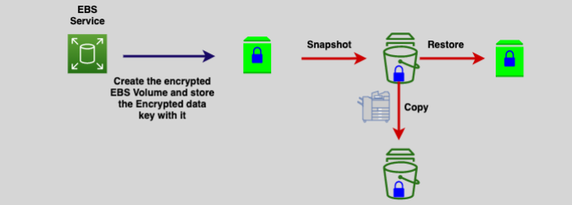
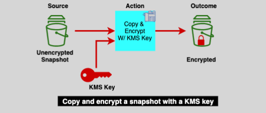
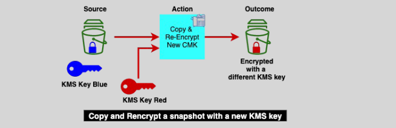
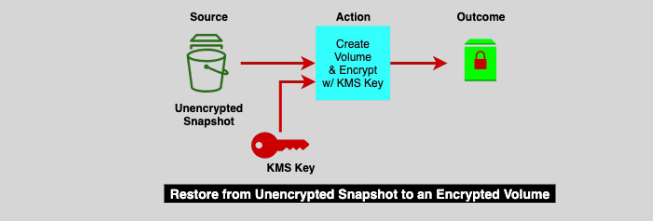
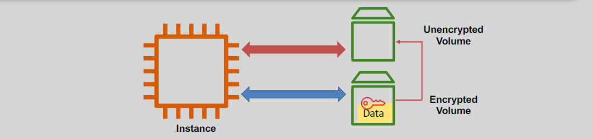

# **🔐 EBS Encryption — Simplified, Secure, and Smart**

Amazon **Elastic Block Store (EBS)** encryption helps keep your data safe by encrypting it **at rest** and **in transit** using AWS’s own **Key Management Service (KMS)**. Whether you're storing logs, databases, or backups — EBS ensures it's all **secure without extra effort on your end**.

---

## **🧠 What Is EBS Encryption?**

- **Definition:** EBS Encryption uses **AES-256** and **AWS KMS** to protect your data as it's stored and moved.
- **Built-In:** No additional tools or scripts are needed.
- **Fully Integrated:** Works with EC2, Snapshots, AMIs, and AWS Backup.
- **Invisible to Apps:** Your operating systems and applications just see regular disk volumes.

---

## **🔄 How EBS Encryption Works (Step-by-Step)**

  

### **📦 Lifecycle Overview**

1. AWS **KMS** generates a one-time-use **Data Encryption Key (DEK)**.
2. The **host encryption module** uses the DEK to encrypt/decrypt.
3. The **EC2 instance** sends/receives data — never touches raw keys.
4. The **EBS volume** stores only encrypted blocks.

### **🧬 Sequence: Behind the Scenes**

---

## **📸 Working with Snapshots**

EBS **snapshots** are like secure time machines — stored in Amazon S3 and **always encrypted at rest**.

### **Snapshot Copy Use Cases**

- 🌍 **Cross-Region Backup**
- ⚠️ **Disaster Recovery**
- 🚚 **Region Migrations**
- 📜 **Long-Term Retention & Compliance**

---

## **🔍 Real Examples: Encryption Status Scenarios**

### **1. Creating an Encrypted Volume from Scratch**

You choose a **KMS key**, and everything downstream (snapshots, restores, copies) stays encrypted.

  

---

### **2. Encrypting an Unencrypted Snapshot**

Copy it and **enable encryption** with a new KMS key during the copy.

  

---

### **3. Re-encrypting a Snapshot with a New Key**

Want to change the key? Just copy the snapshot using a different KMS key.

  

---

### **4. Encrypting a Volume from an Unencrypted Snapshot**

Choose the encryption option **during volume creation** from the snapshot.

  

---

### **5. Indirectly "Unencrypting" a Volume**

There’s no direct way to decrypt an encrypted volume, but here’s the human workaround:

1. Attach a **new unencrypted volume**.
2. Copy data from encrypted → unencrypted.
3. Boom 💥, you now have a non-encrypted version.

  

---

## **🔒 Account-Level Default Encryption**

You can **enable encryption by default** at the account level:

- All **new volumes** will be encrypted automatically.
- **Snapshots** and cross-region copies also `follow` encryption settings.
- Existing volumes **won’t be** affected retroactively.

> ⚠️ Reminder: This only applies to **new resources**, not retroactive encryption.

---

## **🎯 Final Thoughts**

EBS encryption gives you peace of mind, baked right into the cloud.

- ✅ Protects your data transparently.
- ✅ Integrates with IAM and KMS.
- ✅ Ensures compliance and security with no extra effort.

**Think of EBS encryption like having an armored vault that opens instantly every time you need it — but only for the right people 🔐.**
