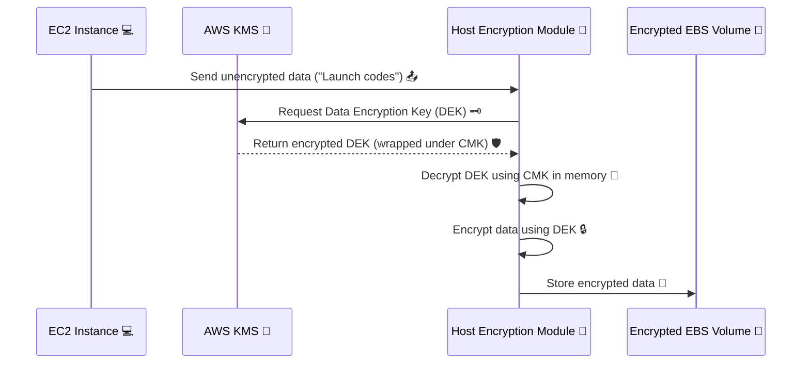
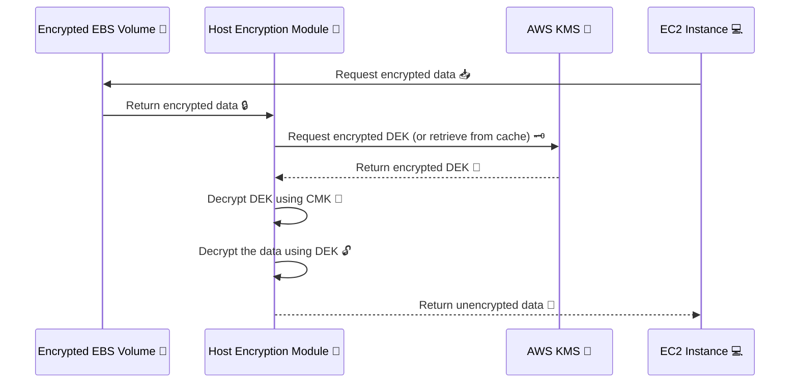

# 🛡️ **EBS Encryption & Decryption: How It Works Behind the Scenes**

Amazon **Elastic Block Store (EBS)** provides durable storage volumes that can be encrypted **at rest and in transit** — all **managed by AWS Key Management Service (KMS)**.

Let’s break down the **two main flows**:

- 🔐 Encryption flow (when **writing data** to the volume)
- 🔓 Decryption flow (when **reading data** from the volume)

---

## 🔐 **1. EBS Encryption Flow (Write Path)**

Let’s imagine your EC2 instance wants to **store** some secret data like `"Launch codes"` on an EBS volume. AWS needs to make sure this is **secure and encrypted** — even before it hits the disk.

### ⚙️ Step-by-Step: Encryption Process

---

### 🧠 Let's Break it Down

1️⃣ **EC2 Sends Data**  
Your EC2 instance writes some data like a database update or log to disk.

2️⃣ **Host Encryption Module Takes Over**  
Before the data reaches the disk, it's intercepted by a **Hypervisor-level host encryption module**.

3️⃣ **KMS Generates a Key**  
The module asks **AWS KMS** for a **Data Encryption Key (DEK)**. KMS uses a **Customer Master Key (CMK)** to generate and return an encrypted DEK.

4️⃣ **DEK is Decrypted in Memory**  
The encrypted DEK is decrypted temporarily in memory and **never stored** unencrypted on disk.

5️⃣ **Data is Encrypted with DEK**  
The module now uses this decrypted DEK to encrypt your data.

6️⃣ **Encrypted Data is Written to EBS**  
Only after encryption is complete does the data go to your EBS volume. Data **at rest** is always encrypted.

---

## 🔓 **2. EBS Decryption Flow (Read Path)**

When your EC2 instance **reads** from the encrypted EBS volume, the system reverses the process — but the EC2 never knows or touches the encryption keys.

### ⚙️ Step-by-Step: Decryption Process

---

### 🧠 Let's Break it Down

1️⃣ **EC2 Requests Data**  
Your app on EC2 asks for data (e.g., reads from a database or a file).

2️⃣ **Encrypted Data is Retrieved**  
The EBS volume sends the encrypted block to the host-level encryption module.

3️⃣ **KMS Provides the Key**  
If not already cached, the module gets the **encrypted DEK** from KMS.

4️⃣ **DEK is Decrypted Temporarily**  
The DEK is decrypted using your CMK, **inside memory only**, never written to disk.

5️⃣ **Data is Decrypted with DEK**  
The encrypted data block is decrypted using the decrypted DEK.

6️⃣ **EC2 Gets the Plaintext**  
Your EC2 instance receives **clean, decrypted data** with no clue that this magic even happened under the hood.

---

## ✨ Real-World Analogy

🔐 **Encryption = Sealing a Secret Letter**

- You (EC2) want to store a letter.
- The host encryption module is your **mailroom guy with a shredder and safe**.
- He calls AWS KMS to **get a vault key** (DEK) locked inside a box (encrypted under CMK).
- He opens the box **in memory**, encrypts your letter, locks it in a safe (EBS), and discards the key copy.

🔓 **Decryption = Opening the Safe**

- When you need the letter back, he retrieves it from the safe, unlocks the vault key again, opens the letter, and hands it to you.
- You never see the key or safe — just your letter.

---

## 🧩 Summary Table: Encryption vs. Decryption

| 🛠️ Action        | 🔐 Encryption                | 🔓 Decryption                  |
| ---------------- | ---------------------------- | ------------------------------ |
| 🔑 Key Source    | KMS (generates DEK)          | KMS (fetches DEK)              |
| 📦 Key Handling  | DEK decrypted in memory only | DEK decrypted in memory only   |
| 🧠 Module        | Host-level Encryption Module | Host-level Encryption Module   |
| 💽 Data Location | Stored encrypted on EBS      | Returned decrypted to EC2      |
| 📡 In Transit    | Encrypted automatically      | Decrypted only before delivery |

---

## ✅ Benefits of This Design

- **Zero Touch**: All this encryption/decryption is transparent to your application.
- **Key Rotation**: You can rotate your CMK in KMS; AWS re-encrypts new data automatically.
- **Compliance**: Meets standards like PCI DSS, HIPAA, GDPR, etc.
- **No Performance Tradeoff**: Encryption is optimized — you don’t take a big performance hit.
