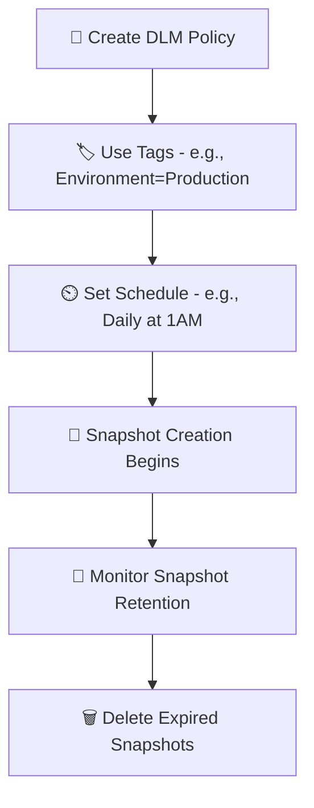

# 📅 **Amazon Data Lifecycle Manager (DLM) — Mastering EBS Snapshot Automation**

Ever felt like managing EBS snapshots manually is like trying to remember birthdays without a calendar? 🎂 Say hello to **Amazon Data Lifecycle Manager (DLM)** — your automated backup scheduler, janitor, and compliance officer all in one!

Let’s explore what it is, how it works, and why your future self will thank you for setting it up.

---

## 🔍 **What is Amazon DLM?**

**Amazon Data Lifecycle Manager (DLM)** is a **fully managed AWS service** that automates:

- 📸 **Snapshot creation** (backups)
- 🗑️ **Snapshot deletion** (cleanup)
- ⏳ **Retention management** (keep only what matters)

> 📦 DLM is specifically designed for **Amazon EBS volumes** and their **snapshots**, reducing the manual overhead of managing backups and improving your data hygiene game.

---

## 🌟 **Key Features at a Glance**

| Feature                       | Description                                                         |
| ----------------------------- | ------------------------------------------------------------------- |
| 🔄 **Automated Snapshots**    | Create snapshots on a fixed schedule (hourly, daily, weekly).       |
| 🧹 **Retention Policies**     | Keep snapshots only as long as you need (e.g., 7 or 30 days).       |
| 🏷️ **Tag-Based Selection**    | Use EC2/EBS **tags** to target volumes or instances for backup.     |
| 📦 **Multi-Volume Support**   | Snapshot all volumes attached to an instance as a consistent group. |
| ⏱️ **CloudWatch Integration** | Trigger snapshot jobs using CloudWatch events.                      |

---

## 🔄 **How DLM Works: Step-by-Step**

Let’s walk through the **full DLM lifecycle** using a simple example: You want to back up all `Environment=Production` EBS volumes **every 24 hours**, and **keep them for 7 days**.

<div style="text-align:center;">



</div>

---

### ⚙️ **1. Create a Lifecycle Policy**

You define:

- Which resources to snapshot (EBS volumes or EC2 instances)
- How often to create snapshots (e.g., every 12 hours)
- How long to keep them (e.g., retain last 14 snapshots)

> 📌 You can use the **AWS Console**, **CLI**, or **API** to define your policy.

---

### 🏷️ **2. Tag Your Resources**

Apply **tags** to your volumes or instances to indicate which ones the policy should manage.

For example:

```bash
aws ec2 create-tags --resources vol-0abc123 \
  --tags Key=Environment,Value=Production
```

> ✅ DLM will match this tag to know which volumes to snapshot.

---

### 📆 **3. DLM Executes the Schedule**

At your scheduled time (e.g., daily 2AM), DLM automatically:

- Takes a new snapshot
- Applies your defined **retention settings**
- Tags the snapshot (e.g., `CreatedBy=AmazonDLM`)

---

### 🧹 **4. Retention Management Happens Automatically**

Once a snapshot exceeds its retention period, DLM:

- Deletes the expired snapshot for you
- Ensures you're not hoarding old, costly data

---

### 🔔 **Optional: Trigger with CloudWatch**

Want to take snapshots **only after a scale-out event** or deployment? You can use **Amazon EventBridge / CloudWatch Events** to trigger a policy run on-demand! 💡

---

## 🎯 **Popular Use Cases**

| Use Case                      | How DLM Helps                                                         |
| ----------------------------- | --------------------------------------------------------------------- |
| 🧰 **Backup Automation**      | Set and forget — DLM handles regular EBS backups.                     |
| 💸 **Cost Optimization**      | Deletes old snapshots you no longer need, saving storage costs.       |
| 🛡️ **Compliance & Retention** | Enforces backup policies and retention rules for audits and recovery. |
| 💼 **Enterprise Governance**  | Centralizes backup strategy across hundreds of volumes via tags.      |

---

## 📈 **Example: Daily Backups for Production Systems**

Let’s say you run an EC2-based database in production and want daily snapshots of the EBS volumes for 14 days retention:

**Steps:**

1. Tag your volume with `Environment=Production`
2. Create a DLM policy:
   - Target volumes with that tag
   - Snapshot frequency = every 24h
   - Retention = 14 snapshots

**Result:**  
🕒 Snapshots happen daily  
🧹 After 14 days, the oldest snapshot is automatically deleted

---

## 🚀 **Benefits of Using DLM**

| Benefit              | Why It Matters                                                 |
| -------------------- | -------------------------------------------------------------- |
| ⏰ Saves Time        | You’re not writing cron jobs or scripts to back up data.       |
| 📦 Reduces Waste     | No forgotten snapshots eating your budget.                     |
| 💼 Enterprise-Ready  | Tag-based targeting works great in complex, multi-team setups. |
| 🔒 Improves Security | Regular backups = faster, more secure disaster recovery.       |

---

## 🧠 **DLM Pro Tips**

- ✅ **Use multi-volume policies** for consistent backups across app stacks.
- 🏷️ **Tag your volumes smartly** — DLM only acts on what matches.
- 🔐 Snapshots created by DLM are encrypted if the source volume is encrypted.
- 🧪 **Test restore scenarios** regularly to make sure backups work as expected.

---

## 🏁 **Conclusion**

Amazon **Data Lifecycle Manager (DLM)** is a simple but powerful automation tool that saves time, money, and headaches when managing **EBS snapshots**. Whether you're backing up one EC2 instance or hundreds, DLM ensures **resilience**, **compliance**, and **efficiency**.
