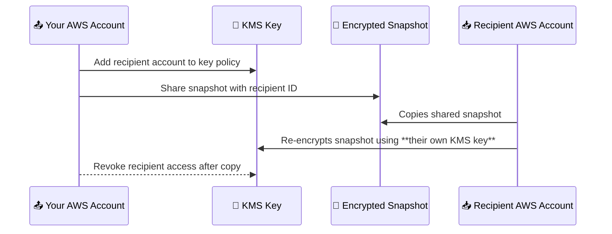

# 🔄 **Sharing EBS Snapshots**

Need to share your backups with a teammate, another AWS account, or across regions? ✅  
**Amazon EBS Snapshot Sharing** lets you do just that — but like lending your favorite book, it’s better when you _set the rules_. 📚🔐

Whether you're distributing unencrypted data publicly or sharing encrypted volumes securely, let’s walk through how snapshot sharing works, what’s allowed, and what steps you need to take.

---

## 🌍 **Sharing Unencrypted Snapshots**

Unencrypted snapshots are like handing someone a USB stick — there's no encryption key needed, just basic access permissions.

### 🔓 1. **Public Sharing**

- Anyone in the AWS universe can copy the snapshot.
- Great for open-source projects, test datasets, or public AMIs.

> ⚠️ Be careful — public means **anyone** can see it!

### 🕵️ 2. **Private Sharing with Specific Accounts**

- Share only with **specific AWS Account IDs** (e.g., your team, customers).
- You manage access from the **Permissions tab** of your snapshot.

---

## 🔐 **Sharing Encrypted Snapshots**

Encrypted snapshots are more like sealed safes: to open them, recipients must have access to the **encryption key** (KMS Key). And not just any key — it must be **your custom key**, not the AWS-managed one.

<div style="text-align:center;">
  
</div>

---

### ✅ **Checklist Before You Share:**

| Requirement                  | Explanation                                             |
| ---------------------------- | ------------------------------------------------------- |
| 🔑 Custom KMS Key            | AWS-managed keys (default KMS keys) **can’t** be shared |
| 👥 Recipient AWS Account ID  | Needed for snapshot access                              |
| ✅ KMS Key Access Permission | Must **allow the recipient account** to use your key    |

---

## 🛠️ **Step-by-Step: Sharing an Encrypted Snapshot**

Here’s the secure sharing dance:



---

## 🔑 **Detailed Breakdown of the Steps**

### 🔧 Step 1: Grant Access to the KMS Key

Go to your **KMS Console → Keys → Key Policy**, and add the recipient AWS account:

```json
{
  "Effect": "Allow",
  "Principal": { "AWS": "arn:aws:iam::123456789012:root" },
  "Action": ["kms:Decrypt", "kms:DescribeKey"],
  "Resource": "*"
}
```

> 🔐 Without this, they won’t be able to copy or use the snapshot.

---

### 📤 Step 2: Share the Snapshot

In the **EC2 Console** → Snapshots → select your snapshot → **Modify Permissions** → enter their AWS Account ID.

- Choose “**Private**” and paste their Account ID.
- Done! 🎉 They now see your snapshot in their console.

---

### 📋 Step 3: Recipient Copies & Re-encrypts

Once shared:

- The recipient **copies** the snapshot into their account.
- During the copy process, they choose their **own KMS key** to encrypt it.

> 🔁 Think of this like "make your own secure version" of my snapshot.

---

### 🚪 Step 4: Revoke Access (Optional but Recommended)

Once they’ve got their copy:

- You can safely **remove** them from your KMS key policy.
- This ensures no one can snoop around later.

> 🧼 This step is your **security cleanup**!

---

## 🧠 **Things to Keep in Mind**

| 💡 Consideration           | Why It Matters                                                                |
| -------------------------- | ----------------------------------------------------------------------------- |
| ⛔ Public Sharing Disabled | You **cannot** share encrypted snapshots publicly (only specific accounts).   |
| 🔁 Manual Region Copy      | To move snapshots across regions, recipients must manually copy & re-encrypt. |
| ⏳ Don’t Delay the Copy    | If you revoke KMS access **before** they copy, they’ll lose access entirely.  |
| 🏷️ Tag Before Sharing      | Tags help recipients identify what the snapshot is for.                       |

---

## 🎯 **Example Use Case: Multi-Account Backup Sharing**

Let’s say you have:

- 🔐 A database snapshot encrypted with `MySecureKMSKey`
- 👥 A partner team in a different AWS account (Account B)
- 🎯 You want to securely share that snapshot with them

**Your Tasks:**

1. Allow Account B to use `MySecureKMSKey`
2. Share the snapshot privately with Account B
3. Tell them to copy + re-encrypt
4. Remove their access once the copy is complete

---

## 🏁 **Conclusion: Share Wisely, Encrypt Securely**

EBS snapshot sharing is a powerful feature for collaboration, migration, and backup. But with great power comes great encryption responsibility. 🔐

- Unencrypted? Easy to share.
- Encrypted? **Follow the proper access + copy steps**.
- Always revoke access after the job’s done for **tight security control**.
