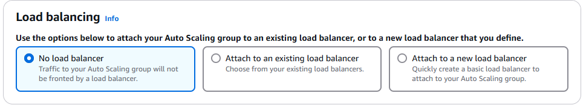
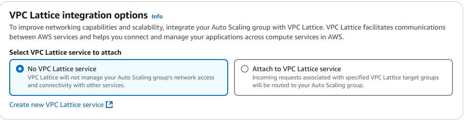
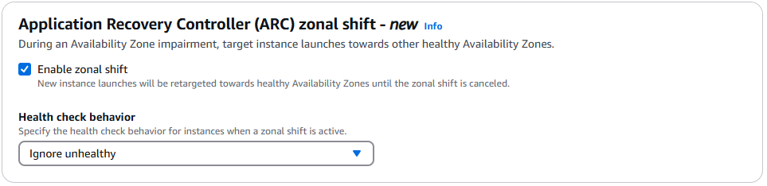
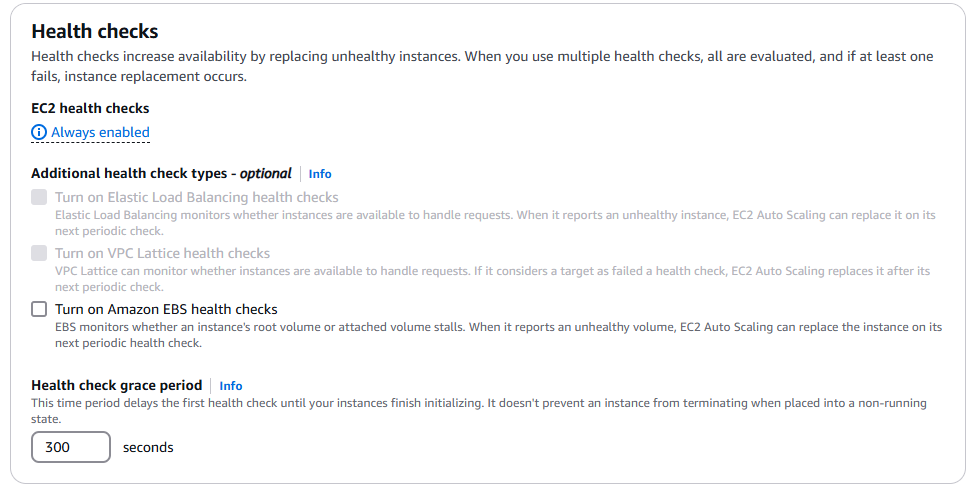

# Integrate with other services - optional

Use a load balancer to distribute network traffic across multiple servers. Enable service-to-service communications with VPC Lattice. Shift resources away from impaired Availability Zones with zonal shift. You can also customize health check replacements and monitoring.

## **Load balancing**

    

If you host an application on multiple Amazon EC2 instances, you can distribute traffic to your application across the instances by attaching an Elastic Load Balancing load balancer. The load balancer can scale to the vast majority of workloads automatically. It can also monitor the health of its registered instances and route traffic only to healthy instances.

### **1. No load balancer**

Traffic to your Auto Scaling group will not be fronted by a load balancer.

### **2. Attach to an existing load balancer**

Choose from your existing load balancers.

### **3. Attach to a new load balancer**

Quickly create a basic load balancer to attach to your Auto Scaling group.

## **VPC Lattice Integration 🕸️**

    

VPC Lattice is a service that improves networking capabilities and scalability for services running in AWS. By integrating Auto Scaling with VPC Lattice, you can enhance communication between different AWS services, making your applications more resilient and flexible.

- **No VPC Lattice Service**:

  - If you don’t need the advanced networking capabilities, you can choose not to integrate with VPC Lattice. In this case, your Auto Scaling group will not have network management from VPC Lattice.

- **Attach to VPC Lattice Service**:
  - When you integrate with VPC Lattice, incoming requests associated with specified VPC Lattice target groups will be routed to your Auto Scaling group. This helps streamline your application’s network traffic, especially in complex environments where multiple AWS services need to communicate.

---

## **Application Recovery Controller (ARC) Zonal Shift (New Feature) 🛠️**

    

When there’s an impairment in an Availability Zone (AZ), you can now redirect new EC2 instance launches to healthy AZs using the Application Recovery Controller (ARC). This feature helps you maintain availability during AZ failures.

- **Enable Zonal Shift**:

  - This option redirects new instance launches to healthy AZs during an impairment. This ensures that your application remains up and running by moving resources to a functioning zone.

- **Health Check Behavior**:
  - **Ignore Unhealthy**: When a zonal shift is active, new instances are launched in healthy zones even if the original zone was unhealthy. However, existing instances are not replaced until they fail health checks.
  - **Replace Unhealthy**: If an instance in the impaired AZ fails a health check, it will be replaced with a new instance in a healthy AZ.

## **Health Checks for Auto Scaling Group**

    

Health checks are critical for maintaining application availability by ensuring only healthy instances handle traffic. EC2 Auto Scaling provides several types of health checks.

### **EC2 Health Checks** ✔️

- **Always Enabled**: EC2 health checks are always on for ASGs. These checks monitor the EC2 instance status and, if an instance is unhealthy, it will be replaced by Auto Scaling.

### **Additional Health Check Types (Optional) ⚙️**

You can turn on additional health checks to improve the monitoring of your instances:

- **Elastic Load Balancing (ELB) Health Checks**:

  - ELB health checks determine whether instances can handle requests. If an instance is marked as unhealthy by ELB, Auto Scaling will replace it during the next health check.

- **VPC Lattice Health Checks**:

  - If integrated with VPC Lattice, this health check ensures that instances can handle requests within your VPC Lattice architecture. If a failure is detected, Auto Scaling will replace the unhealthy instance.

- **Amazon EBS Health Checks**:

  - EBS health checks monitor the health of your instance's root volume or attached EBS volumes. If the volume stalls or is unhealthy, Auto Scaling can replace the instance.

- **Health Check Grace Period**:
  - This option delays health checks for a new instance, allowing it time to initialize before the health check begins. It’s especially useful when instances take time to start (e.g., when booting up or running initialization scripts).
