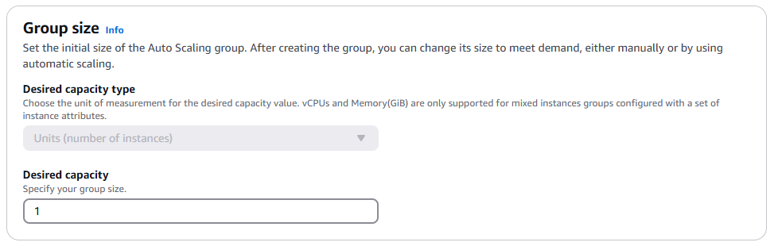
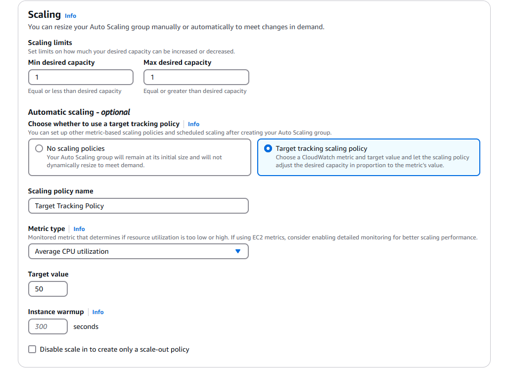
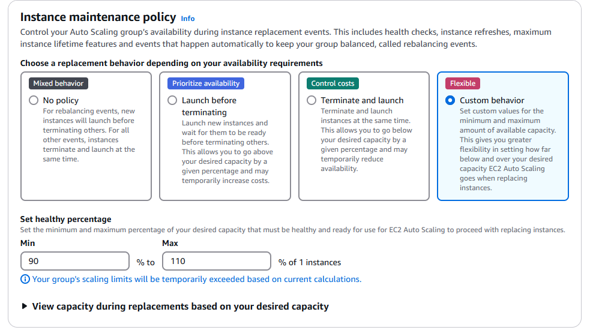
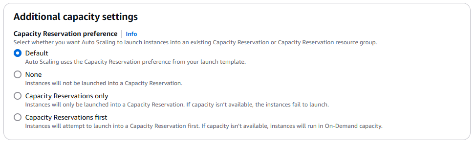
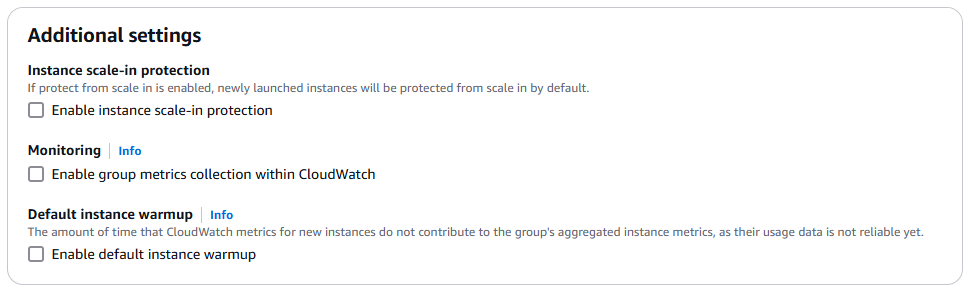

# **Configure group size and scaling**

## **Group Size** \(⚖️\)

Set the initial size of the Auto Scaling group. After creating the group, you can change its size to meet demand, either manually or by using automatic scaling.

    

**Desired Capacity Type** \(📏\)

- Normally, you just say, “I want **3 instances**.”
- But if you use a **mixed instance** group, you can choose to measure by:
  - **vCPUs** (virtual CPUs), or
  - **Memory (GiB)**.
- This means you might say, “I want **12 vCPUs** of capacity” instead of a specific number of instances.

## **Scaling** \(📈\)

You can resize your Auto Scaling group manually or automatically to meet changes in demand.

    

### **A. Scaling Limits**

- **Min Desired Capacity**: The **fewest** instances you’ll ever have—even if nobody is online.
- **Max Desired Capacity**: The **most** instances you’ll ever allow—even if you have a huge traffic spike.

_(So if you set min=1 and max=5, your group can scale **between** 1 and 5 instances.)_

### **B. Automatic scaling** \(🎯\)

#### **1. No Scaling Policies:**

If you choose _no scaling policies_, your group stays at **whatever** size you initially set (like 3). No matter how busy or quiet your service gets, it **won’t** change.

#### **2. Target tracking:**

- It is like a **thermostat** for your servers. For example:

  - If your CPU usage jumps to **70%**, AWS **launches** more instances.
  - If your CPU usage dips to **20%**, AWS **terminates** instances.

- **Instance Warmup⏲️:**

  - This is the **time** it takes for a new instance to fully “wake up” and provide accurate metrics.
  - During this period, the instance doesn’t count toward the overall CPU usage or other metrics.
  - Default warmup is often **enough**, but you can tweak it if you see scaling happening **too fast** or **too slow**.

- **Disable Scale In:**

  - If you only want **scale-out** (more instances when busy), and never scale **in** (fewer instances when quiet), you can **disable** it.
  - This is **not** typical, but it’s handy for special cases.

---

## **Instance Maintenance Policy** \(🔧\)

Picture when an instance needs to be replaced (for example, **health check** fails). The question is: **how** do you replace it without hurting your availability or your wallet?

    

### **A. Replacement Behavior**

#### **1. No Policy** \(🤷\)

- For **rebalancing** events: new instances **launch before** old ones go away.
- For **all other** events: old instances **terminate** at the same time as new ones appear.

#### **2. Launch Before Terminating** \(📈\)

- **High Availability** approach!
- AWS **launches** a new instance first, checks it’s healthy, **then** terminates the old one.
- You might temporarily have **more** instances than your desired capacity => **higher cost** but safer.

#### **3. Terminate and Launch** \(💰\)

- **Cost-Saving** approach!
- AWS **terminates** the old instance at the same time it **launches** the new one.
- You might temporarily have **fewer** instances => **lower** availability, but you save money.

#### **4. Custom Behavior** \(⚙️\)

- **Set healthy percentage**: e.g., a **min** of 90% healthy means you always keep at least 90% of the instances running while new ones come online.
- This is great if you need **very specific** control over how many instances are up or down during maintenance.

## **Additional Capacity Settings (Capacity Reservation Preference)** \(🏨\)

    

Think of **Capacity Reservations** as a “**reserved** spot” in a hotel for your instances. You can set a preference:

1. **Default**: Use the preference in the **Launch Template**.
2. **None**: Don’t use reservations at all.
3. **Capacity Reservations only**: Instances **won’t** launch if no reservation is available.
4. **Capacity Reservations first**: First **try** to use reservations. If none are available, go On-Demand.

## **Additional Settings** \(⚙️\)

    

### **A. Instance Scale-In Protection** \(🛡️\)

- **Protect** newly launched instances from scaling **in**.
- That means if your Auto Scaling Group decides to **downsize**, it **won’t** terminate those protected instances automatically.

### **B. Monitoring** \(🔍\)

- By **enabling group metrics collection**, you get more data about **how** your group is behaving (like how often it’s adding or removing instances).
- These metrics have **1-minute** detail and are stored in **CloudWatch**.
- Perfect for diagnosing weird traffic spikes or checking if scaling is working properly.

### **C. Default Instance Warmup** \(⏲️\)

- This is the **global** warmup period for _all_ newly launched instances.
- Helps ensure that your scaling policies don’t **overreact** to brand-new instances whose metrics aren’t stable yet.
- If you do an **instance refresh**, Auto Scaling also respects this warmup before moving on.
