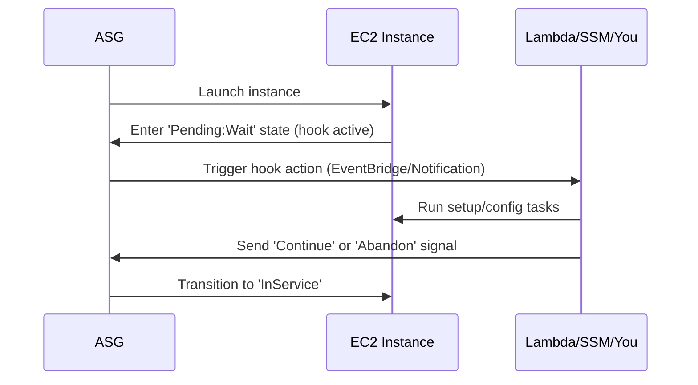
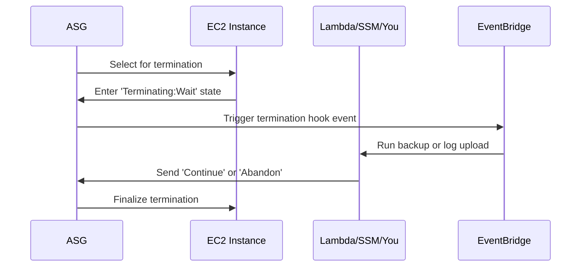

# **⏳ EC2 Auto Scaling – Lifecycle Hooks: Pause, Prepare, Proceed**

**Lifecycle Hooks** in EC2 Auto Scaling are like _"pause buttons"_ in your scaling process. They give you a moment to **intervene**, **customize**, and **automate** before an instance officially joins or exits your Auto Scaling Group (ASG). It’s like telling AWS, “Hold up! Let me finish setting this guy up before you put him to work… or fire him.”

---

<div style="text-align: center;">
  
</div>

---

## **🔍 What Are Lifecycle Hooks?**

A **Lifecycle Hook** lets you **pause** an EC2 instance during key lifecycle events:

- Just **after launch** but **before entering service**
- Just **before termination**

During this wait state, you can run **custom actions**, like:

- Installing software
- Running health checks
- Backing up logs
- Notifying a system
- Even asking for human approval (if you're old-school 👨‍💼)

If nothing happens within the defined **timeout** (default: **1 hour**), the instance **automatically continues** to the next phase unless you explicitly **abandon** or **continue** the lifecycle.

---

## **🚀 Lifecycle Hook: Scale-Out – Preparing the New Guy**

When scaling **out**, a new instance is launched. But before it's thrown into the battlefield (aka receives traffic), you might want to:

- Run **bootstrap scripts**
- Install patches
- Load app configs
- Validate the environment

### **How It Works**

<div style="text-align: center;">



</div>

### **Real-World Use Case**

> 🛠️ You're deploying a web app that requires NGINX, custom PHP packages, and secrets from AWS Secrets Manager. A **scale-out lifecycle hook** ensures the new instance has all this before serving users.

---

## **🔽 Lifecycle Hook: Scale-In – Cleaning Up Before Goodbye**

When scaling **in**, AWS is about to terminate an instance. But what if:

- You need to **extract logs**?
- Or **upload last-minute data to S3**?
- Or notify your team of termination?

Lifecycle hooks give you a final chance to do all that.

### **How It Works**

<div style="text-align: center;">



</div>

### **Real-World Use Case**

> 📦 Your application stores logs locally. Before terminating the EC2 instance, a **scale-in lifecycle hook** triggers an AWS Lambda function that uploads those logs to S3 for compliance and debugging.

---

## **⚙️ Lifecycle Hook Flow Overview**

<div style="text-align: center;">

```mermaid
graph LR
    A[Instance Launched or Selected for Termination]
    A --> B{Lifecycle Hook Exists?}
    B -- No --> D[Proceed Immediately]
    B -- Yes --> C[Enter Wait State (Pending:Wait or Terminating:Wait)]
    C --> E[Perform Custom Action (Lambda, SSM, Scripts)]
    E --> F{Signal?}
    F -- Continue --> G[Instance Proceeds]
    F -- Abandon --> H[Instance Skipped/Terminated]
    F -- Timeout --> I[Auto-Continue - unless Abandon is default]
```

</div>

---

## **🛠️ How To Implement Lifecycle Hooks**

1. **Create an Auto Scaling Group** with your desired config
2. **Define a Lifecycle Hook** (via Console, CLI, or SDK)
   - Choose **scaling event** (launch or terminate)
   - Set **timeout** (max 7200 seconds = 2 hours)
   - Optionally define a **notification target** (SNS/EventBridge)
3. Use **Lambda**, **SSM Run Command**, or other automation to handle the event
4. Send `CONTINUE` or `ABANDON` signal using the AWS CLI, SDK, or automation tool

---

## **💡 Tips & Best Practices**

| Tip                    | Description                                                                |
| ---------------------- | -------------------------------------------------------------------------- |
| 🧠 Think "Wait State"  | Hook pauses instance in "Pending:Wait" or "Terminating:Wait"               |
| ⚙️ Use Automation      | Automate with Lambda, EventBridge, or Systems Manager                      |
| ⏲️ Tune the Timeout    | Set realistic timeout to avoid auto-continue before setup/cleanup finishes |
| 🔒 Use IAM Properly    | Ensure hooked automation has permission to describe/act on ASG and EC2     |
| 📬 Watch Notifications | Use SNS/EventBridge to track and monitor lifecycle events                  |

---

## **🎯 Conclusion**

**Lifecycle Hooks** are your secret weapon for **orchestrating perfect launches** and **graceful shutdowns** in EC2 Auto Scaling. From custom configurations to last-minute log saves, they give you the **power to pause**, run code, then **resume** the scaling flow.

So next time AWS wants to launch or retire an instance — just say, _“Wait! I have one more thing!”_
