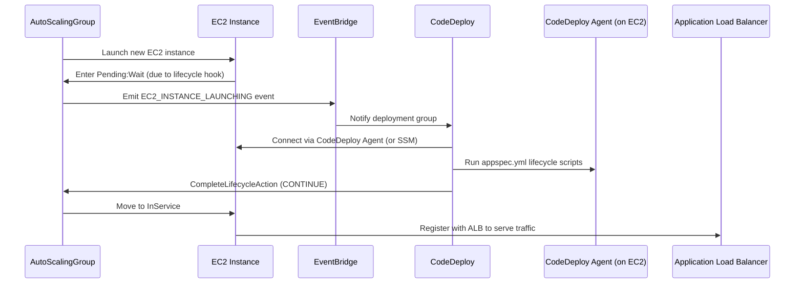

# 🚀 **CodeDeploy + Auto Scaling + ALB: Lifecycle Hook in Action**

When you deploy an app using **AWS CodeDeploy** with **EC2 Auto Scaling Groups (ASG)** and **Application Load Balancer (ALB)**, CodeDeploy magically adds a **lifecycle hook** to your ASG — but what exactly is happening behind the scenes?

Let’s unravel it together 🎯

---

## 📦 **Scenario Setup: CodeDeploy with ALB & Auto Scaling**

You’re deploying a web app with this setup:

- **EC2 Auto Scaling Group**: for scalability and high availability
- **Application Load Balancer (ALB)**: to distribute traffic across instances
- **CodeDeploy**: to manage blue/green or in-place deployments

💡 When CodeDeploy manages an **in-place deployment**, it needs to:

- Gracefully **remove instances** from traffic
- **Install the new app version**
- Then **add them back** behind the ALB

But how does CodeDeploy do this safely without interrupting user traffic?

👇 Enter: **Lifecycle Hooks**

---

## 🧩 **Why CodeDeploy Adds a Lifecycle Hook Automatically**

When CodeDeploy is integrated with an Auto Scaling Group and ALB, it **automatically injects a lifecycle hook** to **pause the instance launch process** at the perfect moment.

This hook is essential for:

| Action                              | Purpose                                                                                           |
| ----------------------------------- | ------------------------------------------------------------------------------------------------- |
| 🎯 Pause on launch (`Pending:Wait`) | Stop the instance from entering service until CodeDeploy finishes setup                           |
| 🛠️ Deploy app                       | CodeDeploy installs your app, runs lifecycle events (hooks) like `BeforeInstall`, `AfterInstall`  |
| ✅ Resume (`Continue`)              | Once all deployment steps are done, CodeDeploy signals the ASG to let the instance go `InService` |

---

## 🔍 **What Exactly Is CodeDeploy Doing?**

CodeDeploy listens for that **lifecycle hook trigger**, and then does the following:

1. 📥 **Blocks instance from serving traffic**

   - ASG says “hold on, let’s not serve requests just yet.”
   - EC2 enters `Pending:Wait` state.

2. 🛠️ **Deploys app to the instance**

   - Executes your `AppSpec.yml` lifecycle hooks like:
     - `BeforeInstall`
     - `Install`
     - `AfterInstall`
     - `ApplicationStart`
     - `ValidateService`

3. ✅ **Signals success**

   - Sends `CONTINUE` to the ASG via the lifecycle hook.
   - EC2 enters `InService` and is registered with ALB to receive traffic.

4. ❌ **Handles failure (optional)**
   - If deployment fails, CodeDeploy can send `ABANDON`, and the instance will not enter service.

---

## 🤔 So... What Triggers CodeDeploy Then?

That **pause** (hook) triggers an **EventBridge rule**.

Here’s the actual flow:

1. The instance enters the **Pending:Wait** state (due to the lifecycle hook).
2. AWS emits a **lifecycle event** (e.g., `EC2_INSTANCE_LAUNCHING`).
3. That event is captured by **Amazon EventBridge**.
4. EventBridge invokes **AWS CodeDeploy** with all necessary instance metadata.
5. CodeDeploy:
   - Knows the ASG and deployment group
   - Connects to the instance (via CodeDeploy Agent preinstalled or via SSM)
   - Starts the app deployment lifecycle (based on `appspec.yml`)
6. After deployment completes, CodeDeploy sends a **`CompleteLifecycleAction`** API call back to ASG to `CONTINUE`.

So the lifecycle hook doesn’t run code itself — it pauses the process and **delegates to CodeDeploy**, which runs the actual deployment.

---

## 🔄 Enhanced Sequence Diagram with Real AWS Services

Here’s an improved version showing the actual services involved:



---

## 📂 Behind the Scenes – What CodeDeploy Executes

When CodeDeploy takes over, it executes the stages in your `appspec.yml`:

```yaml
version: 0.0
os: linux
hooks:
  BeforeInstall:
    - location: scripts/stop_server.sh
  Install:
    - location: scripts/install_dependencies.sh
  AfterInstall:
    - location: scripts/configure_app.sh
  ApplicationStart:
    - location: scripts/start_server.sh
  ValidateService:
    - location: scripts/health_check.sh
```

These are executed **on the EC2 instance** using the **CodeDeploy Agent** (or SSM if configured for agentless).

---

## 🛠️ **How It Works Technically**

CodeDeploy uses:

| Component               | Role                                                            |
| ----------------------- | --------------------------------------------------------------- |
| 🚥 **Lifecycle Hook**   | `autoscaling:EC2_INSTANCE_LAUNCHING` hook pauses instance setup |
| 📡 **EventBridge Rule** | Triggers CodeDeploy deployment logic when instance is pending   |
| 📦 **Deployment Group** | Tied to your ASG and ALB, with lifecycle events defined         |
| 🔐 **IAM Permissions**  | CodeDeploy needs permissions to complete hooks and access EC2   |

---

## ✅ **How to Check This Hook in Action**

To see the lifecycle hook created by CodeDeploy:

```bash
aws autoscaling describe-lifecycle-hooks --auto-scaling-group-name <your-asg-name>
```

You’ll see a hook like:

```json
{
  "LifecycleHookName": "CodeDeploy_Hook_<deployment-group-id>",
  "LifecycleTransition": "autoscaling:EC2_INSTANCE_LAUNCHING",
  "DefaultResult": "ABANDON",
  "HeartbeatTimeout": 3600
}
```

> Notice the **DefaultResult is ABANDON** — if CodeDeploy doesn’t respond, the instance will not enter service!

---

## 🎯 Conclusion

When CodeDeploy is used with Auto Scaling Groups and ALB, it doesn’t just deploy — it **strategically pauses**, **configures**, and then **continues** instance launch using **lifecycle hooks**. This ensures that your app is up, configured, and ready **before** it handles even a single user request.

### ✅ Final Notes: What Makes It Work

| Component                   | Role                                              |
| --------------------------- | ------------------------------------------------- |
| **Lifecycle Hook**          | Pauses instance launch in ASG (`Pending:Wait`)    |
| **EventBridge**             | Detects the hook event and sends it to CodeDeploy |
| **CodeDeploy Agent**        | Executes deployment logic on the instance         |
| **CompleteLifecycleAction** | Final command to tell ASG to continue             |

So yes — when you see that mysterious lifecycle hook in your ASG during a CodeDeploy deployment…

> 🧙 It’s not magic. It’s just AWS being smart and letting you **orchestrate perfection**.
