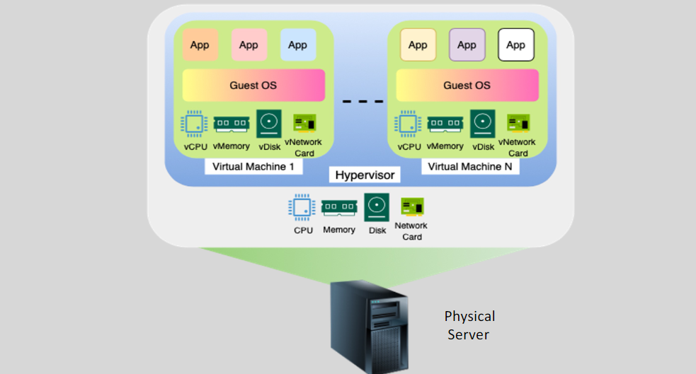

# 🖥️ **Hypervisors in AWS – Xen vs Nitro (Deep & Clear)**

> _The invisible power behind every EC2 instance. Let's open the black box and see how AWS virtualizes cloud compute!_

---

## 🤔 **What is a Hypervisor?**

A **hypervisor** is software that allows multiple **Virtual Machines (VMs)** to run on a **single physical machine**. It does this by:

- Abstracting physical resources (CPU, RAM, Disk, Network)
- Dividing and allocating those resources to each virtual machine (EC2 instance)

Hypervisors are essential for **virtualization**, which powers everything from your local VirtualBox to massive EC2 clusters on AWS.

    

---

## 🔧 **Types of Hypervisors**

| Type                       | Description                                           | Examples                                |
| -------------------------- | ----------------------------------------------------- | --------------------------------------- |
| **Type 1** (Bare Metal) 🏗️ | Runs directly on physical hardware. No underlying OS. | **Xen**, **AWS Nitro**, **VMware ESXi** |
| **Type 2** (Hosted) 🖱️     | Runs **on top of a host OS**, like an app.            | **VirtualBox**, **VMware Workstation**  |

✅ **AWS uses Type 1 hypervisors** (Xen and Nitro) for performance, security, and scalability.

---

## ⚔️ **AWS Hypervisors: Xen vs Nitro**

AWS began with **Xen**, but now uses **Nitro** for almost all new EC2 instance families. Nitro is not just a hypervisor — it’s a **whole system** that offloads resource management to **dedicated hardware**.

---

### 💻 **Xen Hypervisor**

- **Open-source**, widely adopted
- Used in early AWS EC2 instances like **M3**, **C3**, etc.
- Follows a **Domain-based architecture**:
  - `dom0`: Control domain (host)
  - `domU`: Guest domains (EC2 instances)

#### ✅ Pros

- Proven and stable
- Good isolation between instances

#### ❌ Cons

- **More overhead**
- Slower disk/network I/O
- More software = more attack surface

---

### 🚀 **AWS Nitro Hypervisor**

The Nitro System is a **hardware-software co-design**:

- Lightweight hypervisor
- Hardware acceleration via **Nitro Cards** for:
  - Networking
  - Storage
  - Security

#### 🔑 Key Benefits

- ✅ **Near bare-metal performance**
- ✅ **Offloaded management** to hardware = **lower overhead**
- ✅ **Faster startup & provisioning**
- ✅ **Enhanced isolation** via **hardware root of trust**
- ✅ **Ideal for AI/ML, big data, HPC workloads**

#### 💡 Nitro-based instances

`C5`, `M5`, `R5`, `T4g`, `Graviton`, `Inf`, and almost all modern EC2 families.

---

## 🔍 **Xen vs Nitro – Head-to-Head**

| Feature                | 🧠 **Xen**               | 🚀 **Nitro System**                                              |
| ---------------------- | ------------------------ | ---------------------------------------------------------------- |
| **Type**               | Type 1                   | Type 1                                                           |
| **Performance**        | Moderate overhead        | Near bare-metal, **hardware offload**                            |
| **Security**           | Software-based isolation | **Hardware root of trust**, enhanced security                    |
| **Provisioning Speed** | Slower                   | ⚡ Fast instance boot                                            |
| **Networking**         | Software-handled         | **ENA** (Elastic Network Adapter) = High throughput, low latency |
| **Storage**            | Software I/O             | Nitro Card for EBS = **Faster disk access**                      |
| **Isolation**          | dom0-based               | **No dom0** – no privileged OS = smaller attack surface          |
| **Scalability**        | Limited by software      | Hardware acceleration enables massive scale                      |
| **Instance Families**  | Legacy (M3, C3)          | Modern (C5, M6g, R5, Inf1, Graviton2, etc.)                      |

---

## 🛠️ **What Makes Nitro Special?**

| Feature               | Nitro Enhancement                                                |
| --------------------- | ---------------------------------------------------------------- |
| ✅ **No dom0**        | No privileged guest OS — reduces risk, improves isolation        |
| ⚡ **Nitro Cards**    | Hardware cards manage I/O: networking, storage, and security     |
| 🔐 **Secure Boot**    | Hardware-based trust ensures only signed, verified software runs |
| 🧩 **Modular Design** | Easier upgrades and innovation at the hardware layer             |
| 🚀 **Faster Startup** | Instances launch quicker due to simplified architecture          |

---

## 🧬 **Inside a Nitro-Based Physical Host**

| Component       | Description                                    |
| --------------- | ---------------------------------------------- |
| **CPU**         | 16–64 vCPUs (Intel Xeon or AWS Graviton)       |
| **RAM**         | 64GB–1TB+                                      |
| **Disk**        | NVMe SSDs or EBS volumes                       |
| **Network**     | 10–40 Gbps via ENA                             |
| **Nitro Cards** | Manage EBS, ENA, security (offloaded from CPU) |
| **Hypervisor**  | Lightweight Nitro code managing compute only   |

This allows **more compute power** to be allocated to instances, not the hypervisor.

---

## 🧪 **Real Impact: Why Nitro Matters for You**

| Use Case                | How Nitro Helps                                  |
| ----------------------- | ------------------------------------------------ |
| 🧠 AI / ML              | Lower latency, more throughput, GPU/TPU-friendly |
| 📊 Big Data             | Fast EBS + ENA = faster data crunching           |
| ⚙️ Serverless workloads | Quick provisioning, high concurrency             |
| 🔐 Compliance workloads | Stronger isolation & boot integrity              |

---

## 🔁 **Why AWS Still Uses Xen?**

| Scenario                     | Why Xen May Still Be Used                                            |
| ---------------------------- | -------------------------------------------------------------------- |
| 🕰️ **Legacy EC2 Types**      | Older families like M3, C3, T1 still use Xen                         |
| 🧪 **Special Use Cases**     | Some community AMIs may only run on Xen                              |
| 🚧 **Migration Constraints** | You might still have old workloads that depend on Xen’s architecture |

But AWS encourages **migrating to Nitro** for better security, speed, and cost efficiency.

---

## 🌟 **Conclusion: AWS Virtualization Evolved**

- **Xen** laid the foundation for AWS’s early cloud success.
- **Nitro** is the next-gen — secure, modular, fast, and built for modern workloads.
- AWS now uses Nitro across **most instance families**, delivering **closer-to-bare-metal performance** at cloud scale.
- Knowing the **hypervisor** behind your EC2 can help you:
  - Make better **instance type choices**
  - Optimize **performance and cost**
  - Understand **security guarantees**
