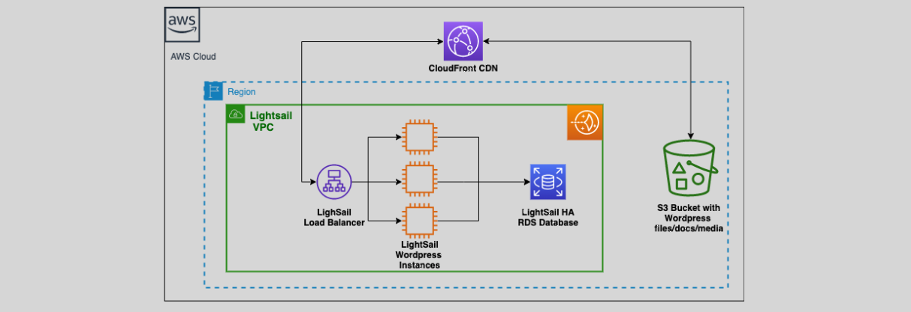

# **💡 Amazon Lightsail: Simplicity Meets Cloud Power**

**Amazon Lightsail** is AWS’s answer to “I want the cloud, but without the headaches.” Think of it as **cloud hosting simplified** — perfect for developers, startups, students, or small businesses who want to launch apps, websites, or servers quickly **without diving deep into complex AWS services like VPC, IAM, or EC2 configurations**.

---

  

---

## **🔍 What is Lightsail, Really?**

> **Official Definition:** Amazon Lightsail is an easy-to-use cloud platform that offers everything needed to build and host applications or websites, with a simple management console and predictable pricing.

Lightsail wraps common AWS services like **EC2**, **EBS**, **Load Balancer**, and **RDS**, but presents them in a **pre-packaged, user-friendly way**.

  

---

## **🚀 Why Developers Love Lightsail**

| Feature                    | Why It’s Great                                                                            |
| -------------------------- | ----------------------------------------------------------------------------------------- |
| **Simplified Interface**   | Clean dashboard, fewer knobs. No need to master EC2, VPC, IAM, etc.                       |
| **Predictable Pricing**    | Fixed monthly plans start at \$3.50/month — no surprise bills!                            |
| **One-Click Launches**     | WordPress, LAMP, Node.js, Plesk, and more, deployed instantly.                            |
| **Fully Managed Services** | Databases, load balancers, and CDN managed for you.                                       |
| **Scalable**               | While it's simple, you can scale to bigger plans or even migrate to full-blown AWS later. |

---

## **🧩 Lightsail Key Building Blocks**

### 1. **💻 Instances (Virtual Private Servers)**

Run Linux or Windows-based apps in the cloud.

### 2. **🛢️ Managed Databases**

Deploy MySQL, PostgreSQL, and soon others — all with automated backups and failover.

### 3. **🐳 Containers**

Lightweight Docker-based apps without the need for Kubernetes or ECS knowledge.

### 4. **⚖️ Load Balancers**

Distribute traffic across multiple instances — great for growing apps.

### 5. **🧭 Static IPs & DNS**

Attach consistent public IPs and use Lightsail’s built-in DNS management.

### 6. **🌎 CDN (Content Delivery Network)**

Accelerate global delivery with Lightsail’s integrated CDN powered by Amazon CloudFront.

---

## **🛠️ Typical Use Cases**

| Use Case                                   | Why Lightsail Shines                                      |
| ------------------------------------------ | --------------------------------------------------------- |
| 🖥️ **Website Hosting**                     | WordPress, Joomla, Magento — deployed in seconds.         |
| 🛒 **E-commerce**                          | Quick launch of small to medium WooCommerce shops.        |
| 🎓 **Learning/Testing**                    | Affordable sandbox environments for devs and students.    |
| 🐣 **Startups/PoC**                        | MVPs, beta products, or staging environments.             |
| ⚙️ **Containers Without the Ops Headache** | Deploy microservices in containers without orchestrators. |

---

## **🔄 Lightsail vs EC2: What's the Difference?**

| Feature         | Lightsail                                | EC2                                              |
| --------------- | ---------------------------------------- | ------------------------------------------------ |
| Setup Time      | Minutes (GUI-driven)                     | Can take longer (manual setup)                   |
| Customization   | Limited but simpler                      | Highly customizable                              |
| Network Control | Basic networking                         | Full control (VPC, subnets, security groups)     |
| Pricing         | Fixed monthly                            | Pay-as-you-go (varies by usage)                  |
| Best For        | Beginners, small teams, budget-conscious | Enterprises, custom apps, complex infrastructure |

---

## **🧠 Best Practices & Tips**

- **Use Snapshots Before Changes**: Snapshots are your rollback parachute 🎒
- **Start Small, Scale Later**: Use the smallest plan to prototype, then resize as needed.
- **Custom Domains with DNS**: Point your custom domains using Lightsail DNS zones easily.
- **Upgrade to EC2**: When your app outgrows Lightsail, use the “Export to EC2” feature to migrate seamlessly.
- **Secure It!**: Always set up key-pair authentication and keep your software patched.

---

## **📊 Real-World Example**

> 💡**Scenario:** You want to launch a personal blog using WordPress.

With Lightsail, you:

1. Select the WordPress blueprint.
2. Choose a \$3.50/month plan.
3. Get a public IP & access credentials instantly.
4. Start blogging in less than 5 minutes.

No EC2 instance types, EBS volumes, VPC configs, or IAM policies to figure out.

---

## **🎯 Conclusion**

Amazon Lightsail is your shortcut to the cloud — **a smart blend of simplicity and power** for developers who want to get things done fast, without the complexity of full AWS services. Whether you’re hosting your portfolio, launching a startup MVP, or just experimenting — Lightsail helps you focus on your app, not infrastructure.

> Want the power of AWS but not the learning curve? **Lightsail’s got you covered.**
