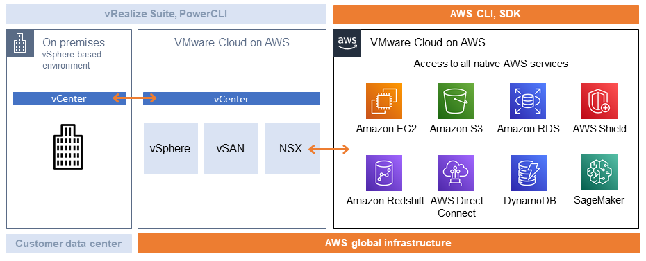
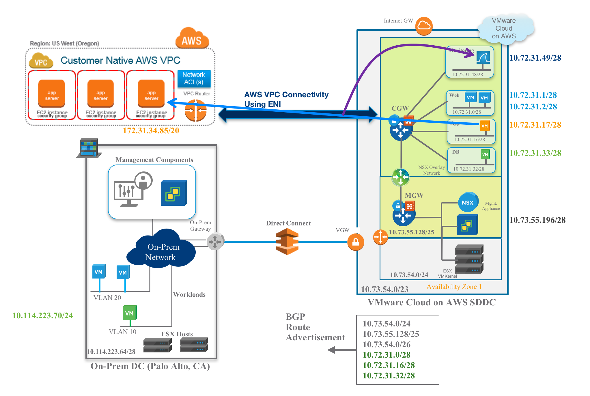
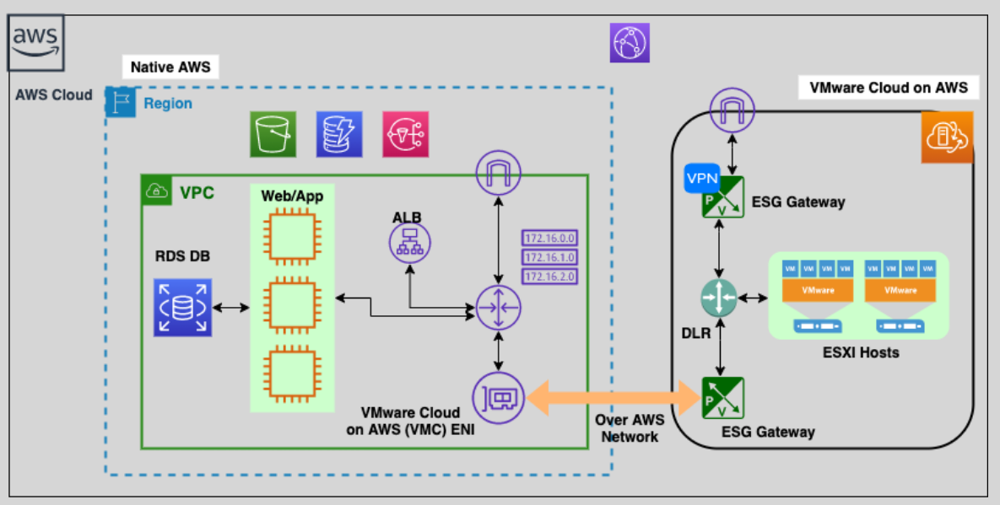

# **☁️ VMware Cloud on AWS: Your Data Center Meets the Cloud**

**VMware Cloud on AWS** is a **joint service from VMware and AWS** that bridges the gap between your on-premises data center and the scalability of AWS. It allows you to **run, migrate, and manage your VMware workloads in the AWS Cloud** using **the same VMware tools you already know and love** — no refactoring needed, no drama.

---

  

---

## **🔍 What Is VMware Cloud on AWS?**

> **Official Definition:** VMware Cloud on AWS is an integrated cloud offering jointly developed by AWS and VMware that delivers a scalable, secure cloud service based on VMware Cloud Foundation, and is optimized to run on AWS infrastructure.

It gives you a fully-managed **VMware Software-Defined Data Center (SDDC)** hosted in AWS, where you can run VMware workloads side-by-side with native AWS services.

---

## **🧱 Core Components of VMware Cloud on AWS**

| Component          | Description                                             |
| ------------------ | ------------------------------------------------------- |
| **vSphere**        | Manages your virtual machines (VMs) and clusters        |
| **vCenter Server** | Centralized control panel to manage VMs and hosts       |
| **NSX-T**          | Provides software-defined networking and security       |
| **vSAN**           | Distributed storage across AWS EC2 bare metal instances |
| **ENI**            | Elastic Network Interface connects SDDC to AWS VPCs     |

---

## **🚀 How It Works**

- Your **VMware SDDC** is deployed on **dedicated EC2 bare-metal instances**.
- An **ENI (Elastic Network Interface)** connects your SDDC to your AWS VPC.
- This setup enables **low-latency, high-bandwidth access** to AWS services from your VMs.

---

  

---

## **🛠️ Key Features**

### ✅ **Seamless Integration**

Run VMware vSphere, vSAN, NSX, and vCenter **natively on AWS infrastructure** — no re-architecting or re-coding required.

### 🔁 **Live Migration with HCX**

Use **VMware HCX** to migrate workloads live (zero downtime) from on-premises to AWS. Like moving your sofa into a bigger apartment — while still watching Netflix on it.

### 🌍 **Hybrid Cloud Done Right**

Keep workloads in sync between your **on-premises data center** and AWS. Scale to the cloud when needed without losing visibility or control.

### ⚡ **Access to AWS Services**

Let your VMs talk to AWS services like **RDS**, **S3**, **Lambda**, **CloudWatch**, and more — all via your VPC.

---

  

---

## **🎯 Use Cases**

| Use Case                     | How VMware Cloud on AWS Helps                         |
| ---------------------------- | ----------------------------------------------------- |
| 🔄 **Cloud Migration**       | Lift and shift workloads with zero refactor.          |
| 🔁 **Disaster Recovery**     | Run a full DR site in AWS without owning a second DC. |
| 🚀 **Elastic Capacity**      | Expand your VMware environment into AWS on demand.    |
| 🧪 **Dev/Test Environments** | Quickly spin up cloned environments for dev/testing.  |
| 🧷 **Data Center Extension** | Seamlessly stretch your network and compute into AWS. |

---

## **🌟 Benefits Overview**

| Benefit                   | Explanation                                                    |
| ------------------------- | -------------------------------------------------------------- |
| **Consistent Management** | Keep using vCenter, vSphere, and NSX just like on-prem.        |
| **Fast Time-to-Cloud**    | Launch a fully configured VMware SDDC in under 2 hours.        |
| **Scalable & Elastic**    | Add/remove hosts on demand — scale vertically or horizontally. |
| **Secure & Compliant**    | Leverage both VMware's and AWS's built-in security standards.  |
| **Deep AWS Integration**  | SDDC communicates directly with services in your VPC via ENI.  |

---

## **💡 When to Choose VMware Cloud on AWS**

| Choose It When…                                   | Because…                                                    |
| ------------------------------------------------- | ----------------------------------------------------------- |
| You have **existing VMware workloads**            | Avoid re-platforming. Move as-is.                           |
| You need **quick DR or failover**                 | DR on AWS without new tooling or overhead.                  |
| You want to **burst to cloud** for scale          | Add hosts during peak hours; remove later.                  |
| You want **AWS-native and VMware power** together | Best of both worlds — EC2 and vSphere working hand-in-hand. |

---

## **🧠 Best Practices**

- 🛡️ **Enable NSX micro-segmentation** for secure internal app traffic.
- 📜 **Tag AWS resources** used by your SDDC to track costs and usage.
- 🧰 **Automate provisioning** with Terraform or CloudFormation + VMware APIs.
- 📡 **Monitor workloads** using vRealize or AWS CloudWatch.
- 🔐 **Control access** using IAM + VMware role-based access.

---

## **🏁 Final Thoughts**

**VMware Cloud on AWS** is your no-compromise bridge to the cloud. You get the **enterprise-grade tools you trust from VMware**, deployed in the **scalable and global AWS cloud**, with deep integration and unified operations.

> Already running VMware and dreaming of cloud? You don’t need to start over — just stretch into AWS. VMware Cloud on AWS makes it smooth, fast, and powerful.
