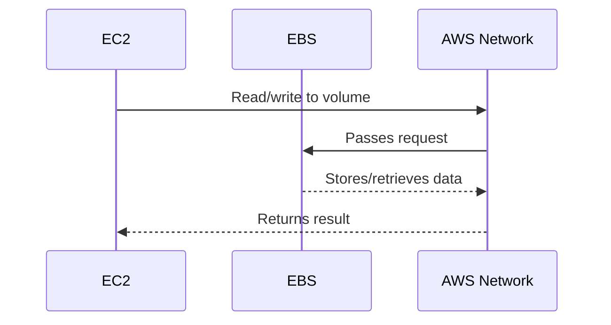

# **EC2 Fundamental**

> _"Your virtual computer in the cloud — scalable, flexible, and powerful."_

---

An **EC2 (Elastic Compute Cloud) instance** is a **virtual server** running in AWS. It provides **resizable compute capacity**, allowing you to run apps and workloads **without managing physical hardware**.

🔧 You choose:

- The **OS** (Linux, Windows, or custom AMI)
- The **instance type** (CPU, RAM, storage)
- The **storage type** (temporary or persistent)

Each EC2 instance behaves like a real server — but it's **provisioned in seconds** from AWS data centers.

## 🔧 **Key Components of an EC2 Instance**

| Component        | Role                                                               |
| ---------------- | ------------------------------------------------------------------ |
| **vCPUs**        | Virtual CPUs (mapped to threads of the physical CPU)               |
| **Memory (RAM)** | Memory allocated to the instance                                   |
| **Storage**      | Either **EBS** (persistent) or **Instance Store** (ephemeral)      |
| **Networking**   | Connects via ENIs with **private**, **public**, or **Elastic IPs** |

---

## 💾 **Storage Options in EC2**

### 🧊 Instance Store (Ephemeral)

- Tied to **physical host**
- **Very fast** but **non-persistent**
- Good for: **caching**, **temporary data**, **distributed systems**
- If the instance stops, **data is lost**

> 🔥 Instance Store-backed EC2 = root volume on instance storage

### 📦 EBS (Elastic Block Store)

- **Network-attached persistent volume**
- Survives **instance stop/reboot**
- Used for: **OS**, **apps**, **databases**, **backups**

> 💡 EBS-backed EC2 = root volume on EBS

---

## 🏷️ **Popular EC2 Instance Types (By Family)**

| Family                    | Best For                 | Examples                     |
| ------------------------- | ------------------------ | ---------------------------- |
| **General Purpose**       | Balanced workloads       | `t3.micro`, `m5.large`       |
| **Compute Optimized**     | CPU-heavy tasks          | `c5.large`, `c6g.medium`     |
| **Memory Optimized**      | RAM-hungry apps          | `r5.large`, `x1e.32xlarge`   |
| **Storage Optimized**     | High IOPS and throughput | `i3.large`, `d2.8xlarge`     |
| **Accelerated Computing** | GPU/ML/AI workloads      | `p3.2xlarge`, `inf1.6xlarge` |

---

## 🌐 **EC2 IP Address Types**

| IP Type        | Internet Routable | Dynamic   | Released on Stop | Sticky | Chargeable |
| -------------- | ----------------- | --------- | ---------------- | ------ | ---------- |
| **Private IP** | ❌ No             | ✅ Yes    | ❌ No            | ✅ Yes | ❌ No      |
| **Public IP**  | ✅ Yes            | ✅ Yes    | ✅ Yes           | ❌ No  | ❌ No      |
| **Elastic IP** | ✅ Yes            | ❌ Manual | ❌ No            | ✅ Yes | ✅ If idle |

> 💡 Elastic IP = static public IP that you **control** (not lost after restart)

---

## **💾 Relationship Between EC2 and EBS**

**Amazon EBS** is a **scalable** and **persistent block storage** service that provides **durable** storage for EC2 instances. It is designed to store **operating system files**, application data, and other files that need to persist beyond the life of the instance.

### 🤔 **Why EC2 Needs EBS (Not Just Instance Storage)**

| Reason               | Description                                                                 |
| -------------------- | --------------------------------------------------------------------------- |
| **Persistence**      | Data survives **stop/terminate/reboot**                                     |
| **Modularity**       | You can **detach/attach** volumes between instances                         |
| **Backup & Restore** | EBS volumes support **snapshots**, which allow **versioned backup**         |
| **Scalability**      | EBS volumes can grow in **size** and **IOPS** without stopping the instance |
| **Separation**       | Compute and storage are **independent** — better scaling, isolation         |

### **🔗 How AWS Connects EC2 and EBS in the Background**

In AWS, **EC2 instances** and **EBS volumes** are connected in the background through the **AWS Elastic Block Store (EBS)** service. When you launch an EC2 instance, it is **linked to an EBS volume** to provide persistent storage. Here’s how it works:

- 1️⃣ **Creation of EBS Volume**:

  - When an EC2 instance is launched, you can specify an **EBS volume** as the root device or additional volumes for storage.
  - AWS uses **EBS APIs** to create and allocate storage resources, and these volumes are automatically associated with the instance.

- 2️⃣ **Attachment Process**:

  - Once the instance is launched, AWS attaches the **EBS volume** to the instance over the **network** (using the **Elastic Block Store protocol**).
  - The volume is then **mounted** as a **block device** within the instance's operating system, allowing it to be used for file storage, databases, or application data.

- 3️⃣ **Data Flow**:

  - All **read and write** operations to the volume happen over the **AWS network** using the **EBS protocol**. The data is stored on **physical disk** located within an AWS data center.
  - EBS provides **durability** by replicating data across multiple servers within the **availability zone**, ensuring **data persistence** even if the EC2 instance is stopped or terminated.

- 4️⃣ **Scaling**:
  - As EC2 instances scale, the **EBS volume** can also scale (in size and performance), ensuring that the attached storage meets the growing demands of the application.

---

---

## 🔄 **Scaling EC2 + EBS Resources**

### 🖥️ EC2 Scaling

| Strategy       | Description                                        |
| -------------- | -------------------------------------------------- |
| **Vertical**   | Change to larger/smaller instance type             |
| **Horizontal** | Add/remove instances using **Auto Scaling Groups** |

### 💽 EBS Scaling

| Feature             | Description                                                   |
| ------------------- | ------------------------------------------------------------- |
| **Resize Volumes**  | Change size **on the fly**, no downtime                       |
| **Upgrade Volumes** | Switch from **gp3 → io2** for higher IOPS                     |
| **Snapshots**       | Take point-in-time backups; create new volumes from snapshots |

---

## 🧠 EC2 Fundamentals Recap

| Concept               | Summary                                                           |
| --------------------- | ----------------------------------------------------------------- |
| **EC2**               | Virtual server in the cloud                                       |
| **vCPUs / RAM**       | Compute resources assigned to the instance                        |
| **Storage**           | Instance Store (ephemeral) or EBS (persistent)                    |
| **Networking**        | Includes private IPs, public IPs, and Elastic IPs                 |
| **Instance Families** | Choose based on workload (general, compute, memory, storage, GPU) |
| **EBS Volumes**       | Persistent, scalable, attachable disks that store your data & OS  |
| **Elasticity**        | Both EC2 and EBS can be **resized**, scaled, and replaced easily  |

---

## ✅ **Conclusion**

- **EC2** = AWS's compute engine. Use it to launch scalable virtual machines.
- **EBS** = Your long-term hard drive in the cloud.
- Together, they form a **modular**, **resilient**, and **highly flexible** compute+storage pair.
- Whether you're hosting a WordPress blog, running ML models, or building a scalable backend, EC2 and EBS give you full control — with **cloud power and cost efficiency**.
