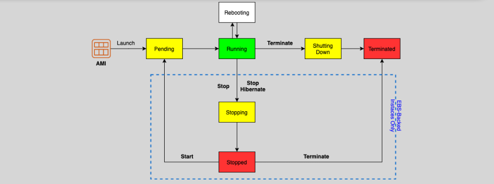

# 🚀 **Amazon EC2 Instance Lifecycle – Explained Visually & Simply**

> _Mastering the EC2 instance lifecycle helps you optimize resource usage, control billing, and better manage your cloud environment._

---

  

---

## 🔄 **1. Pending (Launching)**

🟡 **State**: `pending`  
When you launch a new EC2 instance, AWS begins provisioning the hardware, network, and storage.

- ⏳ **Instance not ready yet**
- 💸 **Billing**: _Not billed during this stage_

---

## 🟢 **2. Running**

🟢 **State**: `running`  
The instance is now up and fully operational. You can SSH (Linux) or RDP (Windows) into it.

- ✅ Ready to process workloads
- 💸 **Billing**: _You are billed for compute usage_

---

## 🔁 **3. Rebooting**

🔁 **State**: `running` (still)  
The instance restarts at the OS level, but **without stopping or terminating** it.

- 🔧 Used for applying patches or soft resets
- 💸 **Billing**: _Continues, same as running state_

---

## 🟡 **4. Stopping → Stopped**

🟡 **State**: `stopping` → 🔴 `stopped`  
Stopping shuts down the instance safely, but **retains configuration and attached EBS volumes**.

- ✅ You can restart it later
- 🔄 Instance store data (if any) is lost
- 💸 **Billing**:
  - ❌ _No compute billing_
  - ✅ _EBS storage billing continues_

---

## 😴 **5. Hibernate**

😴 **State**: `stopping` → `stopped` (but with memory saved)

In Hibernate, AWS **saves RAM contents to the EBS volume** so that when restarted, it resumes where it left off.

- 🧠 Application memory, open files, and state are restored
- 🔑 Must be enabled at launch (`Stop behavior: Hibernate`)
- 💸 **Billing**:
  - ❌ _No compute billing_
  - ✅ _EBS billing for memory snapshot + storage_

---

## 🔴 **6. Stopped**

🔴 **State**: `stopped`  
The instance is shut down completely but **still exists in your account** and is restartable.

- 🧩 EBS-backed root volumes are retained
- 💥 Instance store volumes are erased
- 💸 **Billing**:
  - ❌ _No compute cost_
  - ✅ _EBS cost applies_

---

## ❌ **7. Terminated**

❌ **State**: `terminated`  
The instance is **permanently deleted**. This action cannot be undone.

- 🪓 You lose access completely
- 🧹 Instance store & root volumes are wiped
- 💸 **Billing**:
  - ❌ _No further billing for the instance_
  - ⚠️ _EBS volumes **may persist** and incur charges if not manually deleted_

---

## 🔁 **Lifecycle Flow Summary**

- 1️⃣ **Launch (Pending)** → EC2 instance starts its provisioning process.
- 2️⃣ **Running** → Instance is ready for use.
- 3️⃣ **Reboot** → Restarts the instance without terminating it.
- 4️⃣ **Stop (Stopping → Stopped)** → Temporarily halts the instance (but does not delete it).
- 5️⃣ **Hibernate** → Suspends instance memory to disk before stopping.
- 6️⃣ **Terminate (Terminated)** → The instance is permanently deleted and no longer billed.

---

## 💸 **Billing Cheat Sheet**

| **State**      | **Compute Charges** | **Storage Charges (EBS)**    |
| -------------- | ------------------- | ---------------------------- |
| **Pending**    | ❌ No               | ❌ No                        |
| **Running**    | ✅ Yes              | ✅ Yes                       |
| **Rebooting**  | ✅ Yes              | ✅ Yes                       |
| **Stopped**    | ❌ No               | ✅ Yes                       |
| **Hibernate**  | ❌ No               | ✅ Yes (includes memory)     |
| **Terminated** | ❌ No               | ⚠️ _Only if EBS not deleted_ |

---

## ⚠️ **Important Notes**

- 🔒 **Hibernation is supported only for EBS-backed instances**
- 🧹 **Instance Store**: Temporary storage is **lost** when the instance stops or is terminated
- 🔁 **Stopped vs. Terminated**:
  - _Stopped_ = paused & recoverable
  - _Terminated_ = deleted & gone forever
