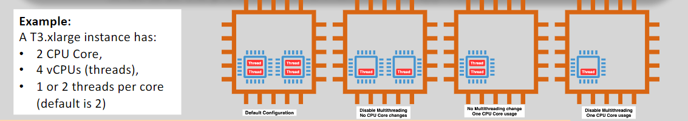

# 💻 EC2 CPU Optimization & vCPU

Optimizing CPU configurations in **Amazon EC2** helps you fine-tune performance, reduce costs, and align your compute resources with workload needs. This guide combines **multi-threading concepts**, **vCPU vs CPU understanding**, and **custom EC2 CPU options** to give you full visibility into EC2 compute optimization.

## **⚡ CPU Multi-Threading**

**Multi-threading** allows a CPU to run multiple tasks (called threads) at the same time. Instead of completing one task and then starting another, it can handle several tasks simultaneously, making more efficient use of CPU resources.

### **🧠 Application Multi-Threading:**

- Allows a program to split its workload into multiple **independent threads**.
- These threads can be executed simultaneously, speeding up applications like web servers or games.

#### **🧰 Hardware Multi-Threading:**

- Each **physical core** on a CPU can handle **2 threads** concurrently (commonly via **Hyper-Threading**).
- This allows better **utilization** of each core and improves **performance**.

> 📌 Example: A 6-core CPU with 2 threads per core = 12 threads (vCPUs)

### **🤔 Why Multi-Threading is Important:**

- It improves **CPU utilization**, helping your instance handle tasks more efficiently.
- **Parallelism** leads to **faster execution** for workloads that can be split into multiple threads.

## 🧩 Understanding CPU vs vCPU in EC2

| Term     | Definition                                   | Provided by EC2?   |
| -------- | -------------------------------------------- | ------------------ |
| **CPU**  | Physical processor core                      | ❌ No (abstracted) |
| **vCPU** | Virtual thread of a CPU core (1/2 of a core) | ✅ Yes             |

- AWS allocates **vCPUs**, which represent logical threads from physical cores.
- Typically: **1 physical core = 2 vCPUs**

> 🧠 `c5.4xlarge` = 16 vCPUs → maps to ~8 physical cores

### 🧮 3. Example Breakdown: `m6id.12xlarge`

| Property     | Value             |
| ------------ | ----------------- |
| CPU Cores    | 24 physical cores |
| Threads/Core | 2                 |
| Total vCPUs  | 48 vCPUs          |

Each core has 2 threads → **24 cores \* 2 = 48 vCPUs**

---

## 🔧 4. Customizing CPU Options in EC2

    

---

Amazon EC2 allows you to fine-tune CPU settings **at launch time**.

### 🛠️ Adjustable Parameters

- **CPU Cores**: You can select fewer cores than the instance provides.
- **Threads per Core**: You can disable SMT (set threads per core = 1) for workloads that don’t benefit from multi-threading.

### 📌 Use Cases for Customization

- **Licensing**: Reduce active cores for apps licensed per-core.
- **HPC**: Maximize core performance by disabling multi-threading.
- **NUMA**: Optimize for memory locality in HPC environments.

### 📋 How to Configure CPU Options (Before Launch)

1. Go to **Launch Instance** in the AWS Console.
2. Under **Advanced Details**, choose **CPU Options**.
3. Set:
   - **Core count** (e.g., 4 instead of 8)
   - **Threads per core** (1 or 2)

> ⚠️ These settings **cannot be changed** after the instance is launched.

---

## 💡 Best Practices for CPU Optimization

| Workload Type       | Instance Family    | Optimization Tip                                           |
| ------------------- | ------------------ | ---------------------------------------------------------- |
| General Apps        | T, M               | Use default CPU settings and burstable types (T3/T4g)      |
| Compute-Intensive   | C Series           | Consider disabling threads for tighter performance control |
| Memory-Intensive    | R, X Series        | CPU optimization less critical, focus on RAM performance   |
| License-Constrained | Any large instance | Reduce cores to match licensing caps                       |

---

## ✅ Summary

- EC2 gives you **vCPUs**, not direct access to physical CPUs.
- Each **vCPU = 1 thread** of a physical core.
- You can **customize cores and threads per core** at launch for:
  - Performance tuning
  - Licensing
  - HPC/NUMA alignment
