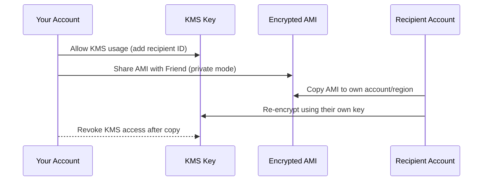
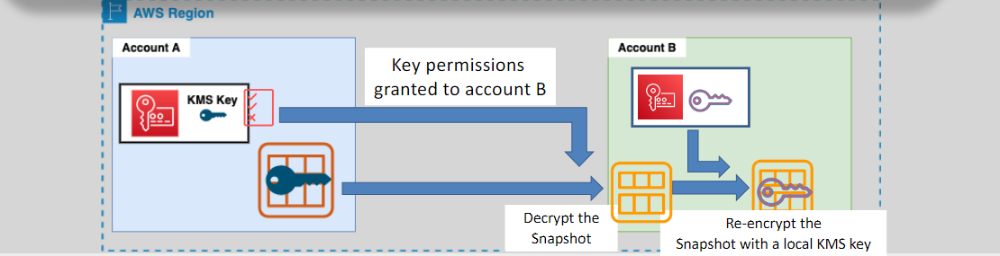

# 📦 **Amazon EC2 AMIs (Amazon Machine Images)**

Amazon EC2 **AMIs** are your go-to solution for creating reusable, consistent, and pre-configured templates of your compute environments. Think of an AMI as a **golden image** — a blueprint that includes the OS, software, and custom settings to help you quickly launch **identical EC2 instances** anywhere in your AWS ecosystem.

  

---

## 🔍 **What Is an EC2 AMI?**

An **AMI (Amazon Machine Image)** is a **pre-packaged snapshot** of an EC2 instance that includes:

- 🖥️ Operating System (e.g., Ubuntu, Amazon Linux, Windows)
- 📦 Installed Software (e.g., agents, scripts, applications)
- ⚙️ Configuration settings and runtime customizations
- 💾 One or more EBS snapshots (root and data volumes)

> ✅ Use AMIs to **quickly launch** new instances, ensure configuration consistency, and automate deployments at scale.

---

## 🏗️ **Creating an AMI from an EC2 Instance**

### 🧱 **Step-by-Step Process**

1. **Launch & Customize** your EC2 instance

   - Install tools, patch OS, apply configs ✅

2. **Reboot (Recommended)** to flush memory and stabilize disk state 🔁

3. **Create AMI**

   - AWS captures **snapshots of root & data volumes**
   - Registers the AMI in your account 🎯

4. **Launch New Instances** from your AMI — done! 🎉

### 🧾 **What's Included in the AMI?**

- Root volume snapshot
- All additional attached EBS volumes
- Installed software + OS + configurations

> 📦 Everything your original instance had — cloned and ready to go!

---

## 🔄 **Sharing AMIs with Other AWS Accounts**

### 🤝 **How to Share an AMI**

If the AMI is **unencrypted**, sharing is simple. For **encrypted AMIs**, it involves careful handling of the KMS key:

### 🛡️ **Key Sharing Notes**

- 🔐 Must use **custom KMS keys**, not AWS-managed ones
- 📍 AMIs can only be **shared privately** — no public sharing for encrypted images
- 📥 Copying is required before use in other accounts

  

---

## 🧳 **Copying AMIs Across Regions or Accounts**

AMIs can be copied to:

- ✅ Create regional backups
- ✅ Deploy the same stack globally
- ✅ Enable cross-account collaboration

### 🌐 **Cross-Region Copying**

- AWS **requires re-encryption** using a KMS key in the destination region
- Encrypted AMIs must use **region-local keys**

### 🚫 **Limitations**

- ❌ Marketplace and Windows AMIs **can’t be copied** directly
- ✅ Workaround: Launch instance → create new AMI → share new AMI instead

---

## 💡 **Use Cases of EC2 AMIs**

| Use Case                      | Benefit                                       |
| ----------------------------- | --------------------------------------------- |
| Auto Scaling Launch Templates | Ensure consistent configs across groups 🛠️    |
| CI/CD Pipelines               | Standardize test/stage/prod environments ⚙️   |
| Multi-Region Architecture     | Deploy apps globally with minimal overhead 🌎 |
| Disaster Recovery             | Restore instances from golden images 🔁       |

---

## 🏁 **Conclusion: Master Your Golden Image Game**

EC2 AMIs give you the power to:

- 📦 Package everything once and launch anywhere
- 🚀 Accelerate deployment speed
- 🛡️ Improve security through consistent baselines

Whether you’re building at small scale or across global regions, mastering AMIs is a must-have skill for AWS engineers. 🙌

> ✨ Keep them updated. Tag them wisely. Encrypt them smartly. Share them securely.
