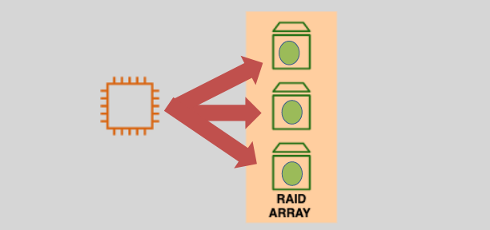

# **💾 RAID with EBS Volumes — Boosting Storage like a Pro!**

**RAID (Redundant Array of Independent Disks)** is a data storage virtualization technique that combines multiple physical disks into a **single logical volume** to deliver improved **performance**, **availability**, or **redundancy** — depending on how it’s configured. It’s like forming a superhero squad of disks — each one contributing to power, safety, or both!

In **AWS**, although RAID isn’t a native service, you can **set it up on EC2 instances using EBS volumes at the OS level** (Linux or Windows). This allows you to squeeze more performance or fault tolerance out of your storage stack.

> ⚠️ **Note:** RAID is **not recommended** for **root/boot volumes** and requires manual configuration inside the operating system.

---

## **🧠 What is RAID?**

RAID is used to:

- 🧪 **Distribute I/O load** across disks (striping)
- 🛡️ **Replicate data** for protection (mirroring)
- 🔁 **Combine both** for performance and redundancy

There are several **RAID levels**, each with different behaviors:

- **RAID 0** → Performance boost
- **RAID 1** → Fault tolerance
- **RAID 10** → Best of both worlds

> 📌 There are more RAID types (like 5, 6, 50), but AWS mostly favors **0, 1, and 10** due to EBS’s managed nature.

---

## **🚀 Why Use RAID with EBS?**

RAID with EBS volumes helps you:

- ⚡ **Increase throughput** and **IOPS**
- 🛡️ Add **redundancy** for durability
- 🔄 **Parallelize read/write operations**

**Best for:**

- **EBS-optimized EC2 instances** 🧠
- High-I/O workloads like **databases**, **analytics**, or **caches**
- **Non-root volumes** (no boot disks)

---

## **🧩 Common RAID Levels You Can Use on AWS**

### **RAID 0 – Striping 🏎️**

- **How it works:** Splits data across multiple volumes for faster read/write.
- **Performance:** ✅ Very high
- **Redundancy:** ❌ None (one disk fails = total data loss)
- **Use Case:** Temporary data, high-speed caching, batch processing

  

---

### **RAID 1 – Mirroring 🛡️**

- **How it works:** Clones data to two volumes.
- **Performance:** ✅ Slightly better reads, slower writes
- **Redundancy:** ✅ Excellent (survives 1 disk failure)
- **Use Case:** Logs, configs, critical systems where durability > speed

  

---

### **RAID 10 – Mirror + Stripe Combo ⚡🛡️**

- **How it works:** Mirrors pairs of disks, then stripes across them
- **Performance:** ✅ High
- **Redundancy:** ✅ High (can survive one failure per mirrored pair)
- **Use Case:** Databases, real-time analytics, high-performance applications

  

---

## **📋 RAID on AWS — Key Considerations & Best Practices**

| 🔍 What to Know              | ✅ Best Practice                                                         |
| ---------------------------- | ------------------------------------------------------------------------ |
| RAID is not a native service | Set up RAID in your **instance OS** (Linux: `mdadm`, Windows: Disk Mgmt) |
| Snapshot behavior            | Snapshots are **per-volume** — take care with backups                    |
| EBS optimization             | Use **EBS-optimized EC2 instances** for better throughput                |
| Instance root volume         | ❌ Don't RAID boot volumes — it complicates recovery                     |
| Monitoring                   | Use **Amazon CloudWatch** or RAID-specific tools to monitor health       |

---

## **📊 RAID Level Comparison Table**

| RAID Type | IOPS Boost | Redundancy | Min Disks | Good For                        |
| --------- | ---------- | ---------- | --------- | ------------------------------- |
| RAID 0    | ✅ High    | ❌ None    | 2         | Speed, cache, temp files        |
| RAID 1    | ❌ No      | ✅ Yes     | 2         | Logs, configs, critical systems |
| RAID 10   | ✅ High    | ✅ Yes     | 4         | DBs, analytics, production      |

---

## **🏁 Final Thoughts — Should You RAID in AWS?**

**RAID with EBS** can be a powerful performance booster or a life-saving redundancy strategy when used right. But it’s **not magic** — it's an OS-level trick that **adds complexity**, so use it only when your workload justifies the setup.

✅ Use **RAID 0** if performance is all you need and the data is disposable.

✅ Use **RAID 1** if you're paranoid about data loss but don’t need speed.

✅ Use **RAID 10** if you're building a production-grade, mission-critical app.

> 🧠 Don’t forget: always benchmark your workload with and without RAID to see real-world benefits!

RAID responsibly, and may your disks never fail 🫡💿
