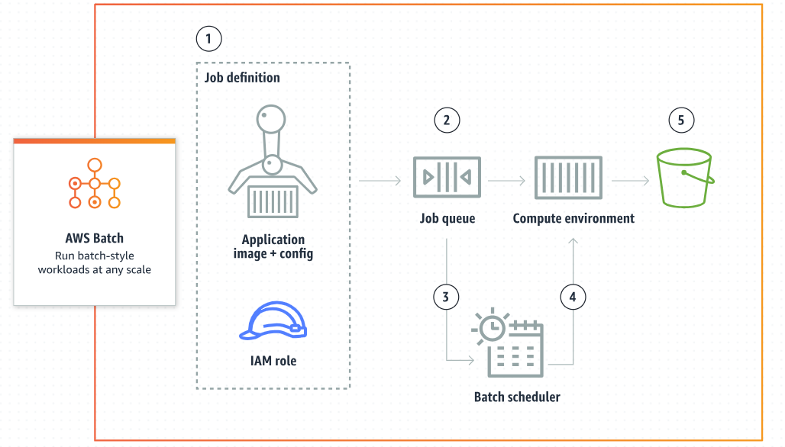
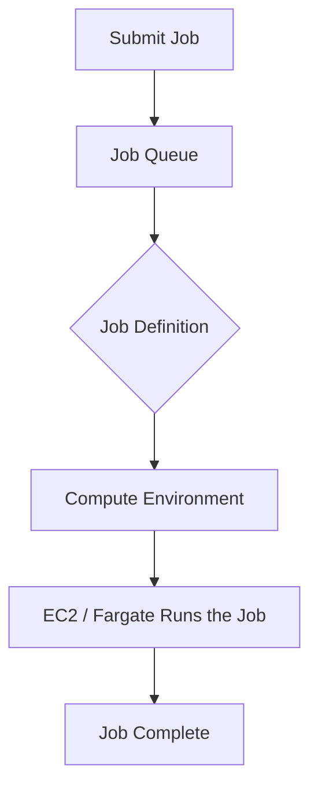

# **🧪 AWS Batch**

**AWS Batch** is a **container-based**, **fully managed** service that allows you to run **batch-style workloads** at any scale. Think of it as your **on-demand supercomputer**, orchestrating jobs without worrying about servers, clusters, or scaling logistics.

It’s ideal for **scientific simulations**, **media rendering**, **machine learning preprocessing**, **financial risk models**, and anything that requires running a boatload of jobs in parallel or sequence.

**The following flow describes how AWS Batch runs each job:**

- 1️⃣ Create a job definition which specifies how jobs are to be run, supplying an IAM role, memory and CPU requirements, and other configuration options.
- 2️⃣ Submit jobs to a managed AWS Batch job queue, where jobs reside until they are scheduled onto a compute environment for processing.
- 3️⃣ AWS Batch evaluates the CPU, memory, and GPU requirements of each job in the queue and scales the compute resources in a compute environment to process the jobs.
- 4️⃣ AWS Batch scheduler places jobs in the appropriate AWS Batch compute environment for processing.
- 5️⃣ Jobs exit with a status and write results to user-defined storage.

---

    

---

## **🔍 What is a Batch Job?**

A **batch job** is a unit of work — like a script or program — that runs to completion. Unlike real-time applications, batch jobs:

- Are scheduled or triggered
- Don't require manual intervention
- Can run asynchronously or in parallel

---

## **🚦 How AWS Batch Works (High-Level Flow)**

1. **Job Definition** 📝 – You define how your job runs (Docker image, vCPUs, memory, etc.)
2. **Job Queue** 📥 – Where submitted jobs wait until compute resources are available
3. **Compute Environment** ⚙️ – AWS provisions EC2 instances or Fargate tasks based on your job needs
4. **Job Scheduling** 📅 – AWS Batch schedules and runs jobs based on priority and resource needs

---

---

## **📦 Key Components**

### **1. Job Definition**

- Specifies the **Docker image**, **vCPUs**, **memory**, **IAM roles**, environment variables, etc.
- You can version and reuse job definitions.

### **2. Job Queue**

- You can assign **priorities** to multiple job queues.
- Jobs sit in the queue until resources are available.

### **3. Compute Environments**

- **Managed or Unmanaged**: Let AWS manage the EC2 fleet or manage your own.
- **EC2 or Fargate**: Choose between EC2 (more control, cost-effective for big jobs) or Fargate (serverless, easier to manage).

---

## **📋 Job Types**

- **Single Job**: A standalone unit of work
- **Array Jobs**: Run multiple jobs with slight variations in parallel (e.g., process 1000 images)
- **Dependent Jobs**: Define jobs that must finish before others can start (build pipelines)

---

## **💡 Use Cases**

- 🧬 **Genomics & Bioinformatics** – Run genome sequencing jobs in parallel
- 📸 **Rendering & Encoding** – Convert 3D models or videos in batch
- 📊 **Data Transformation** – Clean and preprocess data in a pipeline
- 🧠 **Machine Learning** – Feature extraction, model training across parameters
- 💰 **Finance** – Monte Carlo simulations and portfolio risk models

---

## **🛠️ Best Practices**

- Use **Fargate** for small, quick jobs (no EC2 management)
- Use **Spot Instances** for cheap compute in EC2 environments
- Monitor jobs with **CloudWatch Logs** and **AWS Batch Console**
- Set **timeouts** and **retry strategies** to handle failures
- Use **Job Dependencies** to orchestrate pipelines

---

## **🧾 Pricing**

You only pay for the **underlying compute resources** (EC2, Fargate) and any associated **storage or data transfer** — AWS Batch itself is free!

---

## **🆚 AWS Batch vs. Other Compute Services**

Let’s compare AWS Batch to other AWS services (and one external tool) that can achieve **similar goals** but in **very different ways**.

| Service                         | Use Case Fit                                                                                      | How It's Different                                                                             |
| ------------------------------- | ------------------------------------------------------------------------------------------------- | ---------------------------------------------------------------------------------------------- |
| **AWS Batch**                   | Best for traditional batch jobs that require queuing, dependencies, retries, and parallel compute | Fully managed; auto-scales compute; perfect for scientific, ETL, media jobs                    |
| **Amazon ECS (Fargate or EC2)** | Good for microservices or container-based workloads                                               | Requires you to manage job orchestration and scheduling manually (Batch sits on top of ECS)    |
| **AWS Step Functions**          | Good for orchestrating long-running workflows with complex logic                                  | Focuses more on **workflow state**, retries, branching logic — not parallel compute jobs       |
| **AWS Lambda**                  | Great for short-lived, event-driven jobs (≤15 minutes)                                            | Not suitable for long-running or heavy compute batch jobs                                      |
| **Amazon EMR**                  | Great for big data, Apache Spark, Hadoop workloads                                                | Built for **distributed data processing**, not general-purpose compute jobs                    |
| **Kubernetes (EKS)**            | Good for complex container orchestration & custom job schedulers                                  | More flexibility, but requires you to build your own batch logic and scheduling                |
| **Airflow on MWAA**             | Best for **orchestration** of batch workflows (e.g., DAGs)                                        | Doesn’t actually run compute — just manages task order; usually paired with Batch, ECS, or EMR |

---

## **🤔 When to Use AWS Batch Over Others?**

| Scenario                                                    | Choose AWS Batch If...                                            | Alternative                                                       |
| ----------------------------------------------------------- | ----------------------------------------------------------------- | ----------------------------------------------------------------- |
| 🎬 **You need to run 10,000 video transcodes**              | You want auto-scaled compute, retries, logs, and job dependencies | ECS or Fargate if jobs are continuous services                    |
| 🧪 **Running hundreds of simulations or scientific models** | You need queueing, parallel execution, and easy scaling           | Kubernetes (EKS) if you already manage k8s clusters               |
| 🗂️ **Daily ETL data crunching job**                         | You prefer not managing infrastructure, and jobs run for hours    | EMR if you're using Spark/Hadoop                                  |
| 🔁 **Chained workflows**                                    | You need job dependencies and parallel branches                   | Step Functions if logic is complex (e.g., loops, branches, waits) |
| 🧬 **Genome processing job that takes 4 hours**             | You want retries, spot instance savings, and container support    | Lambda if the job is lightweight (under 15 min)                   |

---

## **🎯 TL;DR: AWS Batch is Best When…**

✅ You have **long-running**, **parallel**, **containerized** jobs  
✅ You want **compute auto-scaling** without building infrastructure  
✅ You need **job dependencies**, **retries**, and **priority queues**  
✅ Your team wants **plug-and-play job scheduling** using Docker and IAM

> 🔥 Use AWS Batch when you care more about **executing compute jobs at scale** than building a custom platform to manage them.

## **📚 Resources**

- [AWS Batch Docs](https://docs.aws.amazon.com/batch/)
- [Batch Tutorials](https://docs.aws.amazon.com/batch/latest/userguide/what-is-batch.html)
- [Fargate Pricing](https://aws.amazon.com/fargate/pricing/)
