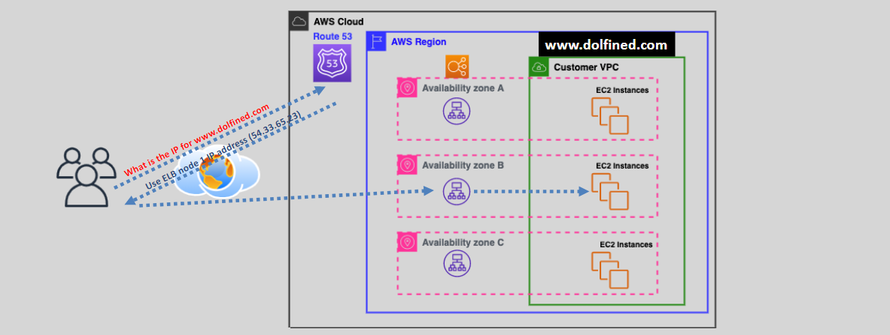
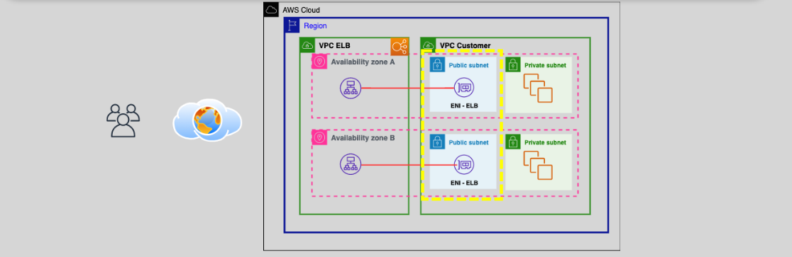
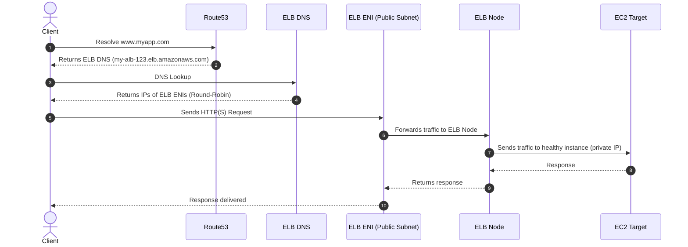

# **🔧 ELB Under the Hood**

Elastic Load Balancing (ELB) is one of the core components of AWS that ensures applications can scale and remain highly available by distributing traffic across multiple targets. Let’s dive deep into how ELB works under the hood, its internal components, and the communication process that ensures reliable and seamless traffic routing.

    

---

## **🌐 What is ELB?**

ELB is a **fully managed service** that automatically distributes traffic across multiple backend targets. It improves application scalability and fault tolerance and supports routing across **multiple AZs** within a region.

### **🧰 Types of ELBs:**

- **Classic Load Balancer (CLB)** – Legacy layer 4 and layer 7 support.
- **Application Load Balancer (ALB)** – Layer 7 (HTTP/HTTPS), path-based and host-based routing.
- **Network Load Balancer (NLB)** – Layer 4, TCP/UDP, ultra-high performance and static IP support.
- **Gateway Load Balancer (GWLB)** – Used with third-party appliances for traffic inspection.

---

## **🛠️ How to Create an ELB**

Creating an ELB involves several steps. Let’s walk through the process:

### 1️⃣ **You select an ELB type:**

- **ALB**: Layer 7, HTTP/HTTPS traffic.
- **NLB**: Layer 4, TCP/UDP traffic.
- **CLB**: Legacy L4/L7 support.
- **GWLB**: Deploy virtual appliances (firewalls, etc.).

### 2️⃣ **You specify the scheme:**

- **Internet-facing**: Exposes a public DNS, requires public subnets with internet gateways.
- **Internal**: Routes traffic inside a VPC, no public IPs involved.

### 3️⃣ **You select Availability Zones (AZs):**

- ELB nodes (managed EC2s) are deployed in each AZ.
- Each node gets an **Elastic Network Interface (ENI)** in the associated subnet.

### 4️⃣ **A DNS name is provisioned by AWS:**

- Example: `my-alb-1234567890.us-east-1.elb.amazonaws.com`
- This DNS maps to multiple public IPs (in case of internet-facing ELBs).

### 5️⃣ **You configure listeners and target groups:**

- Listeners accept traffic (e.g., on port 80 or 443).
- Target groups include EC2 instances, Lambda functions, containers, or IP addresses.

### 6️⃣ **Health checks are configured:**

- ELB periodically checks targets’ health using HTTP, TCP, or HTTPS protocols.
- Unhealthy targets are removed from rotation until recovery.

## **🧩 Components of ELB**

When you create an ELB, AWS automatically creates several underlying components to manage traffic distribution and health checks effectively.

### **🖥️ 1. ELB Nodes**

- **ELB nodes** are essentially EC2 instances running load balancing software, managed by AWS. They are deployed across the **Availability Zones** you selected during the ELB setup.
- **ELB nodes** handle the traffic and forward it to the EC2 instances in the target group.
- Each **ELB** has its own **public IP** (from the **ENI** in your subnet).

### **📇 2. Elastic Network Interface (ENI)**

- **ENIs** are created within your **VPC** and **subnet** to act as a communication interface between the **ELB nodes** and your **EC2 instances** in the target group.
- The **ENI** provides the **public IP** for **internet-facing ELBs**, enabling external communication.

### **🌐 3. ELB DNS Name**

- AWS automatically creates a **DNS name** for your ELB (e.g., `my-elb-1234567890.us-west-2.elb.amazonaws.com`) configured in **Route 53**.
- **Route 53** resolves this DNS name to one of the **public IPs** of the **ELB nodes** distributed across the AZs.
- **Route 53** intelligently routes the traffic across the ELB nodes using **round-robin DNS** and health check statuses.

## **🪜 Step-by-Step Flow: From DNS to Target EC2 Instance**

    

---

Now, let’s go through the detailed flow of how a request moves from DNS resolution all the way to the target EC2 instance.

- **Note**: The selected ELB Node can be any node across the AZs, based on round-robin and health.

---

### **🧭 1. DNS Resolution**

- When a user sends a request (e.g., `www.yourapp.com`), **Route 53** resolves the DNS to the **DNS name of the ELB** (e.g., `my-elb-1234567890.us-west-2.elb.amazonaws.com`).
- **Route 53** resolves the DNS to multiple **public IPs** corresponding to each **ELB node** in the selected **AZs**.
- For example:
  - ELB DNS resolves to:
    - **ELB Node 1**: `24.2.4.6`
    - **ELB Node 2**: `24.2.4.7`
    - **ELB Node 3**: `24.2.4.8`
  - **Route 53** uses **DNS round-robin** to distribute traffic across these nodes.

### **🎯 2. Traffic Routing**

Once the DNS resolves to the ELB, here’s how the traffic is processed:

#### **1. ELB Node Creation:**

- **AWS automatically creates ELB nodes** when you set up the ELB. These nodes are essentially EC2 instances running the load balancing software, but you **cannot see or interact with them directly**.
- These **ELB nodes** are deployed in your **VPC** and across the **selected AZs**.

#### **2. Elastic Network Interface (ENI):**

- **AWS creates an ENI** in each AZ for the ELB. The **ENI** in **public subnets** is assigned a **public IP** to handle external traffic.
- The **ENI** acts as a bridge to expose the **public IP** for the **ELB node**, allowing it to handle requests from external sources.

#### **3. Communication with EC2 Instances:**

- When the traffic reaches the **public IP** of the **ENI**, it is routed to the **ELB node**.
- The **ELB node** then communicates with the **EC2 instances** or other targets in your **target group** using **private IPs** via a **private link** within the VPC.

---

## 🔁 How ELB Ensures Reliability

### ✅ Multi-AZ Redundancy

- ELB nodes are spread across all selected AZs.
- If one AZ fails, the other AZ nodes still serve traffic.
- Route53 will give you the ELB DNS Name.
- When you call ELB DNS Name, Route53 will always returns the ips of healthy ELB Node.

### 🩺 Health Checks

- Each ELB node periodically pings targets.
- If a target fails the health check:
  - It’s **removed from rotation**.
  - Traffic is only routed to **healthy targets**.

### 📦 Cross-Zone Load Balancing

- **Enabled by default for ALB**, optional for NLB/CLB.
- If enabled, ELB nodes can forward traffic to targets **in any AZ**, not just the AZ they reside in.
- Helps evenly distribute traffic when target count is imbalanced across AZs.

### 🔒 SSL Termination (ALB/NLB)

- ELB can **terminate HTTPS connections** and forward traffic as plain HTTP to targets.
- Reduces load on backend instances and centralizes certificate management.

---

## 🧠 Load Balancing Algorithms

### 🔄 ALB (Layer 7)

- Routes traffic based on **URL path**, **host header**, **HTTP methods**, etc.
- Uses **round-robin** for target distribution.

### ⚡ NLB (Layer 4)

- Routes TCP/UDP traffic.
- Uses **flow hash** algorithm (source/destination IP & port).
- Super low latency.

### 🧓 CLB (Legacy)

- Supports both L4 and L7.
- Less flexible, gradually deprecated in favor of ALB/NLB.

---

## 📌 Summary Table

| Component         | Role                                                       |
| ----------------- | ---------------------------------------------------------- |
| **ELB Node**      | Managed instance forwarding requests to targets            |
| **ENI**           | Network interface exposing ELB node’s IP                   |
| **Route 53**      | Resolves ELB DNS to IPs in multiple AZs                    |
| **Health Checks** | Ensure only healthy targets receive traffic                |
| **Target Group**  | Holds EC2s, IPs, Lambdas – ELB routes traffic here         |
| **Cross-Zone LB** | Allows ELB node in one AZ to route to targets in other AZs |

---

## 🏁 Conclusion

Elastic Load Balancing is more than just a routing engine – it’s an infrastructure service that deploys, manages, and scales managed EC2s, network interfaces, and DNS resolution in a coordinated way.
