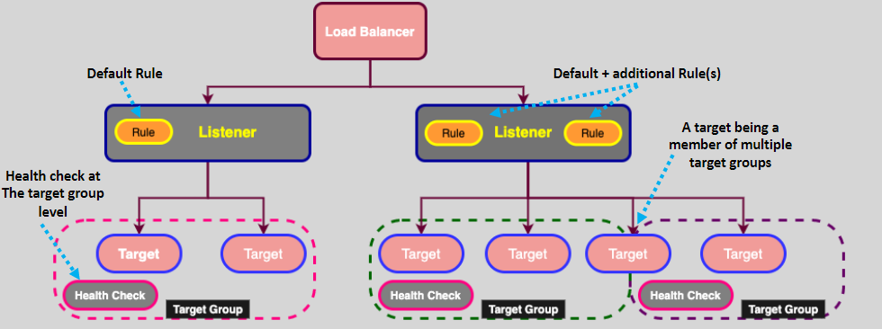
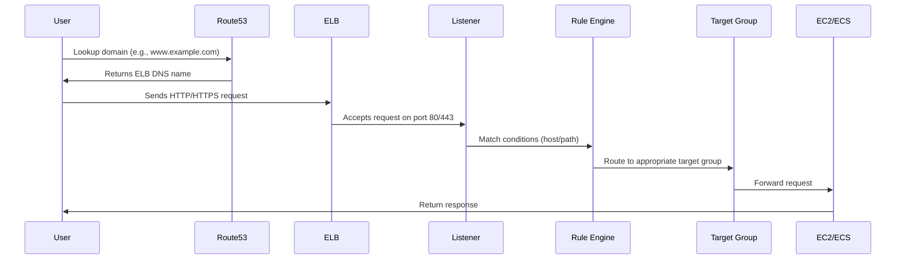
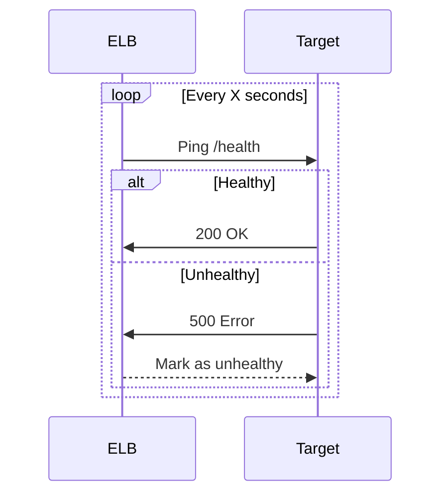

# 🧰 ELB Core Components – Explained Like a Human 🤓

Elastic Load Balancing (ELB) is like a smart traffic cop for your application. It decides **where requests go**, checks **who’s healthy**, and makes sure **no one gets overwhelmed**. Let’s break down the core components of ELB in a way that’s clear, detailed, and just a bit fun.

  

---

## 🎯 1. Target Groups – The Backend Squad

A **Target Group** is a team of servers (EC2 instances, ECS containers, IP addresses, or Lambda functions) that actually do the work when a request comes in.

### 🧠 What Happens Internally

- You define which targets belong to a group.
- ELB keeps an eye on their health.
- When a request comes in, the listener uses **rules** to forward it to the appropriate target group.

### ✅ Use Cases

- `/api` goes to Target Group A (EC2 backend)
- `/media` goes to Target Group B (ECS containers)

---

## 🎧 2. Listeners – The Gatekeepers 🛎️

A **Listener** is the first thing that receives incoming traffic on the load balancer. Think of it as a receptionist that answers the phone and knows who to connect you to based on your request.

### 📦 What a Listener Does

- **Listens** on a port (like 80 or 443) using a protocol (HTTP, HTTPS, TCP, etc.)
- **Evaluates rules** to decide which target group to send the request to
- **Supports multiple listeners** (one ELB can listen on multiple ports)

### 🧪 Real-World Example

- HTTP listener on port 80 → forwards to Target Group A
- HTTPS listener on port 443 → forwards to Target Group B

---

## 🧾 3. Listener Rules – The Routing Brain 🧠

Once a listener receives the traffic, **rules** kick in. These rules are like if-else statements:

### 🧩 Conditions It Can Use

- **Host-based**: `api.example.com`
- **Path-based**: `/login`, `/products`, `/cart`
- **Header/query strings** (only on ALB)

### 🎬 What Rules Can Do

- **Forward** traffic to a target group
- **Redirect** the request to a different URL
- **Return** a fixed response (like a 404 page)
- **Authenticate** the request (via Cognito or OIDC)

### 🏅 Rule Priority

- Rules are evaluated **in order**. First match wins.
- If nothing matches, ELB uses the **default rule**.

### ✅ Example Rules

- If path = `/admin` → forward to Admin Target Group
- If host = `api.example.com` → forward to API Target Group
- Default → fixed response: `404 Not Found`

---

## 🔄 4. Actions – What Happens When Rules Match 🎯

Once a rule matches, ELB needs to know **what to do**. That’s where **Actions** come in.

### 🚦 Types of Actions

- **Forward**: Send to a target group
- **Redirect**: Change URL, port, or protocol (e.g., HTTP → HTTPS)
- **Fixed Response**: Return a message without hitting a backend (e.g., `503: Service Unavailable`)
- **Authenticate**: Let users log in before accessing your app (ALB only)

---

## 🩺 5. Health Checks – Quality Control Doctor 👩‍⚕️

Before ELB sends traffic to a target, it checks: “Hey, are you alive and healthy?”

### 🔍 How It Works

- ELB sends periodic requests to a specified path (e.g., `/health`)
- If a target **fails repeatedly**, it is marked **unhealthy** and ELB stops sending traffic to it
- Once it **passes health checks again**, ELB resumes routing to it

### 🛠️ Configurable Settings

- Path (e.g., `/health`)
- Port (can be fixed or dynamic)
- Success/failure thresholds

---

## 🛰️ How It All Works Together – Traffic Flow 👇

Let’s walk through a typical journey of a request from a user to your backend:

### 🧵 Sequence Flow

### 🔄 Health Check Monitoring

---

## 🧠 Recap – What Did We Learn?

| Component         | Role                                                                   |
| ----------------- | ---------------------------------------------------------------------- |
| **Target Group**  | Backend pool of targets that serve your app                            |
| **Listener**      | Entry point that listens on port/protocol and triggers rule evaluation |
| **Rules**         | Logic to route traffic based on conditions (host/path/etc.)            |
| **Actions**       | What to do when a rule matches (forward/redirect/fixed/auth)           |
| **Health Checks** | Keeps traffic away from unhealthy targets                              |

---

## 🏁 Final Thoughts

An ELB is like a super organized air traffic controller that:

- Welcomes every request (Listener)
- Evaluates where it needs to go (Rules)
- Makes decisions (Actions)
- Sends it to the right team (Target Group)
- Keeps watch on who's fit to work (Health Checks)
