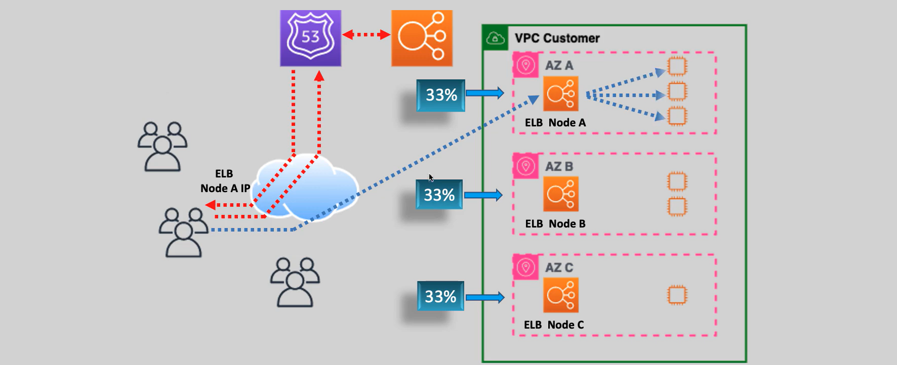
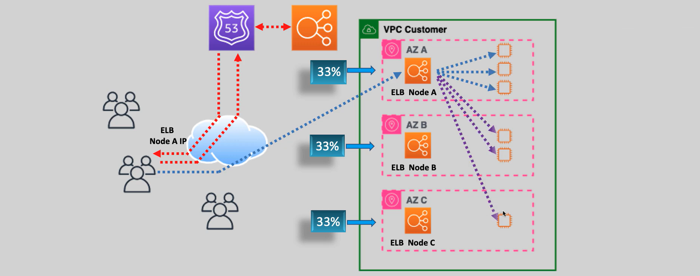

# 🌍 Cross-Zone Load Balancing – Explained Like a Human ⚖️

Cross-zone load balancing sounds fancy, but think of it like **evenly dividing your fries 🍟 between friends at different tables** (availability zones) instead of just serving one table (AZ) and hoping no one notices. Let’s break it down, human-style, and explain how it helps your application scale like a pro.

---

## 🤔 What is Cross-Zone Load Balancing?

**Cross-zone load balancing** is a feature that controls **how traffic is spread across your targets in multiple Availability Zones (AZs)**. Instead of being limited to only using targets in the same AZ as the request, ELB can distribute traffic evenly across **all healthy targets**, regardless of which AZ they’re in.

- **ALB (Application Load Balancer)**: Cross-zone is **always enabled** (you don't even have to think about it 🧠).
- **NLB (Network Load Balancer)**: Cross-zone is **disabled by default** but can be **enabled manually**.
  - ⚠️ When enabled, it may incur **cross-AZ data transfer charges**.

---

## ⚡ Why Should You Care?

Without cross-zone load balancing, each AZ's load balancer node only sends traffic to **targets in the same AZ**. This can lead to uneven traffic distribution and poor performance. With it enabled, ELB becomes smarter and fairer with traffic.

### 🎯 Benefits

- ✅ **Even distribution** of traffic across all healthy targets
- ✅ **Better resource utilization** across AZs
- ✅ **Improved fault tolerance** and **application availability**
- ✅ **No DNS caching headaches** that might skew traffic to a single AZ

---

## 🧪 How It Works – With and Without Cross-Zone

### ❌ Without Cross-Zone Load Balancing

- Clients hitting the ELB DNS might be routed to a specific AZ's node.
- That ELB node **can only talk to targets in its own AZ**.
- If AZ1 has more traffic or fewer targets, it gets overwhelmed, while AZ2 sits bored.

---

  

---

### ✅ With Cross-Zone Load Balancing

- ELB nodes now distribute traffic across **all healthy targets**, no matter which AZ they’re in.
- Result? 🍀 Balanced load, happy instances, smoother scaling.

---

  

---

## ⏳ Deregistration Delay (a.k.a. Connection Draining)

What happens if you want to **remove an instance** from your ELB **without killing live sessions**? That’s where **deregistration delay** comes in.

### 🩺 What It Does

- When a target is removed, ELB waits a configurable **delay period** (default is 300 seconds) to let **in-flight requests finish**.
- No new traffic is sent to the instance, but existing sessions are **not interrupted**.

### 🧪 Example

> You deregister EC2-1 → ELB says: “Chill, I’ll stop sending you traffic, but finish what you’re doing first.” 🧘‍♂️

---

## 🛠️ When Should You Enable It?

Enable **Cross-Zone Load Balancing** when:

- ✅ You have **uneven number of targets** in AZs (e.g., 2 in AZ-A, 1 in AZ-B)
- ✅ Clients might cache DNS responses, causing **hotspots** in one AZ
- ✅ You want **high availability** and fair traffic distribution across regions
- ✅ You run **microservices** or **containerized apps** that autoscale in multiple AZs

---

## 🧾 Example Scenario – Let’s Visualize

> Imagine your app is deployed in 3 AZs: AZ-A, AZ-B, AZ-C
>
> - AZ-A has 2 EC2 instances
> - AZ-B has 1 instance
> - AZ-C has 3 instances

### ❌ Without Cross-Zone

- AZ-B can only use its **1 lonely target**.
- If AZ-B gets lots of traffic, performance suffers 😢

### ✅ With Cross-Zone

- All AZs can **share all 6 instances** 💪
- Balanced traffic = consistent performance = 😄 users

---

## 💸 Pricing Considerations

- **ALB**: Always on. No additional charge for cross-zone load balancing.
- **NLB**: You can enable it, but you’ll **pay for inter-AZ data transfer**.

> 💡 Tip: If you use NLB with targets in multiple AZs **and** enable cross-zone LB, keep an eye on **network charges**.

---

## 🏁 Final Thoughts

Cross-zone load balancing is like the glue that makes your app **resilient and responsive**, even during traffic spikes or AZ hiccups. Whether you're handling steady traffic or sudden bursts, this feature ensures all your resources are used wisely.

- ✅ Enable it for fairness.
- ✅ Enable it for stability.
- ✅ Enable it so no AZ feels left out!
