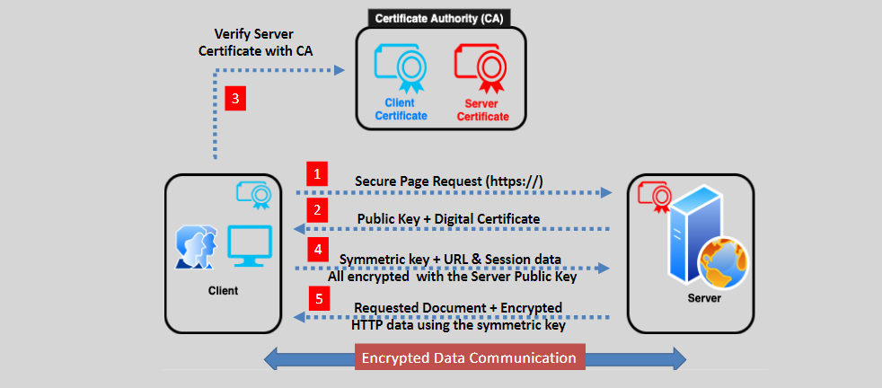
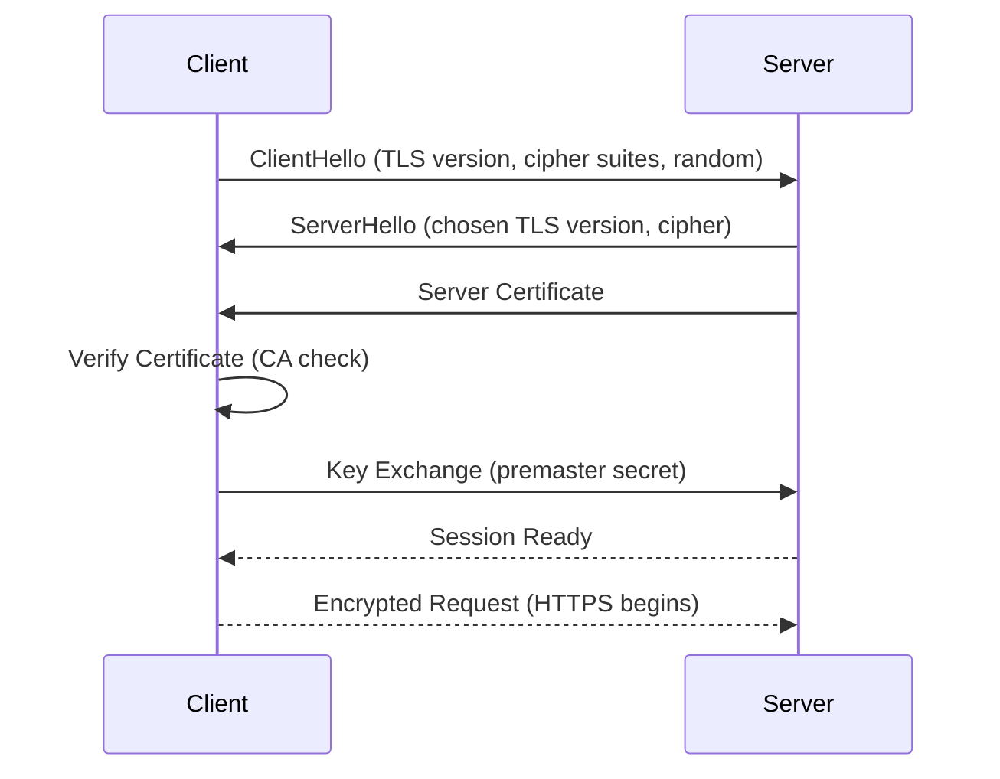

# 🔐 X.509 / SSL / TLS Digital Certificates – Explained the Smart Way 💡

Digital certificates – also called **X.509 certificates**, **SSL/TLS certs**, or just **digital certs** – are the **guardians of secure communication on the internet**. They prove identity and enable encryption to protect your data. Let’s break it all down in a clear, human-friendly, and nerd-approved way.

  

---

## 📜 1. What Is a Digital Certificate?

An **X.509 digital certificate** binds a **public key** to an **identity** (like a website or person). It says, “Hey, I’m `www.example.com`, and here’s my legit public key – verified by someone you trust.”

### 🧱 Core Building Blocks

- **Public Key** – Used to encrypt data or verify signatures.
- **Subject Info** – Who the certificate is for (e.g., website, user, service).
- **Issuer (CA)** – The trusted Certificate Authority that issued the certificate.
- **Validity Period** – Start and end date for the certificate.
- **Digital Signature** – Ensures the certificate hasn't been tampered with.

### 🧠 Key Terms

- **TLS (Transport Layer Security)** – The modern protocol for secure connections.
- **SSL (Secure Sockets Layer)** – The old version of TLS. Still used in name, but deprecated.
- **CA (Certificate Authority)** – A trusted third party that vouches for identities.

---

## 🏢 2. What’s a Certificate Authority (CA)?

A **CA** is the digital notary of the internet. It issues, signs, and manages certificates to verify that an entity is who they say they are.

### 🎯 Responsibilities

- **Verify** requester identity
- **Issue** and sign certificates
- **Revoke** certificates via **CRLs** or **OCSP**
- **Manage** renewal, expiration, and trust chains

### 🏩 Types of CAs

| Type             | Description                                                 |
| ---------------- | ----------------------------------------------------------- |
| **Root CA**      | The top of the chain. Self-signed and ultra-trusted.        |
| **Intermediate** | Issued by root, signs other certs. Adds a trust layer.      |
| **Public CA**    | Used on the public internet (e.g., DigiCert, Let's Encrypt) |
| **Private CA**   | Internal to orgs, used for internal apps or services.       |

---

## 🔑 3. Types of Authentication via Certificates

### 💻 Server Authentication

- Most common (HTTPS websites).
- Ensures you're connecting to the real server.

### 👤 Client Authentication

- Used in internal apps and secure APIs.
- Ensures the client is who they say they are.

### 🤝 Mutual (Two-Way) Authentication

- Both client and server exchange certs.
- Very secure; used in enterprise environments.

---

## 🔄 4. The TLS/SSL Handshake (Explained Visually)

When your browser connects to a secure website, there's a mini secret handshake party happening behind the scenes. Let’s decode this step-by-step:

- 1️⃣ **ClientHello** 🤖: The client (like your browser) says hello and offers its **supported TLS versions**, **cipher suites**, and a **random number**.
- 2️⃣ **ServerHello** 💻: The server responds with the chosen **TLS version**, **cipher**, and its **own random number**.
- 3️⃣ **Server Certificate** 🔐: The server sends its **digital certificate** signed by a trusted CA.
- 4️⃣ **Certificate Verification** 🔧: The client checks if the certificate is valid and trusted.
- 5️⃣ **Key Exchange** 🌟: Both sides use the exchanged random numbers and agreed cipher suite to generate a **shared secret key** (usually via Diffie-Hellman or RSA).
- 6️⃣ **Client Finished** 📢: The client sends a message encrypted with the shared key to confirm everything’s good.
- 7️⃣ **Server Finished** 🌀: The server replies with its own encrypted confirmation.
- 8️⃣ **Secure Session** 🛡️: Now that both sides are happy, encrypted data (like HTTPS traffic) begins to flow.

---

✨ **Note**: The actual handshake may use more secure key exchange algorithms and include other optional features like session resumption, ALPN (Application-Layer Protocol Negotiation), and OCSP stapling.

---

## ☁️ 5. Certificates in AWS Services

### 🏋️ Elastic Load Balancing (ELB)

- **ALB** supports HTTPS with SSL/TLS certs.
- **NLB** supports TLS listeners.
- Certs are attached to **listeners** to secure frontend traffic.

### 🌐 Amazon CloudFront

- Encrypts data between end-users and edge locations.
- Supports **custom domain certificates**.

### 🛠️ AWS Certificate Manager (ACM)

- Manages cert lifecycle: issue, renew, deploy.
- Public certs are **free** from ACM (e.g., for ELB/CloudFront).
- Private certs for internal services are also supported.

---

## 🛡️ 6. Protecting Against MITM Attacks

### ⚠️ Man-in-the-Middle (MITM)

Attackers intercept and manipulate traffic between client and server.

### 🔐 How Certs Protect You

- **Authentication**: Verifies the identity of the server/client.
- **Encryption**: Prevents snooping.
- **Integrity**: Ensures data wasn’t changed in transit.

---

## ✅ 7. Best Practices for Digital Certificates

| Best Practice                  | Why It Matters                                    |
| ------------------------------ | ------------------------------------------------- |
| Use Trusted CAs                | Ensure trust and compatibility                    |
| Use Strong TLS & Cipher Suites | Avoid weak encryption (e.g., disable TLS 1.0/1.1) |
| Rotate and Renew Certificates  | Prevent service downtime and trust loss           |
| Automate Cert Management       | Reduce manual errors and expired certs            |
| Limit Access to Private Keys   | Protect against misuse or leaks                   |
| Monitor and Audit              | Detect anomalies or unauthorized usage            |

---

## 🎯 Conclusion

Digital certificates are **the trust anchors** of secure communication. Whether you're protecting a website, an API, or an internal service, understanding how certificates work helps you:

- Encrypt traffic 🔒
- Prove identity 🧾
- Prevent impersonation attacks 🧙‍♂️

In AWS, tools like ACM and CloudFront make cert management seamless – but behind that simplicity is the mighty **X.509 certificate** doing all the hard cryptographic work.

Be smart. Stay secure. Trust your certs. ✅
