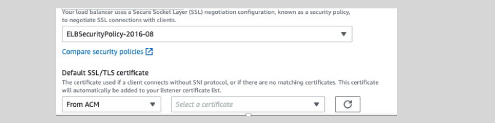

# **AWS Certificate Manager (ACM) 🏨**

AWS Certificate Manager simplifies the process of managing SSL/TLS certificates for your ELBs.

- **Public SSL/TLS Certificates:**

  - **Cost:** **Free** when provisioned through ACM.
  - **Usage:** Easily attach to your ALB or NLB to secure your applications.

- **Importing Certificates:**

  - **Flexibility:** Import externally generated certificates to ACM or IAM.
  - **Use Case:** Utilize existing certificates from your preferred Certificate Authority (CA) for ELB SSL/TLS termination.
