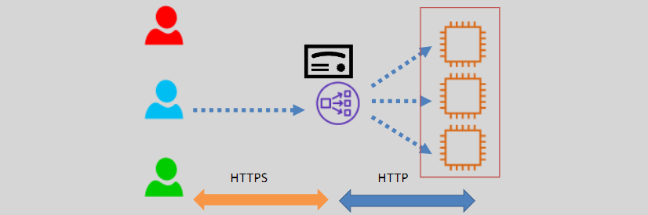
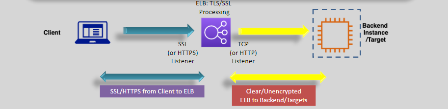
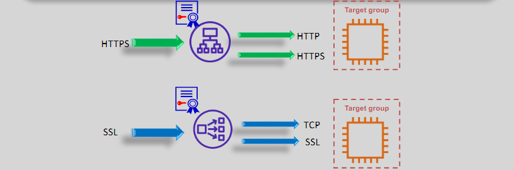
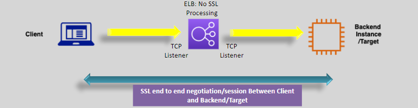

# **SSL Offload and TCP Pass-Through 🔒🔄**

Securing data in transit is essential for maintaining the integrity and confidentiality of your applications. AWS Elastic Load Balancing (ELB) offers two primary methods for handling SSL/TLS encryption: **SSL Offload** and **TCP Pass-Through**. Understanding these approaches allows you to effectively manage encryption based on your application's requirements.

## **1. Overview 🌐**

### **SSL Offload**

- **Definition:** Terminate SSL/TLS encryption at the load balancer, offloading cryptographic processing from backend instances.
- **Supported By:** **Application Load Balancer (ALB)**
- **Layer:** **Layer 7 (Application Layer)**

### **TCP Pass-Through**

- **Definition:** Forward encrypted traffic directly to backend instances without decrypting it, allowing backends to handle SSL/TLS operations.
- **Supported By:** **Network Load Balancer (NLB)**
- **Layer:** **Layer 4 (Transport Layer)**

## **1. SSL Offloading (SSL on the ELB) 🔄🔐**

SSL offloading is ideal for reducing the processing burden on backend instances and centralizing SSL management. it can works on both ALB or NLB

  

---

### **How It Works:**

1. **Certificate Upload:** Upload an SSL/TLS (X.509) certificate to the ALB.
2. **Termination:** The ALB terminates the SSL/TLS session, decrypting incoming traffic.
3. **Forwarding:** The ALB forwards the decrypted traffic to backend instances over HTTP or HTTPS.

  

### **Benefits:**

  

---

- **Supports both ALB and NLB:**
- **Performance:** Reduces CPU usage on backend instances by offloading encryption tasks.
- **Simplified Management:** Centralizes certificate management at the load balancer.
- **Flexibility:** Easily update or rotate certificates without modifying backend servers.

### **Considerations:**

- **Security:** Traffic between the ALB and backend instances can be unencrypted unless HTTPS is used internally.
- **Centralized Point:** The ALB becomes the central point for SSL termination, which may require robust security measures.

## **2. TCP Pass-Through (SSL on the Targets) 🔄🔒**

TCP passthrough ensures that end-to-end encryption is maintained, with backend instances handling all SSL/TLS operations.

### **When to Use:**

- **End-to-End Encryption:** Required for scenarios where data must remain encrypted from client to backend.
- **Compliance:** Necessary for meeting stringent security or regulatory requirements.
- **Application-Specific Needs:** Applications that manage their own encryption for additional security layers.

### **How It Works:**

1. **Encrypted Traffic:** The NLB forwards encrypted traffic directly to backend instances without decrypting it.
2. **Backend Handling:** Each backend instance manages the SSL/TLS handshake and encryption processes.
3. **No ELB Involvement:** The NLB does not perform any encryption or decryption, acting solely as a pass-through.

  

### **Benefits:**

- **Security:** Maintains encryption integrity throughout the entire communication path.
- **Control:** Backend instances have full control over SSL/TLS configurations and certificates.

### **Key Considerations:**

- **Supported Only by NLB:** TCP passthrough is exclusively available with Network Load Balancers.
- **Resource Utilization:** Backend instances must handle the additional load of encryption and decryption.
- **Certificate Management:** Certificates must be managed and rotated on each backend instance individually.

## **Choosing Between SSL Offload and TCP Pass-Through 🤔**

### **Use SSL Offload When:**

- **Performance Optimization:** Reduce computational load on backend instances.
- **Centralized Management:** Prefer managing certificates at the load balancer level.
- **No End-to-End Encryption Requirement:** Your application does not mandate encryption between ELB and backend instances.

### **Use TCP Pass-Through When:**

- **End-to-End Encryption:** Mandated for maintaining encryption from client to backend.
- **Compliance Standards:** Required to meet specific security or regulatory requirements.
- **Independent SSL Management:** Backend instances need to handle SSL/TLS configurations independently.

## **Conclusion 🎯**

Choosing between **SSL Offload** and **TCP Pass-Through** depends on your application's security requirements, performance considerations, and management preferences:

- **SSL Offload** with **ALB** offers performance benefits and simplifies certificate management by handling encryption at the load balancer level.
- **TCP Pass-Through** with **NLB** ensures that encryption is maintained end-to-end, providing enhanced security for sensitive applications.
