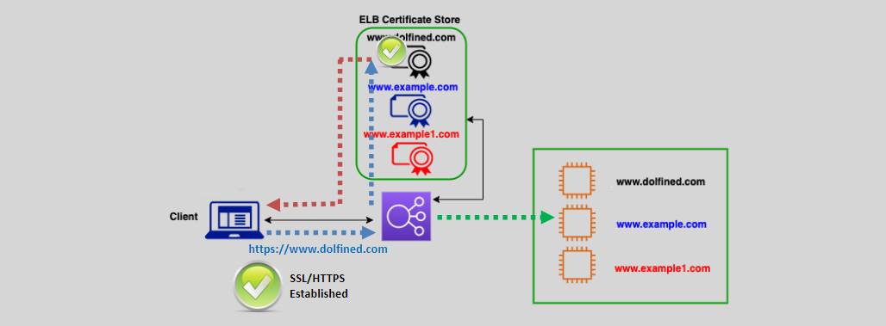

# **Server Name Indication (SNI) 🌐🔐**

Server Name Indication (SNI) is a crucial extension to the TLS protocol that enhances the flexibility and scalability of secure communications. It allows multiple secure (HTTPS) websites to be hosted on a single IP address, facilitating efficient certificate management and resource utilization.

    

---

## **1. What is SNI? 🤔**

- **Definition:** SNI is an extension to the TLS protocol that enables a client to specify the hostname it is attempting to connect to during the TLS handshake process.
- **Purpose:** Allows servers to present the appropriate SSL/TLS certificate based on the requested hostname, enabling multiple secure websites to coexist on a single IP address and port.

## **2. How SNI Works 🔄**

1. **Client Initiates Connection:** The client sends a TLS ClientHello message that includes the desired hostname in the SNI field.
2. **Server Processes SNI:** The server reads the hostname from the SNI extension and selects the corresponding SSL/TLS certificate for that domain.
3. **TLS Handshake Completes:** The server presents the selected certificate, and the TLS handshake proceeds, establishing a secure connection specific to the requested hostname.

## **3. Benefits of Using SNI ✅**

- **IP Address Efficiency:** Reduces the need for multiple IP addresses to host multiple secure websites.
- **Scalability:** Facilitates the hosting of numerous secure domains on a single server or load balancer.
- **Cost-Effective:** Minimizes infrastructure costs by optimizing IP address usage and simplifying certificate management.
- **Flexibility:** Allows dynamic selection of certificates based on the requested hostname, enhancing the ability to manage diverse web applications.

## **4. SNI Support in AWS Elastic Load Balancing (ELB) ☁️**

- **Application Load Balancer (ALB):**

  - **Supports SNI:** Enables multiple HTTPS certificates on a single ALB.
  - **Multi-Domain Hosting:** Facilitates serving multiple secure domains through one load balancer instance.

- **Network Load Balancer (NLB):**
  - **Supports SNI for TLS Listeners:** Allows multiple TLS certificates to be associated with a single NLB.
  - **Enhanced Security:** Ensures that each domain can present its own certificate without requiring separate load balancers.

## **5. Considerations When Using SNI ⚠️**

- **Client Compatibility:** Ensure that clients (browsers, applications) support SNI. Most modern clients do, but some older clients may not.
- **Certificate Management:** Properly manage and update certificates for all hosted domains to maintain secure connections.
- **DNS Configuration:** Accurate DNS records are essential to route traffic to the correct load balancer and domain.
- **Fallback Mechanisms:** Implement fallback strategies for clients that do not support SNI to maintain accessibility.
