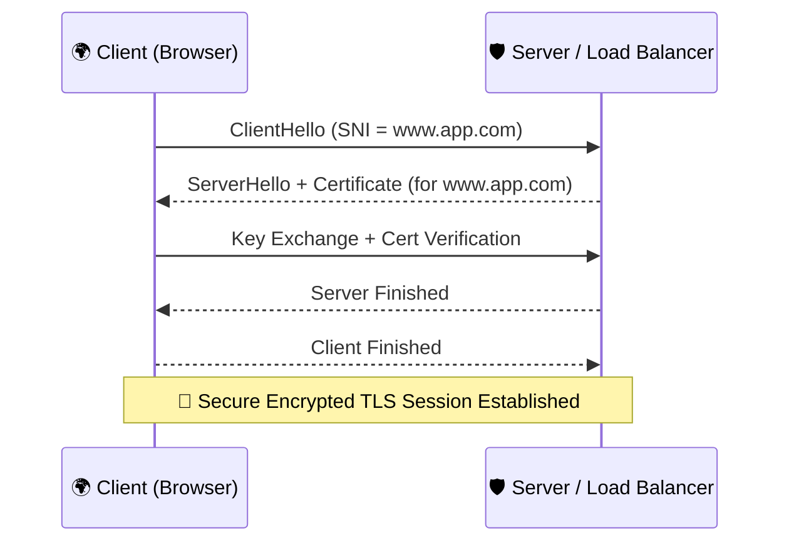

# **🌐🔐 Server Name Indication (SNI): One IP to Rule Them All**

When you’re hosting multiple secure websites on a single server or load balancer, how can the server know **which SSL/TLS certificate** to use for the connection? Enter: **SNI** – the unsung hero of HTTPS scalability. Let’s break down what it is, how it works, how it integrates into AWS, and why you probably use it every day without realizing it. 🧙‍♂️

    

---

## **1️⃣ What Is Server Name Indication (SNI)? 🤔**

- **Definition**: Server Name Indication (SNI) is an extension to the **TLS protocol** that allows the **client** (e.g., a browser) to tell the **server** which hostname it’s trying to reach — right at the start of the TLS handshake.
- **Goal**: This lets the server **choose the right SSL/TLS certificate**, making it possible to host **multiple secure websites on a single IP address and port**.

> 🔍 Without SNI, the server must guess which certificate to present — or use one certificate for all domains. Neither is ideal.

---

## **2️⃣ How SNI Works (Step-by-Step & Diagram) 🔄🧠**

Let’s break this down in two ways: bullet points _and_ a visual sequence.

### **🔢 TLS Handshake with SNI (Point-by-Point)**

1. **ClientHello (with SNI extension) 🧑‍💻**:

   - The client initiates a secure connection and sends a `ClientHello` message.
   - In the `ClientHello`, the client includes the **hostname** (e.g., `api.example.com`) in the **SNI extension field**.

2. **ServerHello + Certificate Selection 🖥️**:

   - The server (or AWS Load Balancer) reads the SNI hostname from the request.
   - Based on the hostname, the correct **SSL/TLS certificate** is selected and sent.

3. **Key Exchange & Certificate Validation 🔑**:

   - The client checks the certificate's validity: Is it signed by a trusted CA? Is it expired? Does the Common Name (CN) or SAN match the SNI?
   - If all is good, the handshake continues and both sides negotiate encryption keys.

4. **Encrypted Session Starts 🔐**:
   - Once the handshake completes, all data exchanged is encrypted with the agreed-upon cipher suite.

### **📈 TLS Handshake with SNI (Mermaid Diagram)**

---

## **3️⃣ Benefits of Using SNI ✅**

- 💡 **Multi-Domain Support**: Host multiple secure websites on **one IP and port**.
- 💰 **Cost Efficiency**: Reduce need for extra IP addresses (especially helpful with IPv4 scarcity).
- 📦 **Simplified Infrastructure**: Manage one load balancer for many domains.
- 🔄 **Dynamic Cert Selection**: Present the correct SSL cert _on the fly_ per request.

---

## **4️⃣ How SNI Works Inside AWS ☁️**

### **🚀 With ALB (Application Load Balancer)**

- ✅ **Built-in SNI Support**: ALB allows you to attach **multiple certificates** to the **HTTPS listener**.
- 📘 **How It Works**:
  - When a client connects to the ALB using HTTPS, it sends a `ClientHello` with the SNI hostname.
  - The ALB uses the SNI hostname to **dynamically select the matching certificate** from those attached to the listener.
- 🛠️ **Configuration Steps**:
  - Go to ALB → Listeners → HTTPS → Certificates.
  - Add multiple **ACM certificates** (wildcard or specific domain).

### **⚡ With NLB (Network Load Balancer)**

- ✅ **SNI via TLS Listeners**: You can associate **multiple certificates** with a single TLS listener on NLB.
- 🧩 **Mapping**: AWS automatically matches the hostname from the SNI extension to the certificate.
- 📦 **Option for TLS Termination**: Choose between:
  - Terminate TLS at the NLB (decrypt at the load balancer).
  - TCP passthrough (end-to-end encryption with decryption at backend).

> 🧠 In AWS, you **don’t have to write logic** to interpret the SNI header — the load balancer handles it transparently.

---

## **5️⃣ What the Client Sends to Trigger SNI 📨**

To trigger SNI-based certificate selection, the client **must include** the desired hostname in the **SNI extension of the TLS ClientHello message**.

### 🧪 This usually happens automatically in

- All modern web browsers (Chrome, Firefox, Edge, Safari)
- Curl (`curl https://yourdomain.com` will include SNI)
- SDKs and libraries that use modern TLS stacks (like Python's `requests`, Node.js `https` module)

> 📦 Example: When a user opens `https://secure.example.com`, the browser includes `secure.example.com` in the SNI field of the TLS handshake, so AWS can return the correct cert.

---

## **6️⃣ Things to Consider ⚠️**

### 💻 **Client Compatibility**

- Modern browsers and HTTP libraries fully support SNI.
- Legacy systems (e.g., Windows XP + IE6) might not.

### 🔐 **Certificate Hygiene**

- Keep all your certificates valid and up to date.
- Use **AWS Certificate Manager (ACM)** to automate provisioning and renewal.

### 🧭 **DNS Setup**

- Ensure each domain name points to the correct load balancer (via Route 53 or external DNS).

### 🧱 **Fallback Behavior**

- AWS lets you configure a **default certificate** for clients that don’t support SNI.
- This is a great safety net — make it something generic or branded.

---

## **7️⃣ Conclusion 🎯**

**Server Name Indication (SNI)** powers modern HTTPS scalability by letting one IP serve many domains securely. It’s built into AWS Load Balancers, giving you:

- 🔀 Flexible certificate management
- 📉 Reduced IP requirements
- 🔐 Enhanced security and simplified HTTPS setups

If you run multi-domain apps, SaaS platforms, or microservices — **SNI is your secret weapon**. And AWS makes it easy to wield. 🧙‍♀️

> "One cert to rule them all, one IP to bind them." 😉
