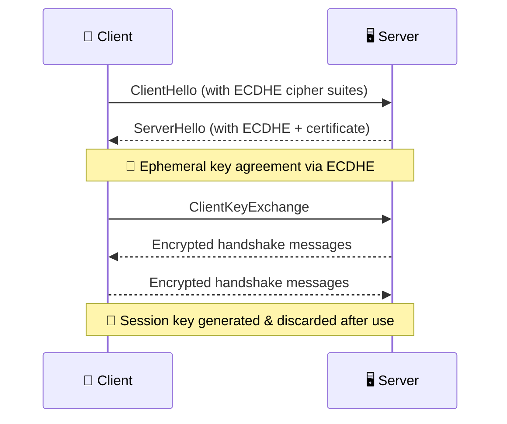

# **Perfect Forward Secrecy (PFS) 🔐💡**

When it comes to securing encrypted connections over time, **Perfect Forward Secrecy (PFS)** is like the vault-within-a-vault approach. It ensures that **past communications stay safe** — even if your long-term private key is compromised someday. Let’s break it down in a clear, simple, and slightly fun way!

---

## **1️⃣ What Is Perfect Forward Secrecy? 🤔**

### 🔐 **Definition:**

PFS is a cryptographic property that ensures **session keys** (used to encrypt your data during a connection) are **not derived from the server’s private key**. That means:

> Even if a hacker steals your server's private key tomorrow, they **can't decrypt** traffic that was captured **yesterday**. 😎

### 🧠 **Why It Matters:**

- Prevents decryption of past conversations.
- Guards against "record now, decrypt later" attacks.
- Great for compliance and peace of mind.

---

## **2️⃣ How Perfect Forward Secrecy Works (Simple Version) 🛠️🔄**

Imagine each HTTPS session is a **new vault** with its own lock and key. Once you’re done, the key is thrown away 🔥 — forever.

### 🔑 Key Concepts

- **Ephemeral Keys:** Short-lived, random session keys are used **only once per session**.
- **Not Stored:** These keys are **never saved**, so there’s no way to retrieve them later.
- **No Dependency:** They aren’t derived from the server’s private key.

### 🔁 The Magic Protocol: **ECDHE** (Elliptic Curve Diffie-Hellman Ephemeral)

- It securely creates a shared key **without transmitting it**.
- Uses math magic (elliptic curves) to generate unique, temporary session keys.

> 🧪 Even if someone records the encrypted data today, they won’t have the key to unlock it tomorrow.

---

## **3️⃣ Visualizing the Process (Mermaid Style) 🧙‍♂️📈**

> 🔒 Each connection = fresh key = extra protection

---

## **4️⃣ PFS in AWS Load Balancers ☁️**

### **✅ Supported by:**

- **Application Load Balancer (ALB)**
- **Network Load Balancer (NLB)** (when using TLS termination)

### **🛠️ How to Enable It:**

- In your **HTTPS or TLS listener**, configure a **TLS security policy** that supports **ECDHE-based cipher suites** (e.g., `ECDHE-RSA-AES128-GCM-SHA256`).
- You can do this in:
  - **AWS Console**
  - **AWS CLI**
  - **CloudFormation**

### **🔐 Certificate Note:**

- Your certificate (via **ACM** or uploaded manually) must be compatible with the selected cipher suites.

---

## **5️⃣ Why Use PFS? (Benefits) 🎁**

| Benefit          | Description                                                       |
| ---------------- | ----------------------------------------------------------------- |
| 🔒 Security      | Protects old sessions even if keys are stolen later               |
| 🧰 Compliance    | Required by many security standards (e.g., PCI-DSS)               |
| 🧠 Peace of Mind | No lingering keys = nothing for attackers to steal                |
| 📉 Reduces Risk  | Eliminates long-term secrets from being a single point of failure |

---

## **6️⃣ Best Practices for PFS 🔧**

- ✅ **Use modern TLS security policies** (`ELBSecurityPolicy-TLS13-1-2-2021-06` is a good start)
- 🔁 **Rotate certificates and review cipher suites** regularly
- 📡 **Test with SSL Labs** to ensure PFS is working (`https://www.ssllabs.com/ssltest/`)
- 🧱 **Avoid outdated protocols** like SSL or TLS 1.0/1.1

---

## **7️⃣ TL;DR Summary 📘**

- Perfect Forward Secrecy = 🔐 ephemeral encryption keys
- Stops hackers from unlocking past traffic if your key leaks
- Works via ECDHE, built into modern TLS versions
- Supported by ALB and NLB in AWS

> If you're serious about security, PFS isn't optional — it's **essential armor** for your encrypted connections. ⚔️
