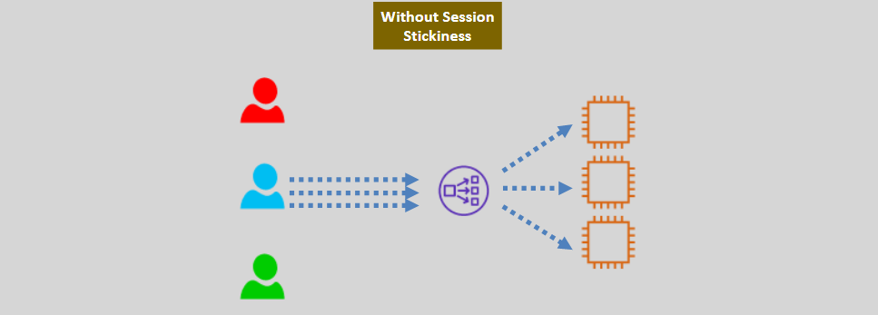
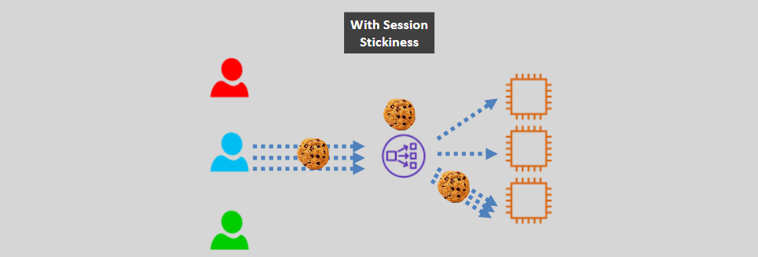
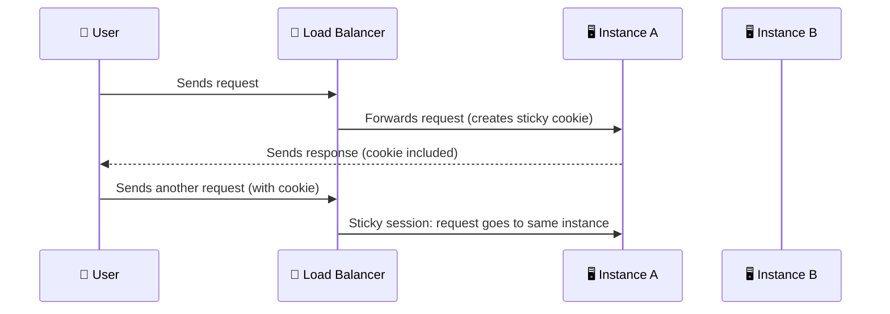

# **🧲 Sticky Sessions (Session Stickiness)**

Ever wondered how a website remembers your shopping cart items even as you click around? That magic often comes from a load balancer feature called **Sticky Sessions** — a simple way to keep a user "stuck" to the same backend server during a session. Let’s break it down in a fun and clear way! 🧠✨

---

    

---

    

---

## **🤔 What Is Sticky Session?**

### 📘 **Definition:**

Sticky Sessions (aka **Session Stickiness**) allow a load balancer to consistently route a user’s requests to **the same backend instance** — keeping their session data (like login status or cart items) consistent.

### 🍪 **How it Works:**

- The load balancer uses a **cookie** (or source IP) to identify the user.
- Then it “sticks” the user to one backend target for the duration of the session.

> Without it, every new request might go to a **different server**, which can break apps that store session data locally. 😵

---

## **🧱 Supported by ELB Types**

| Load Balancer | Sticky Method        | How It Works                                                           |
| ------------- | -------------------- | ---------------------------------------------------------------------- |
| **ALB**       | Cookie-based         | ELB sets its own cookie (or uses app-generated ones) to track sessions |
| **NLB**       | Source IP stickiness | Uses source IP to route requests to same backend                       |
| **CLB**       | Cookie-based         | Uses an AWS-generated or app cookie                                    |

---

## **🧙‍♂️ How Sticky Sessions Work**

> 💡 Even if the load balancer has multiple targets, sticky sessions ensure the same one keeps getting hit.

---

## **✅ When Sticky Sessions Make Sense**

### 🛒 **Stateful Applications**

- E.g., Shopping carts, dashboards, file uploads.
- Session data is stored **locally on the instance**.

### 🏚️ **Legacy Apps**

- Apps that **don’t support shared session stores**.

### 🛠️ **Temporary Fixes**

- Helpful during **migration** to stateless or distributed design.

---

## **❌ When to Avoid Sticky Sessions**

### 🚀 **Modern Stateless Apps**

- These apps store session info in **external stores** or **tokens**.
- Sticky sessions break scalability and can cause uneven traffic.

### 🌐 **High-Availability Needs**

- Stickiness may cause **uneven load**.
- Can overload one server while others are idle.

### 🧩 **Microservices**

- Services should be **independent** and not expect sticky behavior.

### 🔄 **Failover Requirements**

- If a sticky instance fails, session is **lost** unless the app handles recovery.

> ⚠️ **Important:** Sticky Sessions are not recommended for modern applications. A better and modern approach is to **build stateless apps** with an **external caching layer** like **Redis** or **Memcached**.

---

## **⚠️ Limitations & Gotchas**

- **Not Fault Tolerant:** If the instance fails, user session breaks.
- **Uneven Load:** Especially behind NATs or proxies where many users share 1 IP.
- **Cookies Required:** Won’t work for clients that disable cookies.
- **No Stickiness for Weighted Groups:** Not supported in ALB when using weighted target groups.

---

## **💡 Better Alternatives to Sticky Sessions**

If you're designing for **scale**, consider these options:

### 🧼 **Go Stateless**

- Design requests to carry all info needed.
- Makes scaling, failover, and distribution easier.

### 🗄️ **External Session Stores**

- Use **ElastiCache** (Redis/Memcached), **DynamoDB**, or RDS.
- Stores session data **outside** of the instance.

### 🪙 **JWT Tokens**

- Encodes session data inside the token itself.
- Token is sent with each request = no session storage required.

### 🔁 **Session Caching**

- Use a shared session cache where all app nodes can read/write.
- If one fails, another can take over.

---

## **🎯 Conclusion**

Sticky Sessions can be helpful for **stateful** or **legacy apps**, but they’re not ideal for **modern scalable systems**.

### ✅ Use it when

- You need **short-term consistency**.
- You're working with **legacy** or **stateful** apps.

### ❌ Avoid it when

- You're building for **scale and fault tolerance**.
- You're using **microservices** or **stateless** architectures.

> 🧠 **Pro Tip:** Prefer stateless apps with external caching layers like **Redis** or **Memcached**. Stickiness may help today — but stateless scales tomorrow. 🚀
