# **📍 ELB Client IP Management**

When users connect to your application through an AWS Elastic Load Balancer (ELB), understanding how to track their **real IP address** is vital. It helps with **logging, analytics, security rules**, and **personalized responses**. Let's simplify how **Application Load Balancers (ALB)** and **Network Load Balancers (NLB)** handle client IPs — with clear **examples** and a **real request flow**.

<div style="text-align: center;">
    
</div>

---

## **🤔 What Is the Client IP in ELB?**

When a user connects via an ELB, traffic first hits the **ELB nodes** (managed by AWS) before it reaches your app.

🔍 But here's the catch:

- Your backend might **see the IP of the ELB node**, not the user's actual IP.

So… how do we find the real IP? Let’s break it down by ELB type.

---

## **🖥️ ALB (Application Load Balancer – Layer 7)**

### 🧠 How It Works

ALBs add a special header to every HTTP request called `X-Forwarded-For`. This header contains the IP address of the **original client**, even after multiple proxy hops.

### 🔄 Header Behavior

Each time a proxy (e.g., another ELB, CloudFront, or reverse proxy) forwards the request, **it appends** the IP address of the sender to the `X-Forwarded-For` list.

So you’ll get a **comma-separated list**, like this:

```http
X-Forwarded-For: 203.0.113.45, 198.51.100.7, 192.0.2.1
```

🧭 The **leftmost IP is the original client**, the rest are intermediaries.

### 📌 Sample Request

```http
GET /checkout HTTP/1.1
Host: www.example.com
X-Forwarded-For: 198.51.100.123, 70.132.5.9
```

### 🧪 In Your Code (Python Flask Example)

```python
client_ip = request.headers.get("X-Forwarded-For", "").split(",")[0].strip()
```

---

## **⚙️ NLB (Network Load Balancer – Layer 4)**

### 🧠 How It Works

NLB works at the transport layer (TCP), so it **does not modify HTTP headers**. Instead, it forwards the TCP connection **with the original source IP intact**.

So if you're reading the IP from the socket:

```python
client_ip = request.remote_addr  # Works out of the box
```

> ✅ No extra config needed — just read the socket info and you get the real IP.

### ➕ Optional: Proxy Protocol 🧾

If you want **extra metadata** (e.g., client IP + port, protocol), you can enable **Proxy Protocol** on your NLB:

- NLB adds a special line **before** the actual payload.
- Your backend must **parse** this line before processing the request.

#### 📌 Sample Proxy Protocol Header

```ini
PROXY TCP4 198.51.100.123 192.168.1.10 54321 443
```

- First IP: Client’s IP (198.51.100.123)
- Second IP: Your backend IP (192.168.1.10)

🧠 Your app must read and parse this line **before** it handles the real request.

---

## **🛤️ Real Flow: From Client to App**

### 🔹 ALB (Layer 7)

```mermaid
sequenceDiagram
    participant Client as 👤 Client
    participant ALB as 🌐 ALB
    participant App as 🧠 App

    Client->>ALB: Sends HTTP request
    ALB->>App: Adds X-Forwarded-For header
    App-->>App: Reads original IP from header
```

<div style="text-align: center;">



</div>

---

### 🔸 NLB (Layer 4)

<div style="text-align: center;">


</div>

---

## **🔍 Key Differences and Behavior**

| Feature             | ALB                             | NLB                             | NLB + Proxy Protocol          |
| ------------------- | ------------------------------- | ------------------------------- | ----------------------------- |
| Layer               | 7 (HTTP)                        | 4 (TCP)                         | 4 (TCP)                       |
| Client IP Location  | `X-Forwarded-For` header        | Socket source IP                | First line of TCP payload     |
| Multi-hop IP Chain  | Comma-separated IPs in header   | Not applicable                  | Can include full path info    |
| Backend Requirement | Parse HTTP headers              | Nothing special                 | Must parse initial line       |
| TLS Support         | Termination with header support | Pass-through or TLS termination | Supports Proxy Protocol + TLS |

---

## **✅ Best Practices**

### For ALB

- Always **extract only the first IP** from `X-Forwarded-For`.
- **Validate and sanitize** — avoid trusting headers blindly.
- Use **Web ACLs (WAF)** or **middleware** to manage IP logic.

### For NLB

- Stick with native IP preservation when you can 🟢.
- Use Proxy Protocol **only if you need more metadata**.
- Ensure your backend can parse Proxy Protocol safely.

---

## **🎯 Final Tips**

- 📬 **Need smart routing or SSL offloading? Use ALB.**
- 🚀 **Need ultra-fast TCP passthrough with real IP? Use NLB.**
- 💡 **Client IP always comes first** in the list or packet — know where to look!

You’re now ready to log IPs like a champ 🧙 — whether you're debugging traffic, analyzing user patterns, or locking down your firewall rules.

---

🔐 **Bonus:** Use tools like `tcpdump`, `ngrep`, or CloudWatch logs to test and inspect client IP behaviors under your ELB.

Happy traffic hunting! 🕵️‍♂️
