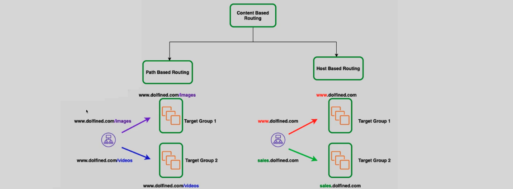
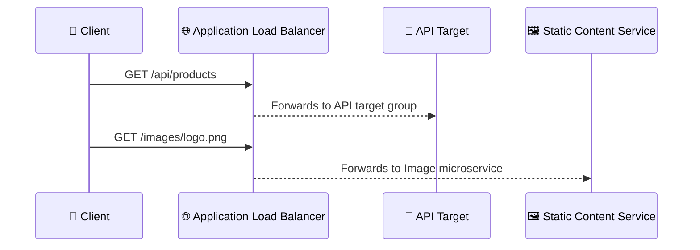

# **Application Load Balancer (ALB) Overview 🔄**

An **Application Load Balancer (ALB)** is a highly scalable, Layer 7 load balancer in AWS that intelligently routes **HTTP**, **HTTPS**, **WebSocket**, and **gRPC** traffic based on application-level content. ALBs are tailor-made for modern architectures like **microservices**, **serverless**, and **containerized apps** running on **ECS**, **EKS**, or **EC2**.

    

---

## **🚀 Key Features of ALB**

### 🔗 **Protocol Support**

- **HTTP/HTTPS** – Standard web protocols.
- **HTTP/2** – Better performance with multiplexed streams.
- **WebSockets** – Persistent, bidirectional communication.
- **gRPC** – Efficient service-to-service communication using Protocol Buffers.

### 🛡️ **Security**

- **AWS WAF Integration** – Protect against SQL injection, XSS, and common threats.
- **SSL Offloading** – Terminate SSL/TLS at ALB to simplify backend.
- **Delete Protection** – Prevents accidental deletion.

### 🌍 **IP Support**

- Dual-stack (IPv4 + IPv6) for internet-facing ALBs.

### ⚖️ **Load Balancing Algorithms**

- **Round Robin** – Default distribution.
- **Least Outstanding Requests** – Send new requests to the target with the fewest active requests.

---

## **🧠 Advanced Routing Capabilities**

ALB shines when it comes to smart content-based routing:

### 🏠 **Host-Based Routing**

Route based on domain:

- `api.example.com` → API target group
- `app.example.com` → Web UI target group

### 📁 **Path-Based Routing**

Route based on URL path:

- `/images/*` → Image microservice
- `/checkout` → Payment microservice

### 📬 **Header-Based Routing**

Example:

- If `User-Agent` contains `Mobile`, route to the mobile-optimized backend.

### ⚙️ **HTTP Method-Based Routing**

Route `GET` requests to a cache layer, `POST` to an API.

### ❓ **Query String Parameter Routing**

- `?version=beta` → Test backend
- `?env=prod` → Production backend

### 📍 **Source IP Routing**

Route specific IPs, CIDR blocks, or geographies to specialized services.

---

## **🔄 Example: Request Flow With ALB**

---

## **📊 Use Cases**

- Web and mobile apps with multiple domains
- Microservices or container workloads in ECS or EKS
- Multilingual websites with localized subdomains
- Real-time apps using WebSocket

---

## **✅ Conclusion**

The **Application Load Balancer (ALB)** is your go-to tool for building smart, scalable, and secure architectures on AWS. With **advanced routing**, **WebSocket and gRPC support**, **WAF integration**, and **SSL termination**, ALB is built for the demands of today’s modern cloud-native apps.

> 🔐 Tip: Use ALB with AWS WAF and CloudWatch Logs for full security and visibility!
