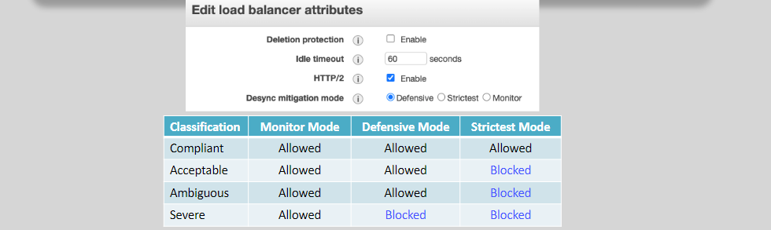

# **🧠 Desync Attacks (HTTP Request Smuggling) — Simplified for Humans!**

Sometimes, security vulnerabilities hide in how computers _talk_ to each other. Desync attacks—also called **HTTP Request Smuggling**—are one of those sneaky bugs where two systems (like a load balancer and a web server) **disagree** on what a user’s request actually is. 😵

---

<div style="text-align: center;">
    
</div>

---

## **🤔 What Is a Desync Attack?**

Imagine this:

> You're whispering a secret to two friends. One thinks you’re done speaking after sentence one. The other thinks you’re still talking. The result? Total confusion.

In computers, this happens between things like:

- A **Load Balancer** (like ALB)
- A **Backend Server** (like NGINX, Apache, etc.)

When they don’t agree on where your request ends, an attacker can sneak in a **second hidden request** that bypasses security checks. That’s **HTTP Request Smuggling**.

---

## **🧪 Real Example (Smuggled Request)**

Here’s a simplified request an attacker might send:

```http
POST / HTTP/1.1
Host: victim.com
Content-Length: 13
Transfer-Encoding: chunked

0

POST /admin HTTP/1.1
Host: victim.com
```

### What Happens

- The **load balancer** sees `Content-Length: 13` and thinks the request body ends after 13 bytes.
- The **web server** sees `Transfer-Encoding: chunked` and thinks it’s just chunked data... but actually reads the `POST /admin` as a _new hidden request_.

🎭 That second request? It flies under the radar!

---

## **🔍 Why This Confusion Happens**

It comes down to **conflicting instructions**:

| Header Type         | Says What?                                |
| ------------------- | ----------------------------------------- |
| `Content-Length`    | “Hey, the body is exactly 13 bytes long!” |
| `Transfer-Encoding` | “Nope, the body is in chunks!”            |

Different systems **choose different rules** to follow. If the load balancer follows one and the backend another... _desync!_

---

## **💥 What Can Go Wrong?**

This seemingly small mistake can cause BIG problems:

- Hackers **bypass login pages** and access admin functions
- **Session hijacking**: steal or reuse someone else's session
- **Cache poisoning**: inject malicious pages into public caches
- **Security log evasion**: sneak in actions that don’t get logged

💡 Big names like PayPal, Netflix, and Yahoo have been affected in the past.

---

## **🛡️ How AWS ALB Protects You**

Thankfully, AWS Application Load Balancer (ALB) has your back with **Desync Mitigation Mode**. It reviews requests and makes sure both it and your backend agree on what a request looks like.

### **Available Modes:**

| Mode        | What It Does 🧰                                             |
| ----------- | ----------------------------------------------------------- |
| `Defensive` | Default mode. Blocks clearly suspicious patterns.           |
| `Strictest` | Enforces strict rules. Drops any potentially risky request. |
| `Monitor`   | Logs suspicious stuff without blocking (great for testing). |

You can set this per **ALB listener**.

---

<div style="text-align: center;">
    
</div>

---

## **⚙️ What Happens Behind the Scenes**

Let’s peek into how ALB defends you:

1. **Receives Request**

   - ALB inspects headers (`Content-Length`, `Transfer-Encoding`, etc.)

2. **Checks for Desync Triggers**

   - Detects conflicts or malformed requests

3. **Takes Action Based on Mode**

   - Blocks it, logs it, or forwards safely

4. **Cleans and Forwards the Request**
   - Only safe, RFC-compliant requests make it to your app

---

## **✅ Best Practices to Stay Safe**

- Use ALB with **Desync Mitigation Mode** (start with `Monitor`, move to `Strictest`)
- Avoid mixing `Content-Length` and `Transfer-Encoding`
- Regularly **review logs** for weird request patterns
- Keep backend servers and proxies **up to date**
- Implement **header validation** in your app

---

## **🔗 Learn More**

- [AWS ALB Desync Mitigation Docs](https://docs.aws.amazon.com/elasticloadbalancing/latest/application/application-load-balancers.html#desync-mitigation-mode)
- [PortSwigger's Research on HTTP Smuggling](https://portswigger.net/research/http-desync-attacks)
- [OWASP HTTP Request Smuggling Guide](https://owasp.org/www-community/attacks/HTTP_Request_Smuggling)

---

## **🎯 Final Words**

Desync attacks sound technical, but at their core, they’re just misunderstandings between systems. Like one friend saying “I’m done talking” while another keeps listening.

That’s what makes them dangerous—but also **preventable**. With ALB’s protection modes and a little attention to headers, you can stay ahead of this subtle (but powerful) threat.

🔐 So inspect those headers, flip the mitigation switch, and keep your app a desync-free zone!

> 🤖 “I see what you meant... and I’m not falling for it.” — Your ALB, probably
