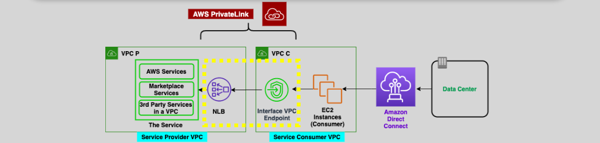

# **🔒 NLB PrivateLink and VPC Endpoint Services: Simplified & Secured**

AWS **PrivateLink** is like a private tunnel that allows you to access services across VPCs without touching the scary public internet. Combine that with the raw power of a **Network Load Balancer (NLB)**, and you’ve got a secure, scalable, and high-performance way to expose services privately. Let’s dive in and simplify this powerful feature combo! 🕵️‍♂️🚀

---

## **1️⃣ What is PrivateLink?**

**PrivateLink** lets you privately access services in another VPC using AWS’s internal network — **no public IPs**, **no internet gateways**, and **no headaches**.

### **Why It’s Awesome:**

- 🛡 **Private Connectivity**: Everything stays within AWS's internal network.
- 🚫 **No Public IP Needed**: You don’t need to expose your app to the internet.
- 🔗 **Useful For**: Accessing services like APIs, databases, or microservices from another VPC (yours or a third party's).

---

## **2️⃣ How NLB and PrivateLink Work Together**

    

Here’s how the pieces come together:

| Role             | Who/What It Is                                |
| ---------------- | --------------------------------------------- |
| **Provider VPC** | Hosts the service (API, DB, etc.)             |
| **NLB**          | Exposes the provider's service privately      |
| **Consumer VPC** | Wants to access the provider’s service        |
| **VPC Endpoint** | Connects the consumer to the provider via NLB |

### 🧩 Step-by-Step

1. **Provider** deploys a service (e.g., API) behind a **Network Load Balancer (NLB)**.
2. **Provider** shares a **Service Name** associated with the NLB.
3. **Consumer** creates an **Interface VPC Endpoint**, which connects privately to that NLB.
4. **Consumer** app connects using the endpoint’s **Private DNS name**, and the traffic stays inside AWS’s backbone.

---

## **✨ Key Features of NLB + PrivateLink**

### ✅ **Private & Secure Access**

- No need to expose services via public IP or internet gateways.
- No attack surface — only consumers with approved VPC Endpoints can access.

### 🌐 **Cross-AZ & High Availability**

- NLB and Interface Endpoints can span multiple Availability Zones.
- This means traffic flows smoothly even if an AZ goes down.

### 🧠 **Private DNS Integration**

- Access the endpoint with a friendly domain name like `api.yourcompany.vpce.amazonaws.com`.
- Behind the scenes, this resolves to private IPs in the consumer VPC.

### 💡 **Real-World Example**

> 🧑‍💻 You work for "DataCorp" and run an analytics API in **VPC-A**. Your client in **VPC-B** needs to call it securely.
>
> ✅ You create an NLB in **VPC-A**.
>
> ✅ Share the **Service Name** with the client.
>
> ✅ They create a VPC **Interface Endpoint** in **VPC-B**.
>
> 🔐 Now they can connect privately — no internet, no public IPs.

---

## **🔧 How to Set It Up (Simplified)**

### 🏗 Step 1: Set up the NLB (Provider VPC)

- Deploy your app (e.g., on EC2 or ECS).
- Create an **NLB** pointing to your app.
- Enable **Cross-Zone Load Balancing** if needed.

### 🌉 Step 2: Create VPC Endpoint Service (Provider VPC)

- In the console, create a new **VPC Endpoint Service**.
- Associate it with your NLB.
- Share the **Service Name** with consumers (you can whitelist specific AWS accounts or principals).

### 🧩 Step 3: Create Interface Endpoint (Consumer VPC)

- In the consumer VPC, create an **Interface Endpoint**.
- Paste the **Service Name**.
- AWS provisions **ENIs** (Elastic Network Interfaces) with **private IPs** in your subnets.

### 🌐 Step 4: DNS Resolution

- AWS automatically sets up DNS names for the endpoint.
- You can enable **Private DNS** to use friendly names like `api.yourcompany.com`.

---

## **💸 Pricing Overview**

| Resource                | Cost                        |
| ----------------------- | --------------------------- |
| Interface Endpoint Hour | ~\$0.01 per AZ per hour     |
| Data Processed          | ~\$0.01 per GB (first 1 TB) |

> 💡 Tip: You’re billed **per AZ**, so using three subnets = 3x hourly rate.

---

## **🎯 Conclusion: Why You Should Use It**

PrivateLink + NLB is a dream combo for:

- 🔒 Secure service exposure without public IPs
- 🧘 Simple connectivity — no NAT, no peering needed
- 🧩 Cross-account or cross-VPC access made easy
- 📈 High performance via NLB and AWS backbone

Whether you’re building a service mesh, exposing internal APIs, or creating a SaaS platform — this setup helps you do it securely and scalably.

> ✅ Safe. ✅ Fast. ✅ AWS-native.
