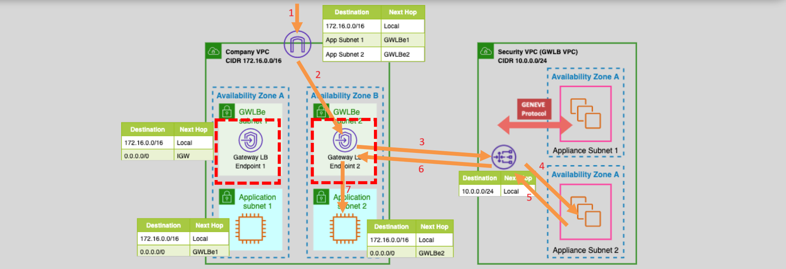
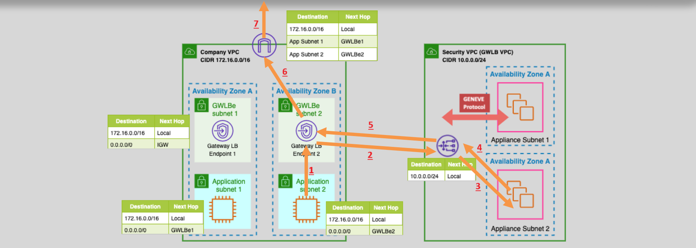
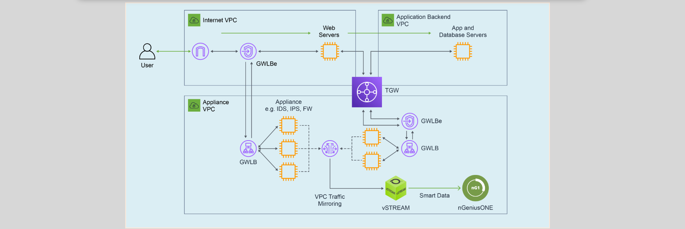

# **Gateway Load Balancer (GWLB) 🚓🧱**

The **Gateway Load Balancer (GWLB)** is a specialized load balancer used to simplify the deployment, scaling, and management of third-party virtual appliances in AWS. These appliances typically perform tasks like security (firewalls), intrusion detection and prevention, deep packet inspection, and more. Let's explore how GWLB works, its use cases, and how it fits into your AWS infrastructure.

## **What is Gateway Load Balancer (GWLB)? 👮**

GWLB is a fully managed service designed for specific use cases involving third-party virtual appliances, such as security devices. Unlike traditional load balancers, which distribute general application traffic, GWLB focuses on routing traffic to appliances that inspect or process the traffic for security and other specialized functions.

- **Use Case**: It is ideal for deploying firewalls, Intrusion Prevention Systems (IPS), and other security appliances in the cloud.
- **Protocol Supported**: It supports **TCP/UDP** traffic and uses the **GENEVE protocol** (port 6081), which is essential for sending traffic to security appliances for inspection.
- **Deployment**: GWLB is deployed in a **Security VPC**, separate from the **Application VPC**.

## **How GWLB Works 🔧**

### **Inbound Traffic Flow** (Ingress) 📥

1. **Deploy GWLB in a Security VPC**: The GWLB is placed in a different VPC, known as the **Security VPC**, where it acts as a gateway for inbound and outbound traffic from the application VPC.

2. **GWLB Endpoints in Application VPC**: The application VPC, where your EC2 instances and other resources reside, is connected to the GWLB through **GWLB endpoints**.

3. **Traffic Forwarding**: When traffic from the outside world enters the AWS environment (via Internet Gateway or Direct Connect), the traffic first hits the **GWLB endpoint** in the Application VPC. From there, the traffic is forwarded to the GWLB in the Security VPC.

4. **Traffic Inspection**: Once the traffic reaches the GWLB, it is directed to security appliances (e.g., firewalls or IPS). These appliances inspect the traffic and make decisions about whether to allow or block it.

   

### **Outbound Traffic Flow** (Egress) 📤

1. **Routing to Security Appliances**: When an EC2 instance in the Application VPC needs to send traffic out to the internet or another destination, the traffic is routed to the **GWLB endpoint** in the Application VPC.

2. **Traffic Inspection**: The traffic is then forwarded to the **GWLB** in the Security VPC, where it is inspected by the appliances (such as firewalls) for potential threats or other security concerns.

3. **Return Traffic**: Once the traffic is inspected, it is returned to the GWLB endpoint and directed to the **Internet Gateway (IGW)** for outbound access to the internet or other destinations.

   

## **Gateway Load Balancer Key Benefits 🔑**

- **Centralized Security Management**: It allows you to use third-party appliances (such as firewalls or IPS) in a centralized way, inspecting traffic without needing to install appliances directly in every VPC.

- **Elastic Scaling**: GWLB automatically scales to handle changes in traffic, making it easy to add more appliances as needed.

- **High Availability**: The GWLB can be deployed in multiple Availability Zones (AZs), ensuring your security appliances are highly available and resilient.

- **Traffic Inspection Flexibility**: GWLB can route traffic through any appliance that supports the GENEVE protocol, giving you flexibility in the types of appliances you can use (e.g., security, monitoring, or optimization).

## **Example Use Case: Enhancing Visibility with NETSCOUT 📊**

For example, companies like **NETSCOUT** have used AWS Gateway Load Balancer to enhance their visibility into traffic patterns and provide additional security measures in AWS.

- **Link**: [AWS Gateway Load Balancer Enhances NETSCOUT Visibility in AWS](https://www.netscout.com/blog/aws-enhances-netscout-visibility)

## **Pricing for Gateway Load Balancer 💰**

- **Pricing Model**: Gateway Load Balancer uses **VPC endpoint pricing**.
  - **Per VPC Endpoint (per hour)**: \$0.01
  - **Data processed per month**:
    - First 1PB: \$0.01 per GB
    - As the data volume increases, the price per GB decreases.

## **Conclusion 🎯**

The **Gateway Load Balancer (GWLB)** is an essential tool for efficiently managing traffic through third-party appliances in AWS, such as firewalls and intrusion detection systems. By using the GENEVE protocol and connecting your application VPC to a security VPC, it enables high availability, elastic scaling, and centralized security management. Understanding how it works and its pricing model will help you secure your AWS workloads effectively while ensuring minimal cost.
