# 🔥 **AWS Lambda Function Execution Lifecycle**

When you deploy an AWS Lambda function, it does **not stay active continuously**. Instead, AWS **dynamically creates, reuses, and shuts down execution environments** based on traffic patterns.

📌 **Key Questions Answered in This Guide:**

- **What happens when you first call your AWS Lambda function?**
- **How does AWS manage subsequent invocations?**
- **Does AWS Lambda always stay in a Warm Start if traffic is high?**
- **When does AWS terminate execution environments?**
- **Visualizing AWS Lambda Execution Lifecycle with Mermaid Sequence Diagram**

---

<div style="text-align: center;">
    
</div>

---

## **📽️ AWS Lambda Execution Lifecycle After Deployment**

After deploying an AWS Lambda function, its lifecycle follows this sequence:

- **1️⃣ Deployment:** AWS **registers the function**, but it is **not active until invoked**.
- **2️⃣ First Invocation (Cold Start):** AWS **creates a new execution environment**, loads the function, initializes dependencies, and runs the handler.
- **3️⃣ Subsequent Invocations (Warm Start):** If the execution environment is **still active**, AWS **reuses it** to handle new requests.
- **4️⃣ Scaling & Concurrency:** If multiple concurrent requests come in, AWS **creates new environments** to handle them.
- **5️⃣ Failure Handling:** If the function crashes or times out, AWS resets the environment.
- **6️⃣ Shutdown:** If no new requests arrive for a while (usually 5-15 minutes), AWS **terminates the environment** to free resources.

📌 **Lambda does not always stay in Warm Start, even with high traffic. AWS optimizes based on load.**

---

## **⚖️ Cold Start vs. Warm Start: When Does It Happen?**

| **Scenario**                                     | **Execution Behavior**                            |
| ------------------------------------------------ | ------------------------------------------------- |
| **First Invocation After Deployment**            | 🟠 **Cold Start (New Environment Created)**       |
| **Subsequent Requests (Short Interval)**         | 🟢 **Warm Start (Reuses Environment)**            |
| **Concurrent Requests**                          | 🟠 **Cold Start (New Environments for Scaling)**  |
| **Function is Idle for a Long Time (5-15 mins)** | 🔴 **Shutdown (New Cold Start Needed Next Time)** |
| **Function Fails During Invocation**             | 🔄 **Execution Environment Reset**                |

> 💡 **If AWS Lambda keeps receiving requests frequently, it tries to keep environments warm, but if execution slows down, it will shut them down.**

---

## **🤔 How AWS Lambda Handles Scaling & Concurrency**

### **🔹 Scenario 1: Multiple Requests Within a Short Time (Warm Starts)**

- If requests come **quickly after each other**, AWS **reuses existing execution environments**.
- Reduces latency by skipping initialization (Warm Start).

> 💡 **Example: API receiving 100 requests per second might have multiple warm instances.**

---

### **🔹 Scenario 2: High Concurrent Requests (Scaling Up)**

- AWS **creates multiple execution environments** to handle concurrent invocations.
- New execution environments go through **Cold Start** before being ready.

> 💡 **Example: An API gets 500 requests in 1 second → AWS spins up 5 new Lambda containers.**

---

### **🔹 Scenario 3: Function Becomes Idle (Shutdown)**

- If **no invocations for 5-15 minutes**, AWS **shuts down execution environments**.
- The next request requires **a Cold Start** again.

> 💡 **Example: A function gets traffic only in the morning → Cold Starts happen every day.**

---

### **🔹 Scenario 4: Failure During Invocation**

- If **Lambda function crashes** or **times out** AWS **resets the execution environment**.
- All in-memory state is lost, and **a Cold Start** happens on the next invocation.

> 💡 **A function runs out of memory, causing a failure → AWS resets the environment.**
> 💡 The next invocation **starts fresh with a Cold Start.**

---

## **📊 AWS Lambda Execution Lifecycle – Mermaid Sequence Diagram**

Below is a **Mermaid diagram** that visually represents how AWS Lambda functions transition through **Cold Start, Warm Start, Scaling, and Shutdown**.

```mermaid
sequenceDiagram
    participant User
    participant AWS_Lambda
    participant Execution_Environment

    User->>AWS_Lambda: Deploy Lambda Function
    AWS_Lambda->>Execution_Environment: Function registered, but inactive

    User->>AWS_Lambda: First Invocation
    AWS_Lambda->>Execution_Environment: 🟠 Cold Start - Create environment, load function, init runtime
    Execution_Environment-->>AWS_Lambda: Ready to execute

    User->>AWS_Lambda: Subsequent Invocation (Short Interval)
    AWS_Lambda->>Execution_Environment: 🟢 Warm Start - Reuse existing environment

    User->>AWS_Lambda: Multiple Concurrent Requests
    AWS_Lambda->>Execution_Environment: 🟠 Scale up - Create new environments for additional load

    User->>AWS_Lambda: Function Invocation Fails (Crash/Timeout)
    AWS_Lambda->>Execution_Environment: 🔄 Reset Environment - New Cold Start Required

    AWS_Lambda-->>Execution_Environment: No traffic for 5-15 min
    Execution_Environment-->>AWS_Lambda: 🔴 Shutdown - Environment terminated
```



📌 **Key Takeaways from the Diagram:**

- **✔️ Cold Start happens when an environment is first created.**
- **✔️ Warm Start occurs when the same container is reused.**
- **✔️ Scaling creates multiple environments to handle high traffic.**
- **✔️ Failures reset execution environments, causing a new Cold Start.**
- **✔️ AWS shuts down execution environments after inactivity.**

---

## **🤔 How to Reduce AWS Lambda Cold Starts?**

| **Optimization Strategy**         | **How It Helps?**                                   |
| --------------------------------- | --------------------------------------------------- |
| **Use Provisioned Concurrency**   | Keeps environments warm to prevent Cold Starts      |
| **Increase Memory Allocation**    | More CPU resources speed up startup time            |
| **Reduce Package Size**           | Smaller function packages load faster               |
| **Keep Connections Warm**         | Store database/API clients outside handler function |
| **Use Lightweight Runtimes**      | Node.js, Python start faster than Java/.NET         |
| **Handle Errors Gracefully**      | Catch errors in code to prevent environment resets  |
| **Use Dead Letter Queues (DLQs)** | Capture failed events for later processing          |

📌 **Well-optimized Lambda functions reduce startup latency and improve performance.**

### **Example Keep Connections Warm**

#### **❌ Bad Practice**

```py
import json, os, time

def lambda_handler(event, context):
  dbconnected=False # First Run

  if dbconnected==False:
    print ("Connecting to some super-secret CATDB ... in handler ETA 5 seconds")
    time.sleep(5) # SOME DB CONNECTION CODE - it's not really, but you get the idea
    print ("Connected to DB....")
    dbconnected=True

  if dbconnected==True:
    print ("Connected to DB....moving to app code")
    print ("Running application.. something something ... cats & doggos")
    print ("Finished running app.....")


  # TODO implement
  return {
    'statusCode': 200,
    'body': json.dumps('Finished!')
  }
```

#### **✅ Good Practice**

```py
import json, os, time, logging

print('Cold Start! .. Loading function')
dbconnected=False # First Run
if dbconnected==False:
  print ("Coldstart DB Connection ... ETA 5s")
  time.sleep(5) # SIMULATE DB CONNECTION TIME
  print ("Connected to DB....")
  dbconnected=True

def lambda_handler(event, context):
  global dbconnected
  if dbconnected==False:
    print ("Connecting to super-secret CATDB ... in handler ETA 5s")
    time.sleep(5) # SIMULATE DB CONNECTION TIME
    print ("Connected to DB....")
    dbconnected=True

  if dbconnected==True:
    print ("DB Connected....moving to app code")
    print ("Running application.. something something ... cats & doggos")

  return { 'statusCode': 200, 'body': json.dumps('Finished!') }

```

---

## **📌Final Thoughts: AWS Lambda Execution Lifecycle After Deployment**

**🔹 AWS Lambda does not stay always warm, even with high traffic.**  
**🔹 Cold Starts happen when a new execution environment is needed.**  
**🔹 Warm Starts reduce latency by reusing existing containers.**  
**🔹 AWS automatically scales functions by creating new environments.**  
**🔹 Failures during invocation reset execution environments, leading to new Cold Starts.**  
**🔹 After 5-15 minutes of inactivity, AWS terminates execution environments.**
