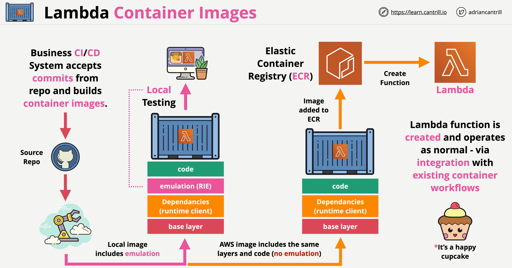

# ⚡ 🫙 **AWS Lambda Container Images**

AWS **Lambda Container Images** allow you to package and deploy **Lambda functions as Docker containers** instead of ZIP archives. This provides **more flexibility**, **custom runtime support**, and **larger function sizes (up to 10 GB)**.

---

<div style="text-align: center;">
  
</div>

---

## 🔥 **1️⃣ What Are Lambda Container Images?**

Traditionally, AWS Lambda functions are **deployed as ZIP files**. However, with **Lambda Container Images**, you can package and deploy functions using **Docker images**.

✅ **Supports custom dependencies and OS configurations**  
✅ **Enables consistent development across local and cloud environments**  
✅ **Allows function packages up to 10 GB**  
✅ **Uses Amazon Elastic Container Registry (ECR) for storage**

---

## ⚙️ **2️⃣ How AWS Lambda Container Images Work**

**1️⃣ You create a Docker image** that contains your Lambda function and dependencies.  
**2️⃣ You upload the image** to **Amazon Elastic Container Registry (ECR)**.  
**3️⃣ AWS Lambda pulls the container** from ECR and executes the function when triggered.  
**4️⃣ Lambda manages scaling** and execution automatically.

---

## 📦 **3️⃣ Key Differences: ZIP vs. Container Images**

| Feature                   | **ZIP-based Lambda**             | **Container Image Lambda**              |
| ------------------------- | -------------------------------- | --------------------------------------- |
| **Package Type**          | ZIP archive (`.zip`)             | Docker Image (`.tar`, hosted on ECR)    |
| **Max Size**              | 250 MB                           | **10 GB**                               |
| **Supported Runtimes**    | Python, Node.js, .NET, Java, Go  | Any runtime (custom containers allowed) |
| **Dependency Management** | Bundled inside the ZIP           | Installed inside the container          |
| **Custom OS & Libraries** | ❌ No                            | ✅ Yes (custom base images)             |
| **Execution Environment** | AWS Lambda's predefined runtimes | Fully customizable container            |

---

## 🏗 **4️⃣ Creating an AWS Lambda Container Image (Example in Python)**

Let’s create an AWS Lambda function using **Docker and Python**.

---

### **Step 1: Install Docker**

Make sure **Docker** is installed on your machine:

```sh
docker --version
```

If not installed, download it from [Docker’s official website](https://www.docker.com/products/docker-desktop/).

---

### **Step 2: Create a Lambda Function Directory**

```sh
mkdir my-lambda-container
cd my-lambda-container
```

---

### **Step 3: Create a Python Script (`app.py`)**

This script will handle the Lambda event.

```python
import json

def lambda_handler(event, context):
    return {
        'statusCode': 200,
        'body': json.dumps('Hello from Lambda Container!')
    }
```

---

### **Step 4: Create a Dockerfile**

Create a `Dockerfile` to define the container.

```Dockerfile
# Use AWS-provided Python 3.9 base image
FROM public.ecr.aws/lambda/python:3.9

# Copy application code
COPY app.py .

# Command to run the Lambda function
CMD ["app.lambda_handler"]
```

📌 **Explanation:**

- `FROM public.ecr.aws/lambda/python:3.9` → Uses the official AWS Lambda base image
- `COPY app.py .` → Copies the function file into the container
- `CMD ["app.lambda_handler"]` → Specifies the function entry point

---

### **Step 5: Build the Docker Image**

Run the following command inside the `my-lambda-container/` directory:

```sh
docker build -t my-lambda-image .
```

📌 This will create a Docker image called `my-lambda-image`.

---

### **Step 6: Test the Lambda Function Locally**

Before deploying, test the function inside the container:

```sh
docker run -p 9000:8080 my-lambda-image
```

Then, in another terminal, invoke the function:

```sh
curl -XPOST "http://localhost:9000/2015-03-31/functions/function/invocations" -d '{}'
```

✅ If successful, you’ll see a response like:

```json
{ "statusCode": 200, "body": "\"Hello from Lambda Container!\"" }
```

---

## 🚀 **5️⃣ Deploying the Lambda Container to AWS**

### **Step 1: Authenticate Docker with AWS ECR**

```sh
aws ecr get-login-password --region us-east-1 | docker login --username AWS --password-stdin <your-account-id>.dkr.ecr.us-east-1.amazonaws.com
```

> 📌 **Replace `<your-account-id>` with your AWS Account ID.**

---

### **Step 2: Create an ECR Repository**

```sh
aws ecr create-repository --repository-name my-lambda-container
```

---

### **Step 3: Tag and Push the Image to ECR**

**1️⃣ Tag the image:**

```sh
docker tag my-lambda-image:latest <your-account-id>.dkr.ecr.us-east-1.amazonaws.com/my-lambda-container:latest
```

**2️⃣ Push the image to AWS ECR:**

```sh
docker push <your-account-id>.dkr.ecr.us-east-1.amazonaws.com/my-lambda-container:latest
```

---

### **Step 4: Create a Lambda Function Using the Container Image**

```sh
aws lambda create-function \
  --function-name MyLambdaContainer \
  --package-type Image \
  --code ImageUri=<your-account-id>.dkr.ecr.us-east-1.amazonaws.com/my-lambda-container:latest \
  --role arn:aws:iam::<your-account-id>:role/lambda-execution-role
```

---

## 🎯 **6️⃣ Invoking the Lambda Function**

After deployment, invoke your Lambda function:

```sh
aws lambda invoke --function-name MyLambdaContainer response.json
```

📌 **Response (`response.json`):**

```json
{ "statusCode": 200, "body": "\"Hello from Lambda Container!\"" }
```

---

## 🎯 **7️⃣ When to Use Lambda Container Images**

| **Use Case**                                     | **Use Lambda Containers?**                                      |
| ------------------------------------------------ | --------------------------------------------------------------- |
| Small Lambda functions (few MBs)                 | ❌ No, use ZIP package                                          |
| Large dependencies (e.g., ML models, SDKs)       | ✅ Yes, supports up to 10 GB                                    |
| Custom OS or runtime required                    | ✅ Yes, use custom Docker images                                |
| Multiple AWS Lambda functions share dependencies | ✅ Yes, centralize dependencies in a container                  |
| Cold start optimization needed                   | ❌ No, containers may have slightly longer cold starts than ZIP |

---

## 🎯 **8️⃣ Summary: Why Use AWS Lambda Containers?**

✅ **More flexibility** – Use any runtime (Python, Node.js, .NET, Java, Go, custom Linux)  
✅ **Larger deployment package** – Supports up to **10 GB** (vs. 250 MB for ZIP)  
✅ **Easier dependency management** – Install libraries with system-level access  
✅ **Standardized deployments** – Use the same Docker image across **local & cloud** environments
